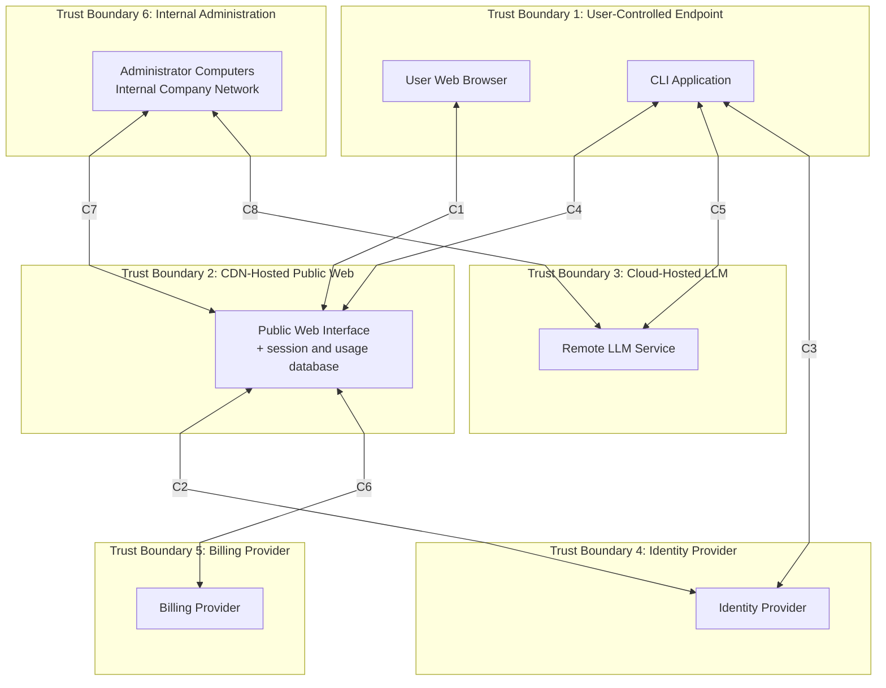

# 1. System Architecture and Trust Model

## 1.1 Architecture Diagram

### Final List of System Components

1. **User Web Browser**
   - A web browser running on the user's personal computer.
   - Used for sign-up, login, account creation, and account management through the website.

2. **CLI Application**
   - The local CLI program running on the user's personal computer.
   - The only interface through which the AI agent itself is used.

3. **Public Web Interface**
   - The public website used for account-related functions.
   - It performs user session management.
   - It stores session data, session histories, and usage records.
   - For this assignment, its database is treated as part of this same component because the specification explicitly states this.

4. **Remote LLM Service**
   - The remote LLM that powers the AI agent.
   - It runs on GPU compute facilities provided by a third-party cloud provider.

5. **Identity Provider**
   - The external authentication provider used by the website and the CLI application.

6. **Billing Provider**
   - The external billing provider that stores customer billing information and performs end-of-month billing for paid users.

7. **Administrator Computers / Internal Company Network**
   - The internal administrative environment used by system administrators to administer the Public Web Interface and the Remote LLM Service.

### Legitimate Communication Channels

1. **User Web Browser <-> Public Web Interface**
   - Purpose: sign-up, login, account creation, account management, and website session management.

2. **Public Web Interface <-> Identity Provider**
   - Purpose: authenticate users logging in through the website.

3. **CLI Application <-> Identity Provider**
   - Purpose: authenticate users running the CLI application.

4. **CLI Application <-> Public Web Interface**
   - Purpose: save sessions, restore sessions, auto-save session histories, and track paid-user usage.

5. **CLI Application <-> Remote LLM Service**
   - Purpose: send prompts to the LLM and receive responses so that the AI agent can operate.

6. **Public Web Interface <-> Billing Provider**
   - Purpose: transmit billing information during sign-up and exchange usage information for end-of-month billing.

7. **Administrator Computers / Internal Company Network <-> Public Web Interface**
   - Purpose: administration and maintenance of the Public Web Interface.

8. **Administrator Computers / Internal Company Network <-> Remote LLM Service**
   - Purpose: administration and maintenance of the Remote LLM Service, including periodic retraining.

### Diagram Draft

To keep the diagram readable, the communication channels are labelled `C1` to `C8` and are explained immediately below the diagram.

**Channel legend**

- `C1`: User Web Browser <-> Public Web Interface: sign-up, login, account creation, account management, and website session management.
- `C2`: Public Web Interface <-> Identity Provider: website-based user authentication.
- `C3`: CLI Application <-> Identity Provider: CLI-based user authentication.
- `C4`: CLI Application <-> Public Web Interface: save sessions, restore sessions, auto-save session histories, and track paid-user usage.
- `C5`: CLI Application <-> Remote LLM Service: send prompts to the LLM and receive responses so that the AI agent can operate.
- `C6`: Public Web Interface <-> Billing Provider: billing submission during sign-up and exchange of usage information for end-of-month billing.
- `C7`: Administrator Computers / Internal Company Network <-> Public Web Interface: administration and maintenance of the Public Web Interface.
- `C8`: Administrator Computers / Internal Company Network <-> Remote LLM Service: administration, maintenance, and periodic retraining of the Remote LLM Service.

## 1.2 Component Descriptions

### 1. User Web Browser

- **Ultimate control:** the user.
- **Role in the system:** provides the web-based interface for sign-up, login, account creation, and account management.
- **How it interacts with other components:** communicates only with the Public Web Interface.

### 2. CLI Application

- **Ultimate control:** the user.
- **Role in the system:** provides the local interface through which the user interacts with the AI agent.
- **How it interacts with other components:** communicates with the Identity Provider for authentication, the Public Web Interface for session persistence and usage tracking, and the Remote LLM Service for model inference.

### 3. Public Web Interface

- **Ultimate control:** the company that created Codey McCodeface controls the application and administers it; the CDN provider controls the underlying hosting infrastructure.
- **Role in the system:** provides the public website, performs user session management, stores saved CLI session histories, and records usage for billing.
- **How it interacts with other components:** communicates with the User Web Browser, CLI Application, Identity Provider, Billing Provider, and Administrator Computers / Internal Company Network.

### 4. Remote LLM Service

- **Ultimate control:** the company that created Codey McCodeface controls and administers the LLM service; the cloud provider controls the underlying hosting infrastructure.
- **Role in the system:** runs the remote LLM that powers the agent's reasoning.
- **How it interacts with other components:** communicates with the CLI Application during normal operation and with Administrator Computers / Internal Company Network for maintenance and retraining.

### 5. Identity Provider

- **Ultimate control:** the third-party identity provider.
- **Role in the system:** authenticates users and vouches for their authenticity to the rest of the system.
- **How it interacts with other components:** communicates with the Public Web Interface and the CLI Application.

### 6. Billing Provider

- **Ultimate control:** the third-party billing provider.
- **Role in the system:** stores customer billing information and calculates end-of-month charges for paid users.
- **How it interacts with other components:** communicates with the Public Web Interface.

### 7. Administrator Computers / Internal Company Network

- **Ultimate control:** the company that created Codey McCodeface.
- **Role in the system:** provides the internal administrative environment used by system administrators to operate and maintain the system.
- **How it interacts with other components:** communicates with the Public Web Interface and the Remote LLM Service.

## 1.3 Sensitive Information Flows and Storage

### Sensitive Information on Each Communication Channel

1. **User Web Browser <-> Public Web Interface**
   - authentication information
   - account-related information
   - billing information during paid-user sign-up

2. **Public Web Interface <-> Identity Provider**
   - authentication information
   - authentication tokens, assertions, or equivalent session credentials
   - **Assumption:** tokens, assertions, or equivalent credentials are returned as part of successful authentication.
   - **Justification:** the assignment states that the Identity Provider authenticates users for the website. Some credential or assertion is required to represent successful authentication.

3. **CLI Application <-> Identity Provider**
   - authentication information
   - authentication tokens, assertions, or equivalent session credentials
   - **Assumption:** tokens, assertions, or equivalent credentials are returned as part of successful authentication.
   - **Justification:** the assignment states that the CLI application uses the Identity Provider to authenticate the user. Some credential or assertion is required to represent successful authentication.

4. **CLI Application <-> Public Web Interface**
   - previous user sessions
   - session histories containing user inputs and agent outputs
   - session names
   - usage records or query counts linked to the user account

5. **CLI Application <-> Remote LLM Service**
   - user input to the agent
   - agent responses
   - conversation history sent to the LLM
   - tool outputs returned to the LLM when those outputs are included in the conversation
   - **Assumption:** tool outputs may be transmitted on this channel as part of the conversation context.
   - **Justification:** the assignment pseudocode and protocol figures show tool responses being appended to the conversation sent to the LLM.

6. **Public Web Interface <-> Billing Provider**
   - billing information
   - paid-user usage information
   - account identifiers needed to associate usage with a particular customer
   - **Assumption:** account identifiers are exchanged so that usage information can be associated with the correct paid customer.
   - **Justification:** the Billing Provider calculates the end-of-month bill for each paid customer based on that customer's usage.

7. **Administrator Computers / Internal Company Network <-> Public Web Interface**
   - administrative authentication information
   - administrative commands or management traffic
   - **Assumption:** administrative access requires privileged authentication and management traffic.
   - **Justification:** the assignment states that system administrators access and administer the system using special-purpose computers on the internal company network.

8. **Administrator Computers / Internal Company Network <-> Remote LLM Service**
   - administrative authentication information
   - model administration traffic
   - retraining-related data derived from user feedback
   - **Assumption:** retraining-related data derived from user feedback is handled through the administrative environment.
   - **Justification:** the assignment states that system administrators periodically retrain the LLM and that user feedback is used to improve the model.

### Sensitive Information Stored by Components

1. **Public Web Interface**
   - user session data
   - session histories
   - saved CLI agent sessions
   - query or usage records used for billing paid users
   - **Status:** explicitly stated in the assignment

2. **Public Web Interface**
   - website session identifiers or equivalent session-management state
   - **Status:** justified assumption
   - **Justification:** the assignment explicitly states that the Public Web Interface performs user session management.

3. **Billing Provider**
   - customer billing information
   - **Status:** explicitly stated in the assignment

4. **Billing Provider**
   - billing records generated from monthly usage information
   - **Status:** justified assumption
   - **Justification:** the Billing Provider calculates end-of-month bills based on customer usage, so retaining billing records is a narrow and reasonable assumption.

5. **Identity Provider**
   - authentication information, such as usernames and password hashes or other authentication tokens
   - **Status:** justified assumption grounded in the assignment's description of authentication information and the Identity Provider's role

6. **Administrator Computers / Internal Company Network**
   - administrative credentials or management material
   - **Status:** justified assumption
   - **Justification:** system administrators use special-purpose computers to access and administer the system.

The assignment does not explicitly state persistent storage of sensitive information by the **Remote LLM Service**, **CLI Application**, or **User Web Browser**, so such storage is not claimed here.

## 1.4 Trust Boundaries

Trust boundaries are identified according to control, ownership, hosting domain, and trust assumptions. They are not grouped merely by functionality. No trust boundary passes through a component.

### 1. User-Controlled Endpoint Boundary

- **Components inside the boundary:**
  - User Web Browser
  - CLI Application
- **Who ultimately controls it:** the user.
- **Why it is a separate trust domain:** both components run on the user's personal computer and are outside the administrative control of the company and its external providers.

### 2. CDN-Hosted Public Web Boundary

- **Components inside the boundary:**
  - Public Web Interface
- **Who ultimately controls it:** the company that created Codey McCodeface controls and administers the application; the CDN provider controls the underlying hosting infrastructure.
- **Why it is a separate trust domain:** it is hosted in a distinct CDN environment and must therefore be separated from the user endpoint, the internal administration environment, and the cloud-hosted LLM environment.

### 3. Cloud-Hosted LLM Boundary

- **Components inside the boundary:**
  - Remote LLM Service
- **Who ultimately controls it:** the company that created Codey McCodeface controls and administers the LLM service; the cloud provider controls the underlying hosting infrastructure.
- **Why it is a separate trust domain:** it is hosted on separate third-party cloud infrastructure and is not co-located with the Public Web Interface.

### 4. Identity Provider Boundary

- **Components inside the boundary:**
  - Identity Provider
- **Who ultimately controls it:** the third-party identity provider.
- **Why it is a separate trust domain:** it is an external authentication service that is trusted by the system but is not controlled by the company or the user.

### 5. Billing Provider Boundary

- **Components inside the boundary:**
  - Billing Provider
- **Who ultimately controls it:** the third-party billing provider.
- **Why it is a separate trust domain:** it is an external billing service with its own control domain and stores customer billing information separately from the Public Web Interface.

### 6. Internal Administration Boundary

- **Components inside the boundary:**
  - Administrator Computers / Internal Company Network
- **Who ultimately controls it:** the company that created Codey McCodeface.
- **Why it is a separate trust domain:** it is the company's internal administrative environment and forms a separate management plane from user-controlled endpoints and externally hosted services.

### Assumptions Used in Question 1

1. **Assumption:** the website-side and CLI-side authentication exchanges involve tokens, assertions, or equivalent session credentials.
   - **Justification:** successful authentication by the Identity Provider must produce some credential or assertion that the relying component can use.

2. **Assumption:** the Public Web Interface stores website session-management state such as session identifiers.
   - **Justification:** the specification explicitly states that the Public Web Interface performs user session management.

3. **Assumption:** administrative channels carry privileged authentication and management traffic.
   - **Justification:** administrators use special-purpose computers on the internal company network to access and administer the system.

4. **Assumption:** the CLI-to-LLM channel can include tool outputs as part of the conversation context.
   - **Justification:** the assignment pseudocode and protocol figures show tool responses being appended to the conversation sent to the LLM.

5. **Assumption:** the Public Web Interface and the Billing Provider exchange account identifiers sufficient to associate usage with the correct paid customer.
   - **Justification:** monthly billing requires usage to be linked to a particular customer.

6. **Assumption:** retraining-related data derived from user feedback is handled through the administrative environment.
   - **Justification:** the assignment states that user feedback is used to improve the model and that system administrators periodically retrain the LLM.

# 2. STRIDE Threat Analysis

The following threats are derived directly from the architecture model in Question 1. They are grouped using STRIDE and are anchored to the specific components, communication channels and trust-boundary crossings identified in that model. The aim is to capture realistic threats to this system, rather than generic security issues, while keeping each threat concise and system specific.

## 2.1 Spoofing

### S1. Spoofed LLM Backend Returns Malicious Tool Invocations
- **Threat ID:** S1
- **STRIDE category:** Spoofing
- **Targeted component or communication channel from Q1:** CLI Application <-> Remote LLM Service; crossing from the User-Controlled Endpoint Boundary to the Cloud-Hosted LLM Boundary
- **Potential attacker:** A network attacker able to interfere with routing, DNS or server identity validation for the CLI's connection to the Remote LLM Service.
- **Security goal violated:** Authentication of the Remote LLM Service and integrity of the commands accepted by the CLI Application.
- **How the attacker might exploit this threat:** The attacker redirects the CLI application's traffic to an attacker-controlled endpoint and presents responses that look like valid LLM messages. If the CLI does not robustly verify the server's identity, the attacker can return crafted `ToolInvocation` messages rather than genuine model output. Because the CLI executes tool requests on the user's machine, spoofing the backend can turn the user endpoint into an execution proxy for the attacker.
- **Assumptions:** The CLI accepts tool invocations returned by the remote model without a separate cryptographic authenticity check beyond the transport session. This is consistent with the assignment pseudocode, which shows the CLI executing tool requests returned by the LLM.
- **Evidence / precedent:** Traffic-redirection attacks such as DNS and BGP hijacking have been used to impersonate legitimate services. In April 2018, attackers executed a BGP route hijack against Amazon's Route 53 DNS service and redirected MyEtherWallet.com users to a Russian phishing server for approximately two hours, resulting in the theft of approximately $152,000 in Ethereum (Zorz, 2018; Cimpanu, 2018).

### S2. Spoofed Codey Login or IdP Consent Flow Captures User Credentials
- **Threat ID:** S2
- **STRIDE category:** Spoofing
- **Targeted component or communication channel from Q1:** User Web Browser <-> Public Web Interface; Public Web Interface <-> Identity Provider; CLI Application <-> Identity Provider
- **Potential attacker:** An external attacker operating a phishing site or a malicious OAuth-style consent page.
- **Security goal violated:** Authentication of user identity and control of the user's Codey account and saved sessions.
- **How the attacker might exploit this threat:** The attacker presents a fake Codey login page or a fake Identity Provider consent flow that imitates the legitimate web experience. The victim supplies credentials or authorises access, after which the attacker uses the captured authentication material to sign in as the victim. Once authenticated, the attacker can access saved session histories, account functions and other user-linked resources exposed through the Public Web Interface.
- **Assumptions:** The website and CLI authentication flows rely on reusable session credentials or tokens after successful authentication. This is a narrow extension of the Q1 authentication model.
- **Evidence / precedent:** Credential phishing and OAuth consent phishing remain common initial-access techniques. In August 2022, Twilio suffered a sophisticated SMS-phishing attack in which attackers sent employees fake IT messages linking to a spoofed Twilio login page, successfully harvesting credentials and gaining access to customer data belonging to 209 customers (Page, 2022; Lakshmanan, 2022).

### S3. Stolen CLI Authentication Token Lets an Attacker Impersonate the User
- **Threat ID:** S3
- **STRIDE category:** Spoofing
- **Targeted component or communication channel from Q1:** CLI Application; CLI Application <-> Identity Provider
- **Potential attacker:** Local malware, a co-user of the machine or anyone with read access to the user's endpoint.
- **Security goal violated:** Authentication of the user to the system.
- **How the attacker might exploit this threat:** After the user authenticates through the CLI, the attacker steals a locally stored or in-memory token and reuses it to obtain a valid authenticated session. The attacker then interacts with the Public Web Interface or any related service as the victim without knowing the victim's password. This threat is particularly relevant because the CLI runs in the user-controlled endpoint boundary, where local malware and credential theft are realistic.
- **Assumptions:** The CLI retains authentication material locally for session continuity. This is a reasonable assumption for a logged-in CLI client.
- **Evidence / precedent:** MITRE ATT&CK documents application-token theft as technique T1528, noting that adversaries can steal application access tokens as a means of acquiring credentials to access remote systems and resources and that developer tooling has repeatedly exposed locally stored bearer tokens (Mitre, 2025).

## 2.2 Tampering

### T1. Saved Session Histories Are Modified to Steer Later Agent Behaviour
- **Threat ID:** T1
- **STRIDE category:** Tampering
- **Targeted component or communication channel from Q1:** CLI Application <-> Public Web Interface; stored session data within the Public Web Interface
- **Potential attacker:** A compromised user account, a malicious insider or an attacker who has obtained write access to the Public Web Interface.
- **Security goal violated:** Integrity of saved session histories and restored agent context.
- **How the attacker might exploit this threat:** The attacker alters a saved session history before the user restores it. Because restored history becomes part of the later conversation context, the tampered session can inject false prior outputs, misleading instructions or prompt-injection content that changes later model behaviour. This directly exploits the Q1 architecture, in which session histories are stored remotely and later restored through the Public Web Interface.
- **Assumptions:** None.
- **Evidence / precedent:** Greshake et al. (2023) demonstrated that malicious prior context can materially alter LLM behaviour through indirect prompt injection; the same principle applies when saved history is later replayed into the model context.

### T2. Client-Side Usage Reporting Is Manipulated to Alter Billing or Quota Enforcement
- **Threat ID:** T2
- **STRIDE category:** Tampering
- **Targeted component or communication channel from Q1:** CLI Application <-> Public Web Interface; usage records stored within the Public Web Interface
- **Potential attacker:** A malicious paid user or an attacker controlling a user's authenticated CLI session.
- **Security goal violated:** Integrity of billing and usage enforcement.
- **How the attacker might exploit this threat:** The assignment states that the CLI communicates with the Public Web Interface so that usage can be tracked. If usage updates are accepted from the client without strong server-side validation, a malicious client can suppress, replay or forge usage events. This could cause underbilling for the attacker, overbilling of a victim or incorrect application of free-tier limits.
- **Assumptions:** Usage information is at least partly reported by the CLI to the Public Web Interface. This is directly implied by the Q1 communication channel for usage tracking.
- **Evidence / precedent:** Metering failures caused by trusting client-reported events are a recurring abuse pattern in SaaS and mobile systems.

### T3. Tool Output Is Tampered With Before It Reaches the Model
- **Threat ID:** T3
- **STRIDE category:** Tampering
- **Targeted component or communication channel from Q1:** CLI Application <-> Remote LLM Service
- **Potential attacker:** A malicious file author, a malicious web-content author or local malware able to alter tool results on the user endpoint.
- **Security goal violated:** Integrity of the model's decision-making context.
- **How the attacker might exploit this threat:** The attacker causes the CLI to read a file, fetch a web page or process a local tool result containing attacker-chosen instructions or false data. The CLI then appends that tool output to the conversation sent to the Remote LLM Service. Because the model reasons over that conversation state, tampered tool output can redirect later tool use or corrupt the final answer.
- **Assumptions:** Tool outputs are appended to the model conversation. This is already justified in Q1 from the assignment pseudocode and protocol diagrams.
- **Evidence / precedent:** Prompt-injection attacks against tool-using LLM agents are documented in the OWASP Top 10 for LLM Applications (OWASP, 2023) and empirically demonstrated by Greshake et al. (2023) against real-world systems including Bing Chat and GitHub Copilot.

### T4. Coordinated Feedback Poisoning Alters Later Model Behaviour
- **Threat ID:** T4
- **STRIDE category:** Tampering
- **Targeted component or communication channel from Q1:** Administrator Computers / Internal Company Network <-> Remote LLM Service
- **Potential attacker:** A coordinated set of malicious users controlling many accounts or an attacker who can manipulate the retraining input.
- **Security goal violated:** Integrity of the retrained model.
- **How the attacker might exploit this threat:** The assignment states that thumbs-up and thumbs-down feedback is used to improve the agent and that administrators periodically retrain the LLM. An attacker can therefore submit coordinated feedback that disproportionately rewards harmful or misleading outputs, causing the retraining process to skew future model behaviour. This does not require compromise of the production model itself; it instead corrupts the inputs to the administrative retraining workflow.
- **Assumptions:** User feedback is incorporated into retraining data. This is explicitly suggested by the assignment description.
- **Evidence / precedent:** Microsoft's Tay chatbot was shut down within 16 hours of its March 2016 launch after coordinated adversarial users fed it racist and offensive content via Twitter, causing the model to replicate harmful outputs through its adaptive learning system (Wakefield, 2016). Data-poisoning attacks against machine-learning systems are furthermore well established in academic literature.

## 2.3 Repudiation

### R1. A User Denies Having Authorised a Harmful Tool Invocation
- **Threat ID:** R1
- **STRIDE category:** Repudiation
- **Targeted component or communication channel from Q1:** CLI Application <-> Remote LLM Service
- **Potential attacker:** A malicious user seeking to avoid responsibility after the agent performs a destructive action.
- **Security goal violated:** Accountability for tool execution on the user's machine.
- **How the attacker might exploit this threat:** The user submits a prompt that predictably leads the model to request a destructive or risky tool invocation, such as deleting files or modifying a repository. After the action completes, the user claims that the system acted autonomously and that the result was not intended. If the system cannot tie the original query, the returned tool request and the execution outcome to the same authenticated session, the dispute becomes difficult to resolve.
- **Assumptions:** None.
- **Evidence / precedent:** Disputes over automated actions are common in digital services when tamper-evident request and action logs are missing.

### R2. A Paid User Denies the Query Volume Used for Monthly Billing
- **Threat ID:** R2
- **STRIDE category:** Repudiation
- **Targeted component or communication channel from Q1:** CLI Application <-> Public Web Interface; usage records stored in the Public Web Interface
- **Potential attacker:** A paid user disputing a legitimate monthly bill.
- **Security goal violated:** Accountability of billing-relevant usage records.
- **How the attacker might exploit this threat:** The user contests the number of recorded queries at the end of the month and claims that the billed usage was not generated by their account. If usage records are incomplete, mutable or weakly linked to the authenticated session that produced them, the operator may be unable to prove that the disputed activity originated from that account. This is especially important because the Public Web Interface is the component that stores usage data for billing.
- **Assumptions:** None.
- **Evidence / precedent:** Chargeback and billing-dispute processes generally require retained, attributable transaction evidence.

### R3. An Administrator Denies Having Made an Unauthorised Change
- **Threat ID:** R3
- **STRIDE category:** Repudiation
- **Targeted component or communication channel from Q1:** Administrator Computers / Internal Company Network <-> Public Web Interface; Administrator Computers / Internal Company Network <-> Remote LLM Service
- **Potential attacker:** A malicious administrator or an attacker using stolen administrator access.
- **Security goal violated:** Accountability for privileged actions.
- **How the attacker might exploit this threat:** The attacker changes stored session data, usage records, model settings or retraining inputs through the administrative environment. They later deny having made the change or claim that another administrator was responsible. If administrative actions are not individually attributable and tamper-evidently logged, the operator cannot establish who performed the privileged action.
- **Assumptions:** None.
- **Evidence / precedent:** The September 2022 Uber breach, carried out via social engineering and hardcoded privileged access management credentials found in a network-accessible PowerShell script, highlighted the severe operational difficulties caused by incomplete privileged-access logging and the ease with which an attacker can deny or obscure their actions in the absence of immutable audit trails (Jackson, 2022; Kost, 2024).

## 2.4 Information Disclosure

### I1. A Web-Interface Compromise Exposes Saved Session Histories
- **Threat ID:** I1
- **STRIDE category:** Information Disclosure
- **Targeted component or communication channel from Q1:** Public Web Interface; stored session data and usage records within the Public Web Interface
- **Potential attacker:** An external attacker exploiting a vulnerability or misconfiguration in the Public Web Interface.
- **Security goal violated:** Confidentiality of saved conversations and associated user data.
- **How the attacker might exploit this threat:** The Public Web Interface stores saved CLI session histories, user session data and usage records. If an attacker exploits a vulnerability in that component, they can extract stored histories that may contain source code, confidential file contents, personal information or secrets entered during earlier agent sessions. Because sessions are remotely stored for later restoration across devices, the impact extends beyond a single endpoint.
- **Assumptions:** None.
- **Evidence / precedent:** In March 2023, a race-condition bug in OpenAI's `redis-py` library caused certain ChatGPT users to see the conversation titles and first messages of other active users; payment-related information of approximately 1.2% of ChatGPT Plus subscribers was also inadvertently exposed (OpenAI, 2023). This illustrates that stored AI conversation data is highly sensitive even when only partial metadata is disclosed.

### I2. Conversation Data Is Intercepted on the CLI-to-LLM Channel
- **Threat ID:** I2
- **STRIDE category:** Information Disclosure
- **Targeted component or communication channel from Q1:** CLI Application <-> Remote LLM Service
- **Potential attacker:** A network attacker or hostile interception appliance on the path between the user endpoint and the cloud-hosted LLM service.
- **Security goal violated:** Confidentiality of user prompts, model responses, and tool-returned content.
- **How the attacker might exploit this threat:** The CLI sends the conversation state to the Remote LLM Service and that state can include sensitive user input and tool outputs. If transport protection or server-identity verification is weakened, the attacker can observe the conversation in transit and recover data that the user never intended to leave their endpoint except for model processing. The confidentiality risk is amplified because tool outputs may include local file contents or secrets.
- **Assumptions:** This threat requires weak transport or weak server-identity verification; otherwise the attack is substantially harder.
- **Evidence / precedent:** TLS-validation flaws and man-in-the-middle interception remain common vulnerability classes in CLI and API clients.

### I3. Privileged Cloud-Hosting Personnel Can Read LLM-Processed Data
- **Threat ID:** I3
- **STRIDE category:** Information Disclosure
- **Targeted component or communication channel from Q1:** Remote LLM Service within the Cloud-Hosted LLM Boundary
- **Potential attacker:** A privileged insider at the cloud provider or an attacker who compromises the cloud-hosting layer.
- **Security goal violated:** Confidentiality of data processed by the Remote LLM Service.
- **How the attacker might exploit this threat:** The assignment states that the Remote LLM Service runs on third-party cloud GPU infrastructure. Even if the Codey company administers the service, the cloud provider still controls the underlying hosts. A privileged host-level actor could inspect prompts, responses or operational logs while they are being processed on that infrastructure.
- **Assumptions:** None beyond the hosting model stated in Q1.
- **Evidence / precedent:** This is a standard cloud-insider risk recognised in processor-trust models and regulated data-processing obligations.

## 2.5 Denial of Service

### D1. Sybil Abuse of the Free Tier Exhausts LLM Capacity
- **Threat ID:** D1
- **STRIDE category:** Denial of Service
- **Targeted component or communication channel from Q1:** Public Web Interface; CLI Application <-> Remote LLM Service
- **Potential attacker:** An automated attacker creating many free accounts.
- **Security goal violated:** Availability of the Remote LLM Service to legitimate users.
- **How the attacker might exploit this threat:** The assignment states that free use is rate-limited per registered account. An attacker can therefore create many free accounts and consume each account's quota, causing aggregate load that exceeds available model capacity. The result is degraded performance or rejected requests for legitimate users even though no single account exceeds its individual limit.
- **Assumptions:** Account creation is inexpensive enough to scale via disposable email addresses or scripted registration.
- **Evidence / precedent:** Sybil abuse of free or trial accounts is a common availability and cost-exhaustion pattern in cloud-backed services.

### D2. The Agent Loop Is Driven into Excessive Tool Invocation Cycles
- **Threat ID:** D2
- **STRIDE category:** Denial of Service
- **Targeted component or communication channel from Q1:** CLI Application <-> Remote LLM Service
- **Potential attacker:** A malicious user or an attacker whose content is ingested through tool output.
- **Security goal violated:** Availability of the agent loop and backend compute resources.
- **How the attacker might exploit this threat:** The assignment pseudocode shows that the loop continues until the model emits a `UserResponse`. An attacker can therefore craft a prompt, or injected tool-output content, that repeatedly induces further tool requests rather than termination. This ties up both the Remote LLM Service and the local CLI session, and the effect scales if many such sessions are triggered at once.
- **Assumptions:** No strict iteration limit is specified in the assignment.
- **Evidence / precedent:** Agent-loop amplification and non-terminating tool-use patterns are recognised operational risks in tool-using LLM systems (Greshake et al., 2023).

### D3. Flooding Session and Account Endpoints Disrupts the Public Web Interface
- **Threat ID:** D3
- **STRIDE category:** Denial of Service
- **Targeted component or communication channel from Q1:** User Web Browser <-> Public Web Interface; CLI Application <-> Public Web Interface
- **Potential attacker:** A botnet operator or scripted attacker targeting stateful web endpoints.
- **Security goal violated:** Availability of account management, session restore, and usage-tracking functions.
- **How the attacker might exploit this threat:** The Public Web Interface handles sign-up, login, session management, session storage and usage recording. An attacker can flood these endpoints with large volumes of registration, save, restore or other expensive requests, forcing contention in the same component that stores session histories and usage data. Even if the CDN absorbs volumetric traffic, application-layer load can still prevent legitimate users from restoring sessions or managing accounts.
- **Assumptions:** None.
- **Evidence / precedent:** Application-layer denial-of-service attacks against login and stateful API endpoints remain common even behind CDN protection.

## 2.6 Elevation of Privilege

### E1. Untrusted Content Gains the Ability to Trigger Local Tool Execution
- **Threat ID:** E1
- **STRIDE category:** Elevation of Privilege
- **Targeted component or communication channel from Q1:** CLI Application <-> Remote LLM Service; trust-boundary crossing from untrusted external content into the User-Controlled Endpoint Boundary
- **Potential attacker:** A malicious web-content author or file author whose content is processed by the CLI's tools.
- **Security goal violated:** Authorisation over what may cause tool execution on the user's machine.
- **How the attacker might exploit this threat:** The attacker embeds instructions in a web page, repository file or other content that the user asks the agent to inspect. Once that content is returned as tool output and appended to the conversation, the model may produce tool requests that the CLI executes with the user's local privileges. The attacker has therefore escalated from controlling untrusted content outside the endpoint boundary to influencing code and command execution inside it.
- **Assumptions:** The CLI executes tool invocations returned by the model without requiring separate approval for each command. This is consistent with the assignment pseudocode.
- **Evidence / precedent:** Indirect prompt injection against tool-using agents is documented in the OWASP Top 10 for LLM Applications (OWASP, 2023). Greshake et al. (2023) demonstrated this class of attack against real-world LLM-integrated applications, showing how instructions embedded in retrieved content can be used to trigger attacker-controlled actions within the LLM's execution environment.

### E2. One Authenticated User Accesses Another User's Saved Sessions
- **Threat ID:** E2
- **STRIDE category:** Elevation of Privilege
- **Targeted component or communication channel from Q1:** CLI Application <-> Public Web Interface; stored session data within the Public Web Interface
- **Potential attacker:** An authenticated user attacking another user's stored sessions.
- **Security goal violated:** Authorisation and tenant isolation between user accounts.
- **How the attacker might exploit this threat:** If session identifiers are predictable or if the Public Web Interface fails to verify ownership on restore or deletion requests, a user can access, modify or delete another user's saved sessions. The attacker begins with their own legitimate account but escalates horizontally into another user's data and functionality. This threat is tied to the Q1 design choice to store and restore session histories centrally through the Public Web Interface.
- **Assumptions:** This threat requires weak object-level authorisation or predictable identifiers.
- **Evidence / precedent:** Insecure Direct Object Reference (IDOR) remains a standard access-control weakness and is listed as the top category in the OWASP API Security Top 10. Predictable object identifiers have repeatedly enabled cross-user data access in production systems.

### E3. A Compromised Administrator Endpoint Yields System-Wide Control
- **Threat ID:** E3
- **STRIDE category:** Elevation of Privilege
- **Targeted component or communication channel from Q1:** Administrator Computers / Internal Company Network <-> Public Web Interface; Administrator Computers / Internal Company Network <-> Remote LLM Service
- **Potential attacker:** An external attacker who steals administrator credentials or compromises an administrator workstation.
- **Security goal violated:** Authorisation boundaries protecting privileged system administration.
- **How the attacker might exploit this threat:** The administrative environment is the management plane for both the Public Web Interface and the Remote LLM Service. If an attacker compromises that environment, they can move from ordinary external access to privileged control over session data, usage records, model configuration and retraining operations. The effect is system-wide because the same trust boundary administers multiple critical components from Q1.
- **Assumptions:** None.
- **Evidence / precedent:** The September 2022 Uber breach demonstrated how a compromised privileged endpoint can yield system-wide control. After a contractor's credentials were obtained via social engineering, the attacker found hardcoded privileged access management admin credentials in a PowerShell script on an internal network share, gaining administrative access to Uber's AWS, Google Workspace and Slack, among other systems (Jackson, 2022; Kost, 2024).

### E4. A Free User Bypasses Web-Layer Controls to Consume Backend Service Illegitimately
- **Threat ID:** E4
- **STRIDE category:** Elevation of Privilege
- **Targeted component or communication channel from Q1:** CLI Application <-> Public Web Interface; CLI Application <-> Remote LLM Service
- **Potential attacker:** A malicious free-tier user reverse-engineering the client-side workflow.
- **Security goal violated:** Authorisation over service entitlement, rate limits and paid access.
- **How the attacker might exploit this threat:** The assignment states that usage is tracked through the Public Web Interface while the actual model interaction occurs on the Remote LLM Service. If rate-limit or entitlement checks are enforced only in the client-facing workflow, an attacker can script requests that imitate the backend call path and consume model service without the intended free-tier restrictions. The attacker thereby escalates from the privileges of a normal free user to service consumption closer to a paid or unrestricted user.
- **Assumptions:** The attacker can directly reach or replay the relevant backend-facing request path; if backend enforcement is strict and isolated, this threat is reduced.
- **Evidence / precedent:** Bypassing client-side or workflow-only entitlement checks is a standard abuse pattern in API-backed services.

# 3. Threat Impacts

The following impacts are derived from the Question 2 threats and are evaluated in the context of the Question 1 architecture. Each impact focuses on the concrete consequences for the affected components, stored data, communication channels, and trust boundaries in `Codey McCodeface`. The emphasis is on what would happen if each threat succeeded, who would be harmed, and why that harm matters in this specific system.

## 3.1 Impacts of Spoofing Threats

### S1. Spoofed LLM Backend Returns Malicious Tool Invocations
- **Impact:** If this threat succeeds, the CLI Application may execute attacker-chosen tool invocations on the user's machine, causing deletion of files, exfiltration of local data, or execution of unwanted commands. The immediate harm falls on the user through loss of confidentiality, integrity, and availability on the endpoint, but the company also suffers severe reputational damage because the compromise appears to come from the core agent workflow. This matters especially in this system because the CLI is explicitly permitted to run local tools on behalf of the remote model.

### S2. Spoofed Codey Login or IdP Consent Flow Captures User Credentials
- **Impact:** A successful phishing or consent-spoofing attack can give the attacker control of the victim's Codey account, including access to saved session histories and any account-linked usage or billing state. The user may suffer privacy loss, account misuse, and downstream financial or professional harm if saved conversations contain source code or sensitive information. The company is also harmed because compromise of the authentication flow undermines user trust in both the website and CLI access model.

### S3. Stolen CLI Authentication Token Lets an Attacker Impersonate the User
- **Impact:** If a stolen CLI token can be replayed, the attacker can silently act as the legitimate user without needing the user's password, which makes detection and attribution harder. This can expose saved sessions, allow misuse of paid usage, and lead to unauthorised actions being charged to or blamed on the victim. In this system, the impact is significant because authenticated access is the gateway to both session restoration and ongoing agent use.

## 3.2 Impacts of Tampering Threats

### T1. Saved Session Histories Are Modified to Steer Later Agent Behaviour
- **Impact:** A tampered saved session can corrupt the context that the user later restores, causing the agent to produce misleading answers or unsafe tool requests based on false prior conversation state. The user may therefore lose data integrity, make incorrect decisions, or execute harmful actions while believing the restored session is trustworthy. This matters in `Codey McCodeface` because saved session histories are a core cross-device feature stored centrally in the Public Web Interface.

### T2. Client-Side Usage Reporting Is Manipulated to Alter Billing or Quota Enforcement
- **Impact:** Manipulated usage records can cause some users to be under-billed, others to be over-billed, or free-tier limits to be enforced incorrectly. The direct harm is financial to both the company and affected users, but it also damages trust in the fairness and correctness of the service. This is particularly important here because usage tracking is part of the Public Web Interface's stated role in the architecture.

### T3. Tool Output Is Tampered With Before It Reaches the Model
- **Impact:** If tool output is altered before it reaches the Remote LLM Service, the model may act on false information or attacker-supplied instructions rather than genuine execution results. This can lead to incorrect answers, unsafe local actions, or disclosure of additional data through later tool use. The impact matters in this system because the Q1 architecture explicitly feeds tool results back into the conversation used by the model.

### T4. Coordinated Feedback Poisoning Alters Later Model Behaviour
- **Impact:** Poisoned feedback can degrade the quality and safety of later model versions for many users at once, rather than only affecting a single session. Users may receive increasingly harmful, biased, or unreliable outputs, while the company suffers reputational damage and loss of confidence in the product's improvement process. This matters because the assignment explicitly states that feedback is used to improve the agent and that administrators retrain the model periodically.

## 3.3 Impacts of Repudiation Threats

### R1. A User Denies Having Authorised a Harmful Tool Invocation
- **Impact:** If the system cannot prove which authenticated query led to a harmful tool invocation, the company may be unable to determine whether the user, the model, or an attacker caused the event. This creates accountability disputes, possible compensation claims, and reduced trust in the safety of agent-assisted actions. The issue matters especially here because the CLI can perform consequential actions on the user's local machine.

### R2. A Paid User Denies the Query Volume Used for Monthly Billing
- **Impact:** Successful repudiation of billed usage can lead to charge disputes, revenue loss, and significant operational overhead in resolving billing complaints. Affected users may also lose trust if legitimate charges cannot be defended or if incorrect usage is recorded against their account. In this system, that impact is directly tied to the Public Web Interface's role in storing query counts for billing paid users.

### R3. An Administrator Denies Having Made an Unauthorised Change
- **Impact:** If privileged actions cannot be attributed, the company may be unable to identify who altered session data, model configuration, or retraining inputs after an incident. This weakens incident response, increases insider risk, and can leave other users exposed to continuing compromise. The impact is especially serious because the administrative environment controls multiple critical components rather than only one isolated service.

## 3.4 Impacts of Information Disclosure Threats

### I1. A Web-Interface Compromise Exposes Saved Session Histories
- **Impact:** Disclosure of data stored in the Public Web Interface can reveal users' saved session histories, which may contain source code, secrets, file contents, or sensitive personal queries. The immediate harm is a privacy and confidentiality breach for affected users, but the company also faces reputational damage and possible legal or regulatory consequences. This matters because central storage of session histories is one of the system's key cross-device features.

### I2. Conversation Data Is Intercepted on the CLI-to-LLM Channel
- **Impact:** Interception of the CLI-to-LLM channel can expose prompts, model responses, and tool-returned data while the session is in progress. The user may lose confidentiality over local file contents or other sensitive material included in tool outputs, and the company may lose user trust in the safety of using the agent for coding or other personal tasks. The impact is specific to this system because the remote model receives conversation context rather than only isolated prompts.

### I3. Privileged Cloud-Hosting Personnel Can Read LLM-Processed Data
- **Impact:** If privileged cloud-hosting personnel can inspect LLM-processed traffic, users may be exposed even when the Codey company itself does not intentionally misuse their data. This creates privacy, confidentiality, and compliance risks for both users and the operator, especially when prompts or tool outputs contain proprietary code or sensitive information. The impact matters here because the architecture explicitly places the Remote LLM Service on third-party cloud infrastructure.

## 3.5 Impacts of Denial of Service Threats

### D1. Sybil Abuse of the Free Tier Exhausts LLM Capacity
- **Impact:** If many attacker-controlled free accounts consume available quota, legitimate users may experience slow responses, failed requests, or complete loss of access to the Remote LLM Service. The company is harmed both operationally and financially because scarce GPU-backed compute is consumed without corresponding revenue. This matters in this system because free access is explicitly rate-limited per account rather than per adversary.

### D2. The Agent Loop Is Driven into Excessive Tool Invocation Cycles
- **Impact:** A non-terminating or excessively long tool-use loop can tie up both the Remote LLM Service and the user's local CLI session, preventing timely completion of legitimate work. At scale, repeated abuse can reduce overall system availability for other users and increase backend operating cost. This is especially relevant because the assignment pseudocode describes an iterative loop that continues until the model emits a final user response.

### D3. Flooding Session and Account Endpoints Disrupts the Public Web Interface
- **Impact:** If the Public Web Interface is overwhelmed, users may be unable to sign up, log in, save sessions, restore histories, or have their usage recorded correctly. The direct result is loss of availability of important system features, and the company may also face billing errors and support burden caused by interrupted session management. This matters because the Public Web Interface is not a minor component: it is the central store for session histories and usage data.

## 3.6 Impacts of Elevation of Privilege Threats

### E1. Untrusted Content Gains the Ability to Trigger Local Tool Execution
- **Impact:** If untrusted external content can cause the CLI to execute tools with the user's privileges, the attacker may delete files, install malware, or exfiltrate sensitive local data. The immediate harm is to the user's device and data, but the broader consequence is severe loss of trust because ordinary content inspection becomes a path to endpoint compromise. This matters in `Codey McCodeface` because the architecture explicitly combines remote model reasoning with local tool execution.

### E2. One Authenticated User Accesses Another User's Saved Sessions
- **Impact:** Successful cross-user access would expose or corrupt another user's saved session histories, allowing one customer to read, alter, or delete another customer's conversations. That creates direct confidentiality, integrity, and privacy harm for affected users and undermines the operator's obligation to keep users logically separated. The impact is especially severe because saved sessions are a named system feature intended to persist across devices.

### E3. A Compromised Administrator Endpoint Yields System-Wide Control
- **Impact:** Compromise of the administrative environment can give the attacker effective control over the Public Web Interface and the Remote LLM Service at the same time. This could enable mass disclosure of session data, manipulation of billing or model behaviour, and disruption of service for many users, making it one of the highest-impact threats in the system. The company would suffer technical, financial, and reputational harm because the attack crosses the management plane that governs multiple trust boundaries.

### E4. A Free User Bypasses Web-Layer Controls to Consume Backend Service Illegitimately
- **Impact:** If a free user can bypass entitlement checks and consume backend model service directly, the result is unpaid compute consumption, weaker rate-limit enforcement, and unfair degradation of service for legitimate users. The company suffers financial loss and reduced control over its service tiers, while other users may experience slower or less reliable access. This matters because the Q1 architecture separates usage tracking in the Public Web Interface from model execution in the Remote LLM Service.

# 4. Security Requirements and Mitigations

The following security requirements are derived from the threats in Question 2 and the impacts in Question 3, in the context of the architecture established in Question 1. They are expressed as concrete system requirements rather than generic advice, and each requirement is linked to the threat or threats it is intended to address. Where a single control mitigates several related threats, the requirement groups them deliberately.

## 4.1 Authentication and Communication Security

### R1. Verify Remote LLM Identity
- **Related threats:** S1, I2
- **Requirement:** The CLI application should verify the Remote LLM Service's server identity on every connection, including certificate validation, hostname validation, and rejection of untrusted or invalid certificates. The system should not accept model responses from unauthenticated endpoints.
- **Rationale:** This is required because spoofing or interception of the `CLI Application <-> Remote LLM Service` channel could cause malicious tool invocations or disclosure of conversation data.

### R2. Strengthen User Authentication Flows
- **Related threats:** S2
- **Requirement:** The Public Web Interface and CLI application should use only pre-registered Identity Provider endpoints and redirect targets, and user authentication should support phishing-resistant multi-factor authentication where feasible. Authentication responses should be bound to the legitimate Codey service origin and rejected if returned through unauthorised flows.
- **Rationale:** This is needed because compromise of the website or IdP-facing login flow would expose saved sessions and account-linked usage information rather than only a low-value login event.

### R3. Protect CLI Authentication Tokens
- **Related threats:** S3
- **Requirement:** The CLI application should store authentication tokens only in a protected operating-system credential store where available, use short-lived access tokens, and support revocation or re-authentication after suspected endpoint compromise. Tokens should not be written to plaintext configuration files or logs.
- **Rationale:** This reduces the chance that local malware or a co-user can replay stored credentials to impersonate the user and access remotely stored sessions.

## 4.2 Integrity and Safe Tool Execution

### R4. Require Explicit Confirmation for Sensitive Tool Invocations
- **Related threats:** S1, T3, E1
- **Requirement:** The CLI application should require explicit user confirmation before executing high-risk tool invocations such as file deletion, file overwrite, shell command execution, credential access, or external data transmission. The confirmation prompt should identify the proposed action and its target clearly enough for the user to make an informed decision.
- **Rationale:** This provides a defensive barrier when the model is manipulated by a spoofed backend, malicious tool output, or prompt injection from untrusted content.

### R5. Treat Restored Sessions and Tool Outputs as Untrusted Input
- **Related threats:** T1, T3, E1, D2
- **Requirement:** The system should treat saved session histories, fetched web content, and tool outputs as untrusted input when constructing the conversation sent to the Remote LLM Service. The CLI application should separate data returned by tools from trusted system instructions and should apply filtering or guardrails to content that attempts to issue meta-instructions to the model.
- **Rationale:** This is required because both restored sessions and tool outputs can become part of the model context and can therefore tamper with later tool use or prolong the agent loop.

### R6. Make the Public Web Interface Authoritative for Session and Usage Integrity
- **Related threats:** T1, T2, E2, E4
- **Requirement:** The Public Web Interface should maintain authoritative server-side state for saved sessions, session ownership, and usage records, and it should reject unauthenticated or inconsistent client-side updates. Changes to session histories and billing-relevant usage data should be validated, versioned, and attributable to an authenticated account.
- **Rationale:** This is necessary because the Public Web Interface is the component that stores both cross-device session history and billing-related usage information, making integrity failures particularly damaging.

### R7. Validate Feedback Before Retraining
- **Related threats:** T4
- **Requirement:** Feedback used for retraining should be linked to completed authenticated sessions, rate-limited per account, monitored for anomalous patterns, and reviewed before inclusion in retraining datasets. The retraining pipeline should be able to exclude suspicious or low-quality feedback in bulk.
- **Rationale:** This requirement is needed because the assignment explicitly connects user feedback to later model improvement, making poisoning of that signal a realistic integrity threat.

## 4.3 Accountability and Auditability

### R8. Maintain Tamper-Evident User Activity Logs
- **Related threats:** R1, R2, T1, T2
- **Requirement:** The system should maintain append-only, tamper-evident logs for authenticated user actions, including login events, saved-session changes, usage-record updates, submitted prompts, returned tool invocations, and execution outcomes where applicable. Log records should be timestamped and linked to the authenticated account and session.
- **Rationale:** This is required to resolve disputes about harmful tool actions and billed usage, and to detect tampering with session or metering data.

### R9. Maintain Per-Administrator Auditability
- **Related threats:** R3, E3
- **Requirement:** Administrative access should use individually assigned accounts rather than shared credentials, and all privileged actions affecting the Public Web Interface, usage data, session data, model configuration, or retraining inputs should be logged immutably per administrator. Administrative log records should be protected from alteration by the same administrator who generated them.
- **Rationale:** This is necessary because the internal administration boundary controls multiple critical components and therefore presents a high-impact repudiation and privilege-escalation risk.

## 4.4 Confidentiality and Data Protection

### R10. Protect Centrally Stored Session Histories and Usage Data
- **Related threats:** I1, T1, E2
- **Requirement:** The Public Web Interface should protect saved session histories and usage data with least-privilege access controls, encryption at rest, and strict separation between ordinary user access and privileged administrative access. Session restore, deletion, and modification operations should require authenticated ownership checks for every request.
- **Rationale:** This is required because remotely stored session histories are one of the system's most sensitive assets and are central to both the information-disclosure and cross-user access threats.

### R11. Minimise and Protect Data Sent to the Remote LLM Service
- **Related threats:** I2, I3, T3
- **Requirement:** The CLI application should send only the conversation and tool data needed for the current turn, and should minimise or redact obvious secrets before transmission where feasible. Data sent to the Remote LLM Service should be protected in transit and should not be retained longer than needed for operation and approved retraining purposes.
- **Rationale:** This reduces the confidentiality impact of interception, cloud-hosting exposure, and unnecessary propagation of sensitive tool output.

### R12. Enforce Strong Object-Level Authorisation for Saved Sessions
- **Related threats:** E2, I1
- **Requirement:** The Public Web Interface should use non-predictable identifiers for saved sessions and should verify the requesting account's ownership on every restore, update, and delete operation. Authorisation decisions should be made server-side and should not rely on client-supplied identity claims alone.
- **Rationale:** This directly addresses the risk that one authenticated user could access or alter another user's stored session histories through weak ownership checks.

## 4.5 Availability and Abuse Resistance

### R13. Apply Multi-Layer Anti-Abuse Controls to Free-Tier Access
- **Related threats:** D1, E4, S2
- **Requirement:** The Public Web Interface should apply anti-automation controls to account creation, per-account and per-origin rate limits to usage, and server-side entitlement checks before model service is consumed. Free-tier limits should be enforced at the service side rather than only in client-visible workflow steps.
- **Rationale:** This is needed because per-account free-tier limits alone do not stop Sybil abuse or direct attempts to bypass client-facing controls.

### R14. Bound Agent Loops and Expensive Tool Use
- **Related threats:** D2, E1, T3
- **Requirement:** The CLI application and Remote LLM orchestration should enforce maximum tool-iteration counts, per-session compute budgets, tool timeouts, and safe termination conditions. Sessions that exceed those limits should fail safely and surface a clear warning to the user.
- **Rationale:** This limits both accidental and attacker-driven runaway loops that would otherwise consume backend compute and prolong unsafe tool execution.

### R15. Protect the Public Web Interface Against Application-Layer Flooding
- **Related threats:** D3
- **Requirement:** The Public Web Interface should rate-limit and prioritise sign-up, login, save-session, restore-session, and usage-tracking endpoints, and should degrade gracefully under load rather than failing unpredictably. Backend storage and session-management paths should be isolated so that overload of one workflow does not disable all account and history functions at once.
- **Rationale:** This is important because the Public Web Interface is a central dependency for account management, cross-device session restore, and billing-related usage recording.

## 4.6 Administrative and Privilege Controls

### R16. Harden and Segment the Administrative Environment
- **Related threats:** E3, R3, I3
- **Requirement:** Administrative access should require strong multi-factor authentication, dedicated administrator workstations, and network restriction to the internal administration boundary. The management interfaces for the Public Web Interface and Remote LLM Service should be separated from public-facing paths and should not be reachable through ordinary user channels.
- **Rationale:** This is necessary because compromise of the administrative environment yields system-wide control across multiple trust boundaries rather than compromise of a single component.

### R17. Enforce Least Privilege and Separation of Duties Across Hosted Components
- **Related threats:** E3, T4, I1, I3
- **Requirement:** Administrative roles and service accounts should be scoped so that no single account has unnecessary authority over the Public Web Interface, saved-session data, usage records, and retraining operations simultaneously. Changes to high-impact assets such as model retraining inputs or bulk session data should require additional approval or dual control.
- **Rationale:** This reduces the impact of administrator compromise and makes insider misuse or poisoning of the retraining workflow harder to perform undetected.

# 5. Use of Generative AI

Generative AI was used as a learning aid to support this assignment, rather than to replace our own analysis. In particular, it was used to help clarify the assignment structure, brainstorm possible STRIDE threats, identify relevant classes of past incidents, refine the wording of draft answers and improve the organisation of the final submission.

Its main value was as an auxiliary study tool: it was helpful for surfacing alternative threat ideas, checking whether proposed mitigations were sufficiently specific and improving clarity of expression. However, its suggestions were not accepted uncritically. All architecture decisions, threat selections, impact assessments and security requirements were reviewed against the assignment specification and revised where necessary.

Generative AI was therefore useful for guided learning, idea generation and drafting support, but not sufficient on its own for completing the assignment accurately. The final content remains our responsibility and any errors that may remain are our own.

# 6. References

- Catalin Cimpanu. (2018, April 24). *Hacker Hijacks DNS Server of MyEtherWallet to Steal $160,000*. BleepingComputer. https://www.bleepingcomputer.com/news/security/hacker-hijacks-dns-server-of-myetherwallet-to-steal-160-000/
- Jackson, M. (2022, September 16). *Uber Breach 2022 - Everything You Need to Know*. GitGuardian Blog - Automated Secrets Detection. https://blog.gitguardian.com/uber-breach-2022/
- Kost, E. (2024, November 18). *What Caused the Uber Data Breach? | UpGuard*. Www.upguard.com. https://www.upguard.com/blog/what-caused-the-uber-data-breach
- Greshake, K., Abdelnabi, S., Mishra, S., Endres, C., Holz, T., & Fritz, M. (2023, May 5). *Not what you've signed up for: Compromising Real-World LLM-Integrated Applications with Indirect Prompt Injection*. ArXiv.org. https://doi.org/10.48550/arXiv.2302.12173
- Mitre. (2025). *Steal Application Access Token, Technique T1528 - Enterprise | MITRE ATT&CK*. Attack.mitre.org. https://attack.mitre.org/techniques/T1528/
- OpenAI. (2023, March 24). *March 20 ChatGPT outage: Here's what happened*. Openai.com. https://openai.com/index/march-20-chatgpt-outage/
- OWASP. (2023). *LLMRisks2023-24 Archive - OWASP Top 10 for LLM & Generative AI Security*. OWASP Top 10 for LLM & Generative AI Security. https://genai.owasp.org/llm-top-10-2023-24/
- Page, C. (2022, August 8). *Twilio hacked by phishing campaign*. TechCrunch. https://techcrunch.com/2022/08/08/twilio-breach-customer-data/
- Lakshmanan, R. (2022, August 9). *Twilio Suffers Data Breach After Employees Fall Victim to SMS Phishing Attack*. The Hacker News. https://thehackernews.com/2022/08/twilio-suffers-data-breach-after.html
- Lakshmanan, R. (2023). *OpenAI Reveals Redis Bug Behind ChatGPT User Data Exposure Incident*. The Hacker News. https://thehackernews.com/2023/03/openai-reveals-redis-bug-behind-chatgpt.html
- Wakefield, J. (2016, March 24). *Microsoft chatbot is taught to swear on Twitter*. BBC News. https://www.bbc.com/news/technology-35890188
- Zeljka Zorz. (2018, April 25). *MyEtherWallet users robbed after successful DNS hijacking attack - Help Net Security*. Help Net Security. https://www.helpnetsecurity.com/2018/04/25/myetherwallet-dns-hijacking/
