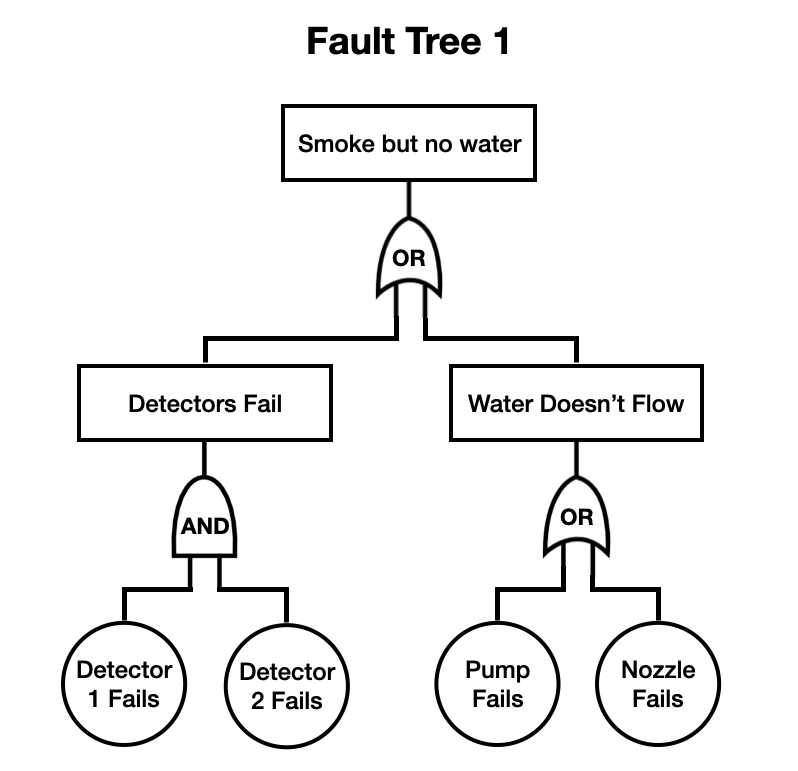
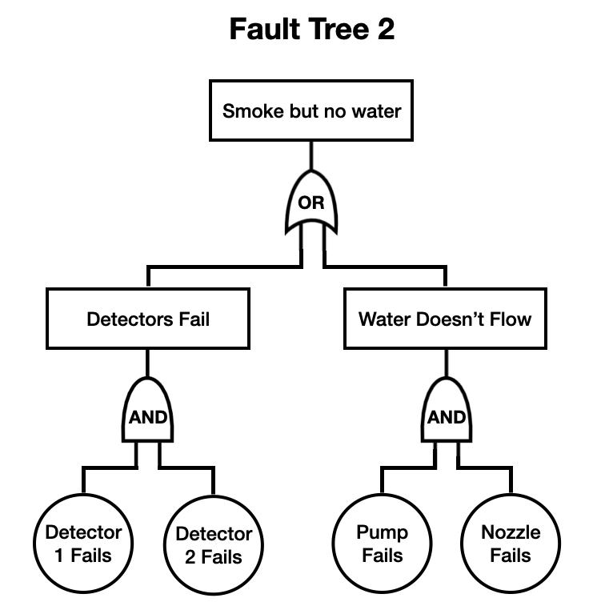
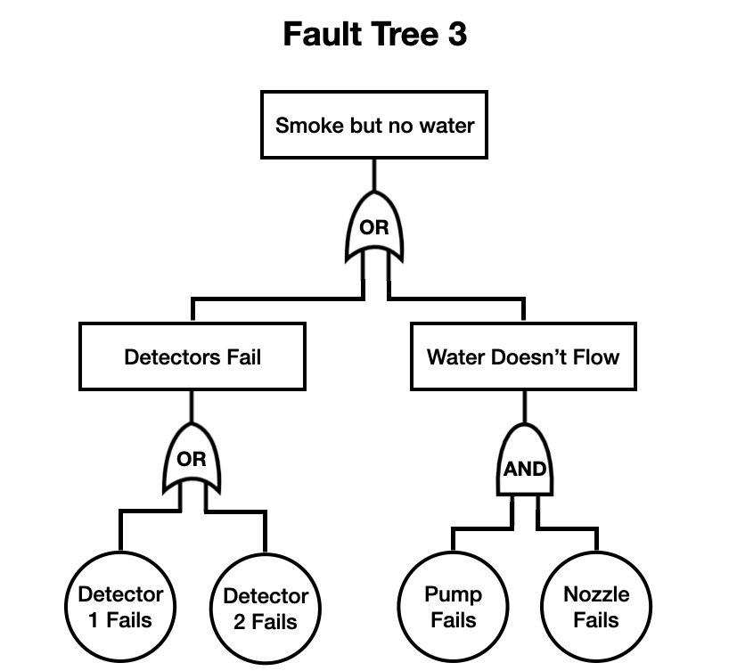
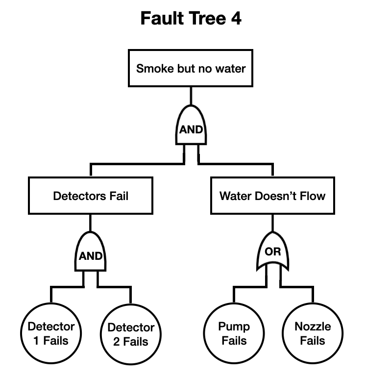

# SWEN90010 2024 Practice Exam - Markdown Practice Version

Source PDF: `materials/2024-pastpaper.pdf`

Visible total: 70 marks across 20 questions

## Q1. Fault-Tree Analysis - 4 marks

A building's automatic fire sprinkler system consists of a water sprinkler, installed into the building's ceiling, as well as two smoke detectors, plus other components mentioned below. The purpose of the system is to automatically activate the sprinkler when a fire is detected by either of the smoke detectors.

**Sprinklers and pump.** When a fire is detected, the system activates a water pump, to feed water to the sprinkler. If the sprinkler's nozzle is not blocked and the water pump is activated, water will flow from the sprinkler.

**Smoke detectors.** The system employs two smoke detectors to detect fires. Each is designed to act as a redundant back-up for the other: a fire is detected if either of the detectors is triggered, that is, if either of the smoke detectors detects smoke.

**Safety condition.** A hazard occurs when there is smoke but water does not flow from the sprinkler system.

Suppose you have been asked to perform a fault-tree analysis on this system, for this hazard.

The top-level event, i.e. the root, for the fault tree is the case in which there is smoke but water does not flow from the sprinkler system.

The following components in the system can each fail, and are assumed to fail independently of each other. These failures constitute the basic failure events, i.e. the leaves, of the fault tree:

- The smoke detectors, each of which fails independently of the other.
- The water pump.
- The sprinkler nozzle, by becoming blocked.

For each of the fault trees below, decide whether it is correct or incorrect for this scenario and hazard.

### Fault Tree 1



### Fault Tree 2



### Fault Tree 3



### Fault Tree 4



| Fault tree | Correct / incorrect | One-sentence reason |
|---|---|---|
| 1 |  |  |
| 2 |  |  |
| 3 |  |  |
| 4 |  |  |

### Q1 Full-Mark Answer

```text
Fault Tree 1: Correct.
Reason: The hazard can occur if both smoke detectors fail, or if water cannot flow because either the pump fails or the nozzle is blocked.

Fault Tree 2: Incorrect.
Reason: It incorrectly says pump failure and nozzle failure must both occur. Either pump failure or nozzle blockage is enough to stop water flow.

Fault Tree 3: Incorrect.
Reason: It incorrectly says either single detector failure is enough. Since the smoke detectors are redundant, both detectors must fail for detection to fail. It also incorrectly requires both pump and nozzle failure for water not to flow.

Fault Tree 4: Incorrect.
Reason: It incorrectly says detector failure and water-flow failure must both occur. For this hazard, either failure to detect smoke or failure of water flow can be sufficient.
```

**Schema:** Translate each intermediate event into the required logical connective. Redundant detectors require `AND` to fail as a group; alternative causes of no water flow require `OR`.

---

## Q2. Smoke Detector Failure Masking - 2 marks

The minimum number of smoke detectors required so that the building's automatic fire sprinkler system can mask smoke detector failures is:

> Answer:

In this case, the system will operate correctly in the presence of at most:

> Answer:

smoke detector failure(s).

### Q2 Full-Mark Answer

```text
Minimum number of smoke detectors required: 3.
Maximum smoke detector failures tolerated in this case: 1.
```

**Reason:** In the course's fault-tolerant-design terminology, masking a failed unit means the system can still choose the correct external output despite one unit producing a faulty output. With only two detectors, if one reports smoke and the other does not, the system can detect disagreement but cannot reliably know which detector is faulty. To mask one arbitrary smoke-detector failure, the system needs three detectors and majority voting.

**Schema:** A static pair can detect disagreement but cannot mask one arbitrary faulty output. N-modular redundancy needs `N = 2m + 1` units to mask `m` failed units. Therefore three detectors can mask one smoke-detector failure.

---

## Q3. STRIDE Threats and Security Properties - 6 marks

For each STRIDE security threat, which security property does it correspond to?

| STRIDE threat | Corresponding security property |
|---|---|
| Spoofing |  |
| Tampering |  |
| Repudiation |  |
| Information Disclosure |  |
| Denial of Service |  |
| Elevation of Privilege |  |

### Q3 Full-Mark Answer

| STRIDE threat | Corresponding security property |
|---|---|
| Spoofing | Authentication |
| Tampering | Integrity |
| Repudiation | Non-repudiation |
| Information Disclosure | Confidentiality |
| Denial of Service | Availability |
| Elevation of Privilege | Authorisation / access control |

**Schema:** STRIDE names the attack style; the matching property names what the system must protect. Spoofing attacks identity, tampering attacks data correctness, repudiation attacks accountability, information disclosure attacks secrecy, denial of service attacks service availability, and elevation of privilege attacks permission control.

---

## Q4. Trust Boundaries - 2 marks

Consider a fictitious web based system that comprises the following four components: users, a web server, a third-party identity provider service, and a database back-end server.

- Users access the system using their web browser.
- A web server receives the user requests and makes use of two other servers to process them.
- The web server communicates with a third-party identity provider service to authenticate users.
- The web server also communicates with a database back-end server to service each user request by fetching data from the database that the user is authorised to read.

The web server and the database back-end are both controlled by the same organisation. However, the third-party identity provider is not under the control of that organisation.

How many trust boundaries exist in this system? You may assume that all users reside in the same trust boundary.

> Answer:

Reason:

>

### Q20 Full-Mark Answer

Variable `Y` is called an:

```text
alias
```

for `X` because:

```text
X and Y refer to the same allocated Integer object in memory.
```

After this program finishes executing, the statement `"X.all = 5"` is:

```text
false
```

Reason:

```text
Y.all := 10 changes the object that both X and Y point to. Since X and Y alias the same object, X.all is now 10, not 5.
```

**Schema:** Aliasing means two names or access values refer to the same object. Updating the object through one access path is visible through the other access path.

### Q4 Full-Mark Answer

```text
Number: 3
```

**Reason:** The components fall into three trust regions:

1. Users and their browsers, treated as one user-side trust boundary.
2. The organisation-controlled web server and database back-end, which can be placed in the same trust boundary because they are controlled by the same organisation.
3. The third-party identity provider, which is outside the organisation's control and therefore sits in a separate trust boundary.

**Schema:** Count trust boundaries by asking who controls or is trusted to manage each part. Components under the same control can share a trust boundary; components controlled by different entities usually sit across a trust boundary.

---

## Q5. STRIDE Threat Generation - 12 marks

For each of the STRIDE categories, for the system from the previous question, list two threats from that category that are applicable for the system.

| STRIDE category | Threat 1 | Threat 2 |
|---|---|---|
| Spoofing |  |  |
| Tampering |  |  |
| Repudiation |  |  |
| Information Disclosure |  |  |
| Denial of Service |  |  |
| Elevation of Privilege |  |  |

### Q5 Full-Mark Answer

One possible full-mark answer is:

| STRIDE category | Threat 1 | Threat 2 |
|---|---|---|
| Spoofing | An attacker uses stolen user credentials or session cookies to impersonate a legitimate user to the web server. | A fake or compromised identity provider sends false authentication assertions to the web server. |
| Tampering | An attacker modifies requests from the browser to change the requested user ID or query parameters. | A compromised web server, API path, or database connection modifies database records without authorisation. |
| Repudiation | A user denies making a sensitive request because audit logs are missing, incomplete, or not bound to the authenticated identity. | The third-party identity provider denies having authenticated a user at a particular time because authentication events are not logged or signed. |
| Information Disclosure | A user accesses another user's database records because the web server fails to enforce authorisation correctly. | Secrets, tokens, database results, or authentication assertions are exposed in transit or logs. |
| Denial of Service | Attackers flood the web server with requests until legitimate users cannot use the service. | Attackers overload the third-party identity provider or database back-end, preventing login or data retrieval. |
| Elevation of Privilege | A normal user changes request parameters or exploits an access-control bug to read data they are not authorised to read. | An attacker compromises the web server and gains database/admin privileges beyond normal user permissions. |

**Schema:** For Q5, do not define the STRIDE words. Generate concrete attack scenarios for this exact architecture. A strong answer names the attacker, the affected component or boundary, and the security property being broken.

### Q5 Exam Wording Bank for STRIDE Threats

Use this sentence frame:

```text
An attacker/user/component [does action] to [target component/data/message], causing [security property] to be broken.
```

For this web-system scenario, useful targets are:

- user credentials
- session cookies
- browser requests
- authentication assertions
- identity-provider messages
- web-server endpoints
- database queries
- database records
- audit logs
- access tokens
- network traffic

#### Spoofing - Authentication Threats

Core meaning: someone pretends to be another user, service, or component.

Useful verbs:

- impersonates
- pretends to be
- uses stolen credentials
- reuses a stolen session cookie
- forges an authentication token
- sends a fake authentication assertion

Sentence starters:

```text
An attacker uses stolen credentials to impersonate a legitimate user to the web server.
A fake identity provider sends a forged authentication assertion to the web server.
An attacker reuses a stolen session cookie to make requests as another user.
```

Avoid:

```text
The user's identity is leaked.
```

That is mainly Information Disclosure unless you say the attacker uses the leaked identity to impersonate the user.

#### Tampering - Integrity Threats

Core meaning: someone modifies data, messages, requests, or records without permission.

Useful verbs:

- modifies
- changes
- alters
- injects
- rewrites
- corrupts
- replaces

Sentence starters:

```text
An attacker modifies a browser request to change the requested user ID.
A compromised identity provider alters authentication assertions before sending them to the web server.
An attacker changes database records through a vulnerable web-server endpoint.
```

#### Repudiation - Non-Repudiation Threats

Core meaning: someone can deny an action because evidence is missing or unreliable.

Useful verbs:

- denies
- disputes
- erases logs
- modifies logs
- prevents audit logging
- avoids traceability

Sentence starters:

```text
A user denies making a sensitive request because the web server does not keep reliable audit logs.
An attacker deletes or modifies logs so their database access cannot be proven.
The identity provider denies authenticating a user because authentication events are not signed or timestamped.
```

#### Information Disclosure - Confidentiality Threats

Core meaning: secret or private information is exposed to someone who should not see it.

Useful verbs:

- reads
- leaks
- exposes
- reveals
- intercepts
- discloses
- logs sensitive data

Sentence starters:

```text
A user reads another user's database records because authorisation checks are missing.
An attacker intercepts authentication tokens sent between the browser and web server.
The web server logs sensitive identity-provider tokens where unauthorised people can read them.
```

#### Denial of Service - Availability Threats

Core meaning: legitimate users cannot use the service.

Useful verbs:

- floods
- overloads
- exhausts
- blocks
- crashes
- slows down
- makes unavailable

Sentence starters:

```text
Attackers flood the web server with requests until legitimate users cannot access the site.
An attacker overloads the identity provider so users cannot log in.
An attacker sends expensive database queries that exhaust database resources.
```

#### Elevation of Privilege - Authorisation / Access-Control Threats

Core meaning: someone gains permissions or access they should not have.

Useful verbs:

- gains admin access
- bypasses access control
- escalates privileges
- accesses unauthorised data
- changes role
- abuses a missing permission check

Sentence starters:

```text
A normal user changes a request parameter to access another user's data.
An attacker exploits a web-server bug to gain database administrator privileges.
A user bypasses an authorisation check and performs an admin-only operation.
```

#### Fast Exam Checklist

Before writing each threat, check:

1. Did I name an actor?
2. Did I name an action?
3. Did I name the affected component, message, or data?
4. Did the action match the STRIDE category?
5. Is it specific to this system, not just a definition?

---

## Q6. Alloy File-System Model: Function Constraint - 1 mark

The following Alloy code models part of a file system, which stores a collection of files. A file contains data and also an access control list (ACL). A file's ACL specifies which users are allowed to access the file and which permissions each user has to access the file. Here we consider just `Read` and `Write` permissions. A state of the system is a mapping from filenames to files.

The following signature declarations model the state of the system described above.

```alloy
sig Data {}
sig User {}
sig FileName {}

abstract sig Permission {}
one sig Read, Write extends Permission {}

sig File {
  contents : Data,
  acl : User -> Permission
}

one sig State {
  var files : FileName -> File
}
```

Write a fact declaration that specifies that the `files` mapping of every `State` is a function, i.e. that there is at most one file associated with each filename.

```alloy
// Your answer
```

### Q6 Full-Mark Answer

```alloy
fact filesMappingIsFunction {
  always all s : State, f : FileName | lone s.files[f]
}
```

Equivalent answer:

```alloy
fact filesMappingIsFunction {
  always all s : State | s.files in FileName -> lone File
}
```

**Schema:** `files` is already declared as a mutable field inside `State`. A fact should constrain that existing field. The keyword `lone` goes on the result side because each filename may map to zero or one file. The keyword `always` is used because `files` is `var`, so the function constraint should hold in every state, not only initially.

---

## Q7. Alloy File-System Model: Permissions Function - 2 marks

Continuing the file system model from the previous question.

Write a `fun` declaration, i.e. an Alloy function, called `permissions` that takes as its arguments a `User u`, `FileName f`, and a `State s`, and returns the set of permissions that `u` has to `f` in state `s`.

```alloy
// Your answer
```

### Q7 Full-Mark Answer

```alloy
fun permissions[u : User, f : FileName, s : State] : set Permission {
  s.files[f].acl[u]
}
```

**Schema:** Follow the relations left to right. First `s.files[f]` finds the file associated with filename `f` in state `s`; then `.acl[u]` finds the permissions that user `u` has in that file's ACL.

---

## Q8. Alloy File-System Model: Copy Predicate - 7 marks

Continuing the file system model from the previous question.

Complete the definition of the following predicate that models the copy operation. The copy operation, executed on behalf of the user `u`, copies the contents of the source file whose name is `src` to the destination file whose name is `dest`. State `s` is the state before the copy operation.

If the destination file does not exist, the copy operation creates it and sets its access control list to `new_acl[u]` where the `new_acl` function is given below. Copy does not modify the ACL of an existing destination file.

If the destination file already exists, then copy can proceed only if user `u` has `Write` permission to the destination file; similarly, copy can proceed only if `u` has `Read` permission to the source file.

```alloy
fun new_acl[u : User] : (User -> Permission) {
  (u -> Permission)
}

pred copy[u: User, src: FileName, dest: FileName, s: State] {
  // Complete this definition
}
```

Work area:

```alloy

```

### Q8 Full-Mark Answer

One suitable answer is:

```alloy
pred copy[u: User, src: FileName, dest: FileName, s: State] {
  some s.files[src]
  Read in permissions[u, src, s]

  some s.files[dest] => Write in permissions[u, dest, s]

  one newFile : File | {
    newFile.contents = s.files[src].contents

    some s.files[dest] => newFile.acl = s.files[dest].acl
    no s.files[dest] => newFile.acl = new_acl[u]

    s.files' = s.files ++ (dest -> newFile)
  }
}
```

**Schema:** The predicate has three jobs. First, check preconditions: source exists, user can read source, and if destination exists then user can write destination. Second, construct the destination file's post-state value: copied contents, preserved ACL if the file already existed, or `new_acl[u]` if it is new. Third, use override `++` as the frame condition: only `dest` changes in `s.files'`; all other filename mappings remain as they were.

---

## Q9. New File ACL Interpretation - 1 mark

Continuing the file system model from the previous question.

When `copy` creates a new file, explain in words which users are allowed to access that file and with what permissions.

> Your answer:

### Q9 Full-Mark Answer

Only the user `u` who performs the copy operation is allowed to access the newly created file. That user has all permissions in `Permission`, namely `Read` and `Write`. No other users are given permissions by `new_acl[u]`.

**Schema:** In Alloy, `u -> Permission` forms the relation pairing user `u` with every atom in the set `Permission`.

---

## Q10. `write_safe` Assertion Interpretation - 1 mark

Continuing the file system model from the previous question.

We can define when a state transition occurs on behalf of a user `u` as follows.

```alloy
pred state_transition[u : User, s : State] {
  some src : FileName, dest : FileName | copy[u, src, dest, s]
}
```

Explain in words the meaning of the following assertion: what is it trying to check about state transitions?

```alloy
assert write_safe {
  all u : User, s : State | state_transition[u, s] implies
    (all f : FileName | Write not in permissions[u, f, s] implies
      s.files'[f] = s.files[f])
}
```

> Your answer:

### Q10 Full-Mark Answer

The assertion checks that a state transition performed by user `u` cannot change any file `f` unless `u` had `Write` permission to `f` in the pre-state `s`. If `u` does not have `Write` permission to `f` before the transition, then the mapping for `f` must be unchanged in the post-state.

**Schema:** Read assertions as a universal safety property: for every user and state, if a transition occurs, then every file without the required permission must be unchanged.

---

## Q11. Critique `write_safe` - 2 marks

Continuing the file system model from the previous question.

Should a correct copy operation, as defined above, satisfy this assertion? If so, explain why. If not, explain how the assertion should be changed so that a correct copy operation always satisfies it.

> Your answer:

### Q11 Full-Mark Answer

No. A correct `copy` operation should not satisfy this assertion as written, because `copy` is allowed to create a new destination file when the destination filename does not already exist. In the pre-state, the user has no `Write` permission to that non-existing file, so the assertion would require the mapping for that filename to remain unchanged. That would incorrectly forbid creating the new file.

The assertion should apply only to files that already exist in the pre-state. One possible correction is:

```alloy
assert write_safe {
  all u : User, s : State | state_transition[u, s] implies
    (all f : FileName |
      some s.files[f] and Write not in permissions[u, f, s] implies
        s.files'[f] = s.files[f])
}
```

**Schema:** When checking write safety, distinguish modifying an existing protected file from creating a new file. A missing pre-state file has no ACL yet, so "no Write permission" should not automatically mean creation is forbidden.

---

## Q12. Write `read_safe` Assertion - 4 marks

Continuing the file system model from the previous question.

Write an assertion `read_safe` that checks that the only files that can be read by a state transition are those to which the user has `Read` permission.

```alloy
// Your answer
```

### Q12 Full-Mark Answer

One suitable answer is:

```alloy
assert read_safe {
  all u : User, s : State, src : FileName, dest : FileName |
    copy[u, src, dest, s] implies
      Read in permissions[u, src, s]
}
```

Equivalent answer, written with the transition shape exposed:

```alloy
assert read_safe {
  all u : User, s : State |
    (all src : FileName, dest : FileName |
      copy[u, src, dest, s] implies
        Read in permissions[u, src, s])
}
```

**Schema:** For `copy`, the file being read is the source file `src`. Read safety should therefore constrain the source of every possible `copy` transition. It should not use `s.files'[f] = s.files[f]`, because reading a file does not necessarily change that file.

---

## Q13. C-to-Ada Translation - 2 marks

Consider the following snippet of C code that adds two signed integers and returns the result.

```c
int add(int a, int b) {
  return (a + b);
}
```

To understand this code, suppose we compile and run this code on a platform in which integers are 32-bits wide. Imagine that we call `add` with `a = 2147483647` and `b = 10`. In this case, `add` returns `-2147483639`.

Translate this function directly into Ada, using the standard `Integer` type for signed integers. Define an Ada implementation of this function that, given two `Integer` arguments `a` and `b`, returns `a + b`, where `+` is the standard addition operator on Ada signed `Integer`s.

```ada
-- Your answer
```

### Q13 Full-Mark Answer

```ada
function Add (A : Integer; B : Integer) return Integer is
begin
   return A + B;
end Add;
```

**Schema:** A normal Ada function body has a specification, `is`, `begin`, one or more statements, and `end Function_Name;`. The returned expression is written as a `return` statement.

---

## Q14. Ada `CONSTRAINT_ERROR` - 1 mark

Continuing the `add` Ada function from the previous question.

If we compile and run an Ada version of this function, on a platform with 32-bit `Integer`s, passing it the values of `a = 2147483647` and `b = 10`, the program results in a `CONSTRAINT_ERROR` being raised.

Why does this error occur? Choose one.

- [ ] Integer underflow has occurred.
- [ ] The result of `a + b` is larger than can fit into the 32-bit signed integer type.
- [ ] Integer overflow has occurred.
- [ ] Undefined behaviour has occurred.

Reason:

>

### Q14 Full-Mark Answer

Correct choice:

```text
B. The result of a + b is larger than can fit into the 32-bit signed integer type.
```

This is integer overflow: `2147483647` is the maximum 32-bit signed integer, so adding `10` would produce a mathematical result outside the range of the type. Ada checks this and raises `CONSTRAINT_ERROR` instead of silently wrapping around like the C behaviour described in the question.

**Schema:** In Ada, bounded integer arithmetic is checked. If the mathematical result is outside `Integer'First .. Integer'Last`, the operation raises `CONSTRAINT_ERROR`.

---

## Q15. Ada Weakest Error-Free Precondition - 3 marks

Continuing the `add` Ada function from the previous question.

Write a suitable precondition for your Ada implementation of the `add` function, to guarantee that it is free of errors. Your precondition should be no stronger than necessary, i.e. it should be the weakest precondition that ensures that the function is free of errors.

```ada
-- Your answer
function Add(A: Integer; B : Integer) return Integer 
with pre => (A+B)<=Integer'Last

```

Reasoning:

>

### Q15 Full-Mark Answer

A mathematically safe SPARK-style answer is:

```ada
with Big_Integers; use Big_Integers;

function Add (A : Integer; B : Integer) return Integer
  with Pre =>
    In_Range
      (Arg  => To_Big_Integer(A) + To_Big_Integer(B),
       Low  => To_Big_Integer(Integer'First),
       High => To_Big_Integer(Integer'Last));
```

Equivalent mathematical form:

```text
Integer'First <= mathematical_value(A) + mathematical_value(B)
and
mathematical_value(A) + mathematical_value(B) <= Integer'Last
```

Equivalent explicit `Big_Integer` comparison form:

```ada
Pre =>
  To_Big_Integer(Integer'First) <= To_Big_Integer(A) + To_Big_Integer(B)
  and then
  To_Big_Integer(A) + To_Big_Integer(B) <= To_Big_Integer(Integer'Last)
```

A range-arithmetic version that avoids evaluating `A + B` directly is:

```ada
Pre =>
  (if B > 0 then
      A <= Integer'Last - B
   elsif B < 0 then
      A >= Integer'First - B
   else
      True)
```

**Schema:** The weakest error-free precondition says exactly that the mathematical sum of `A` and `B` fits inside the bounded Ada `Integer` range. It must exclude both overflow and underflow. Writing `A + B` directly inside the precondition is unsafe in SPARK/Ada because that expression may itself overflow while checking the precondition.

---

## Q16. Apply the Precondition - 2 marks

Continuing the `add` Ada function from the previous question.

Suppose you call your `add` function from some other piece of code, passing it the values of `a = 2147483647` and `b = 10`. Would it satisfy your precondition? If so, explain why. If not, explain why not.

> Your answer:

### Q16 Full-Mark Answer

No. The call does not satisfy the precondition, because the mathematical sum is:

```text
2147483647 + 10 = 2147483657
```

For a 32-bit signed `Integer`, `Integer'Last = 2147483647`, so the mathematical sum is greater than `Integer'Last`. Therefore the precondition is false and the caller is not allowed to make this call.

**Schema:** A precondition is the caller's responsibility. If the arguments would make the arithmetic result fall outside `Integer'First .. Integer'Last`, the call is outside the allowed contract.

---

## Q17. Hoare Logic: Postcondition Meaning - 3 marks

Consider the program below. This program searches the array `A` whose length is `N` and whose valid indexes are between `0` and `N - 1` inclusive. For this question you can assume that `N >= 0` always. The program searches for a value `X` in the array. If it finds `X` then the variable `pos` is set to the index of `X` in the array. Otherwise, if `X` is not in the array, the final value of `pos` should be `-1`. If `pos`'s final value is not `-1`, then `pos` must be a valid index, i.e. `0 <= pos <= N - 1`.

```text
pos := -1;
i := 0;
while i != N and pos = -1 do
  if A[i] = X then
    pos := i
  else
    skip
  endif;
  i := i + 1
done
```

We can express the correctness of this program via the Hoare triple `{true} S {Q}` where `S` is the program above and the postcondition `Q` is defined as follows:

```text
Q =
  (pos = -1  =>  notfound(N))
  and
  (pos /= -1 =>  A[pos] = X and 0 <= pos <= N - 1)
```

where the predicate `notfound(k)` states that the first `k` elements of the array `A` are not `X`:

```text
notfound(k) = forall j . 0 <= j <= k - 1 => A[j] /= X
```

Explain why this postcondition guarantees that when `X` is present in the array, then `pos` is guaranteed to be set to the index of `X` in the array.

> Your answer:

### Q17 Full-Mark Answer

If `X` is present somewhere in the array, then `notfound(N)` is false, because `notfound(N)` says that none of the first `N` elements is equal to `X`.

The postcondition says:

```text
pos = -1 => notfound(N)
```

So if `X` is present, `pos` cannot be `-1`; otherwise the postcondition would imply `notfound(N)`, which contradicts the fact that `X` is present.

Therefore `pos /= -1`. The second part of the postcondition then applies:

```text
pos /= -1 => A[pos] = X and 0 <= pos <= N - 1
```

So `pos` is a valid array index and `A[pos] = X`. Hence `pos` is guaranteed to be set to an index where `X` occurs.

**Schema:** Use both branches of the postcondition. The first branch rules out the "not found" result when `X` is present; the second branch explains what must be true once `pos` is not `-1`.

---

## Q18. Hoare Logic: Loop Invariant - 4 marks

Continuing the Hoare logic example from the previous question.

Write down a suitable loop invariant `I` for the while-loop of this program that is strong enough to guarantee the postcondition `Q` given above.

```text
I =
```

Reasoning:

>

### Q18 Full-Mark Answer

A suitable loop invariant is:

```text
I =
  0 <= i <= N
  and (pos = -1 => notfound(i))
  and (pos /= -1 => A[pos] = X and 0 <= pos <= i - 1)
```

Equivalent variants may use `pos < i` instead of `pos <= i - 1`.

**Why this works:**

- `0 <= i <= N` records the progress bound.
- `pos = -1 => notfound(i)` says that if no match has been found yet, then the already-checked prefix `0 .. i - 1` does not contain `X`.
- `pos /= -1 => A[pos] = X and 0 <= pos <= i - 1` says that if a match has been found, `pos` is a valid index in the already-checked prefix and points to `X`.

**Schema:** During the loop, use the processed prefix `i`, not the final array length `N`. At loop exit, the guard is false; if `pos = -1`, then `i = N`, so `notfound(i)` becomes `notfound(N)`.

---

## Q19. Hoare Logic Proof - 8 marks

Continuing the Hoare logic example from the previous questions.

Use the rules of Hoare logic to prove that this program satisfies the Hoare logic statement `{true} S {Q}` where `S` is the program above and the postcondition `Q` is defined as above.

You may write the answer as plain text using suitable notation. For instance, you could write `forall` instead of the mathematical symbol.

Suggested structure:

1. Show initialization: the invariant holds before the loop.
2. Show preservation: if the invariant holds and the loop guard is true, then one loop body execution re-establishes the invariant.
3. Show exit: the invariant plus the negated loop guard implies `Q`.

Proof:

>

### Q19 Full-Mark Answer

Use the invariant:

```text
I =
  0 <= i <= N
  and (pos = -1 => notfound(i))
  and (pos /= -1 => A[pos] = X and 0 <= pos <= i - 1)
```

#### 1. Initialization

After:

```text
pos := -1;
i := 0;
```

we have:

```text
i = 0
pos = -1
```

The invariant holds:

- `0 <= i <= N` holds because `i = 0` and the question assumes `N >= 0`.
- `pos = -1 => notfound(i)` holds because `notfound(0)` is true: no elements have been checked yet.
- `pos /= -1 => ...` is vacuously true because `pos = -1`.

So `I` holds before the loop.

#### 2. Preservation

Assume `I` holds and the guard is true:

```text
i != N and pos = -1
```

From `0 <= i <= N` and `i != N`, we get:

```text
0 <= i < N
```

Since `pos = -1`, the invariant gives:

```text
notfound(i)
```

Now consider the loop body.

Case 1:

```text
A[i] = X
```

Then the body sets:

```text
pos := i
i := i + 1
```

In the post-state, `pos /= -1`, `A[pos] = X`, and because old `0 <= i < N`, the new value of `i` is old `i + 1`, so:

```text
0 <= pos <= i - 1
```

Thus the found-position branch of the invariant holds.

Case 2:

```text
A[i] /= X
```

Then `pos` remains `-1`, and:

```text
i := i + 1
```

Since `notfound(i)` was true for the old checked prefix, and `A[i] /= X`, we get:

```text
notfound(i + 1)
```

So in the post-state:

```text
pos = -1 => notfound(i)
```

using the new value of `i`. The bound `0 <= i <= N` is also preserved because old `0 <= i < N`, so new `i = old i + 1 <= N`.

Therefore one loop iteration preserves `I`.

#### 3. Exit

When the loop exits, the guard is false:

```text
not (i != N and pos = -1)
```

So:

```text
i = N or pos /= -1
```

Together with invariant `I`, prove the postcondition by cases.

Case 1:

```text
pos = -1
```

Since the guard is false and `pos = -1`, it must be that:

```text
i = N
```

From the invariant:

```text
pos = -1 => notfound(i)
```

so:

```text
notfound(N)
```

This proves the first branch of `Q`.

Case 2:

```text
pos /= -1
```

From the invariant:

```text
A[pos] = X and 0 <= pos <= i - 1
```

and from `0 <= i <= N`, we get:

```text
0 <= pos <= N - 1
```

This proves the second branch of `Q`.

Therefore:

```text
{true} S {Q}
```

holds by the while-loop rule with invariant `I`.

**Schema:** A loop proof is not just a final explanation. It must show three obligations: the invariant starts true, one loop body execution preserves it, and invariant plus loop exit implies the final postcondition.

---

## Q20. Ada Pointers and Aliasing - 3 marks

Consider the following Ada program.

```ada
procedure Pointers is
  X : access Integer := new Integer'(5);
  Y : access Integer := X;
begin
  Y.all := 10;
end Pointers;
```

Complete the following statements.

Variable `Y` is called an:

> Answer:

for `X` because:

> Answer:

After this program finishes executing, the statement `"X.all = 5"` is:

> Answer:

Reason:

**Full-Mark Answer**


 Variable Y is called an alias for X because X and Y refer to the same allocated Integer object

 in memory.


 After this program finishes executing, the statement "X.all = 5" is false.


 Reason:


 Y.all := 10 changes the object that both X and Y point to. Since X and Y alias the same object,

 X.all is now 10, not 5.
