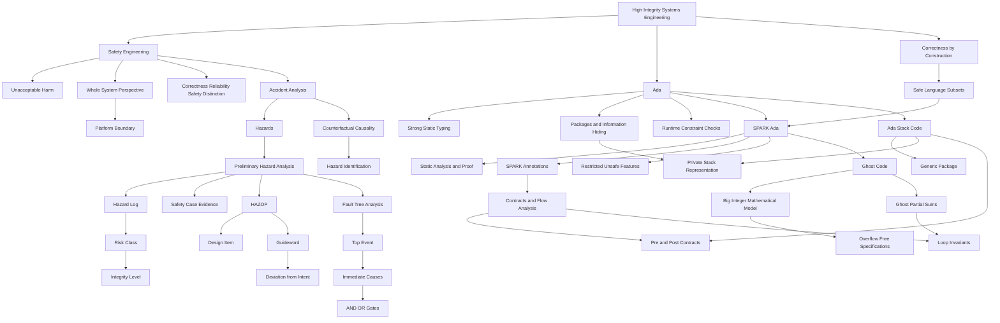

```mermaid
graph TD
    A[High Integrity Systems Engineering] --> B[Safety Engineering]
    B --> C[Unacceptable Harm]
    B --> D[Whole System Perspective]
    D --> Y[Platform Boundary]
    B --> Z[Correctness Reliability Safety Distinction]
    B --> AA[Accident Analysis]
    AA --> AB[Hazards]
    AB --> AC[Preliminary Hazard Analysis]
    AC --> AD[Hazard Log]
    AD --> AE[Risk Class]
    AE --> AF[Integrity Level]
    AC --> AG[Safety Case Evidence]
    AA --> AH[Counterfactual Causality]
    AH --> AI[Hazard Identification]
    AC --> AJ[HAZOP]
    AJ --> AK[Design Item]
    AJ --> AL[Guideword]
    AL --> AM[Deviation from Intent]
    AC --> AN[Fault Tree Analysis]
    AN --> AO[Top Event]
    AO --> AP[Immediate Causes]
    AP --> AQ[AND OR Gates]
    A --> E[Ada]
    E --> F[Strong Static Typing]
    E --> G[Packages and Information Hiding]
    E --> H[Runtime Constraint Checks]
    E --> I[SPARK Ada]
    I --> J[Static Analysis and Proof]
    A --> K[Correctness by Construction]
    K --> L[Safe Language Subsets]
    L --> I
    I --> M[SPARK Annotations]
    I --> N[Restricted Unsafe Features]
    M --> O[Contracts and Flow Analysis]
    E --> P[Ada Stack Code]
    P --> Q[Generic Package]
    P --> R[Private Stack Representation]
    P --> S[Pre and Post Contracts]
    G --> R
    O --> S
    I --> T[Ghost Code]
    T --> U[Big Integer Mathematical Model]
    T --> V[Ghost Partial Sums]
    U --> W[Overflow Free Specifications]
    V --> X[Loop Invariants]
    O --> X
```
