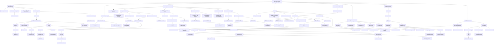

```mermaid
graph TD
    A[High Integrity Systems Engineering] --> B[Safety Engineering]
    B --> C[Unacceptable Harm]
    B --> D[Whole System Perspective]
    D --> Y[Platform Boundary]
    B --> Z[Correctness Reliability Safety Distinction]
    B --> AA[Accident Analysis]
    AA --> AB[Hazards]
    AB --> AC[Preliminary Hazard Analysis]
    AC --> AD[Hazard Log]
    AD --> AE[Risk Class]
    AE --> AF[Integrity Level]
    AC --> AG[Safety Case Evidence]
    AA --> AH[Counterfactual Causality]
    AH --> AI[Hazard Identification]
    AC --> AJ[HAZOP]
    AJ --> AK[Design Item]
    AJ --> AL[Guideword]
    AL --> AM[Deviation from Intent]
    AC --> AN[Fault Tree Analysis]
    AN --> AO[Top Event]
    AO --> AP[Immediate Causes]
    AP --> AQ[AND OR Gates]
    A --> BA[Security Engineering]
    BA --> BB[Security Properties]
    BB --> BC[Confidentiality Integrity Availability]
    BB --> BD[Authentication Non Repudiation Access Control]
    BA --> BE[Threat Modelling]
    BE --> BF[Trust Boundaries]
    BF --> BG[STRIDE]
    BG --> BH[Threat Enumeration]
    AJ --> BG
    BE --> BI[Attack Trees]
    AN --> BI
    BI --> BJ[Root Threat]
    BJ --> BK[Immediate Attack Paths]
    BK --> BL[Implicit OR Alternatives]
    A --> CA[Formal Model Based Specification]
    CA --> CB[Natural Language Ambiguity]
    CA --> CC[Logic and Set Theory]
    CC --> CD[Propositions and Connectives]
    CC --> CE[Sets and Set Operations]
    CC --> CF[Predicates and Quantifiers]
    CC --> CG[Relations as Sets of Tuples]
    CG --> CH[Functions as Relations]
    CG --> CI[Alloy Relation Operators]
    CA --> CJ[Alloy Counterexample Analysis]
    CA --> CK[State Machine Model]
    CK --> CL[Pre State Post State Transition]
    CL --> CM[Temporal Trace Operators]
    CK --> CN[Preconditions and Postconditions]
    CN --> CO[Operation Relation]
    CA --> CP[Alloy Model Structure]
    CP --> CQ[Signatures Facts Predicates Functions]
    CJ --> CR[Run Animation]
    CJ --> CS[Assertions and Check]
    CS --> CT[Bounded Counterexample Search]
    CT --> CU[Scope and Small Scope Hypothesis]
    CS --> CV[Invariant Preservation]
    CV --> CW[Frame Conditions]
    CV --> CX[Normal Exceptional Behaviour]
    CA --> CY[Trace Based Modelling]
    CY --> CZ[Transition Facts]
    CZ --> DA[Read Write Unchanged]
    CY --> DB[Boebert Capability Attack]
    DB --> DC[Capabilities as Data]
    DB --> DD[Bell LaPadula]
    DD --> DE[No Read Up]
    DD --> DF[No Write Down]
    A --> E[Ada]
    E --> F[Strong Static Typing]
    E --> G[Packages and Information Hiding]
    E --> H[Runtime Constraint Checks]
    E --> I[SPARK Ada]
    I --> J[Static Analysis and Proof]
    A --> K[Correctness by Construction]
    K --> L[Safe Language Subsets]
    L --> I
    I --> M[SPARK Annotations]
    I --> N[Restricted Unsafe Features]
    M --> O[Contracts and Flow Analysis]
    E --> P[Ada Stack Code]
    P --> Q[Generic Package]
    P --> R[Private Stack Representation]
    P --> S[Pre and Post Contracts]
    G --> R
    O --> S
    I --> T[Ghost Code]
    T --> U[Big Integer Mathematical Model]
    T --> V[Ghost Partial Sums]
    U --> W[Overflow Free Specifications]
    V --> X[Loop Invariants]
    O --> X
    A --> EA[Program Correctness Reasoning]
    EA --> EB[Hoare Triples]
    EB --> EC[Preconditions]
    EB --> ED[Program Statements]
    EB --> EE[Postconditions]
    EA --> EF[Assignment Axiom]
    EF --> EG[Weakest Preconditions]
    EA --> EH[Consequence Rule]
    EH --> EI[Strong Weak Predicate Reasoning]
    EA --> EJ[Sequencing Rule]
    EJ --> EK[Intermediate Assertions]
    EA --> EL[Conditional Rule]
    X --> EM[Loop Invariant Proof]
    EG --> EM
    A --> FA[Advanced Verification]
    FA --> FB[Pointers]
    FB --> FC[Heap State]
    FC --> FD[Aliasing]
    FD --> FE[Unsafe Aliasing]
    FE --> FF[SPARK Anti Aliasing Rule]
    FD --> FG[Separation Logic]
    FG --> FH[Points To Assertion]
    FG --> FI[Separating Conjunction]
    FI --> FJ[Non Aliasing Heap Facts]
    FG --> FK[Frame Rule]
    FK --> FL[Local Heap Reasoning]
    FG --> FM[Memory Safety]
    A --> GA[Fault Tolerant Design]
    GA --> GB[Fault Tolerance Boundary]
    GB --> GC[Finite Fault Model]
    GB --> GD[Specification Preservation]
    GC --> GE[Fault Error Failure]
    GC --> GF[Fault Classification]
    GF --> GG[Temporal Behaviour]
    GF --> GH[Byzantine Output]
    GF --> GI[Independent Correlated Failure]
    GA --> GJ[Redundancy]
    GJ --> GK[Hardware Redundancy]
    GK --> GL[Voting]
    GL --> GM[N Modular Redundancy]
    GJ --> GN[Software Redundancy]
    GN --> GO[Common Mode Failure]
    GJ --> GP[Information Redundancy]
    AJ --> GC
```
