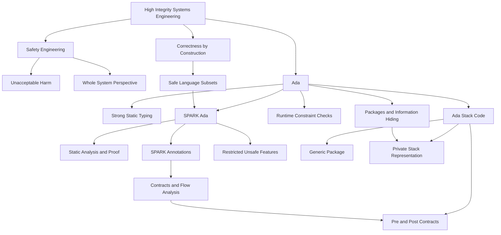

```mermaid
graph TD
    A[High Integrity Systems Engineering] --> B[Safety Engineering]
    B --> C[Unacceptable Harm]
    B --> D[Whole System Perspective]
    A --> E[Ada]
    E --> F[Strong Static Typing]
    E --> G[Packages and Information Hiding]
    E --> H[Runtime Constraint Checks]
    E --> I[SPARK Ada]
    I --> J[Static Analysis and Proof]
    A --> K[Correctness by Construction]
    K --> L[Safe Language Subsets]
    L --> I
    I --> M[SPARK Annotations]
    I --> N[Restricted Unsafe Features]
    M --> O[Contracts and Flow Analysis]
    E --> P[Ada Stack Code]
    P --> Q[Generic Package]
    P --> R[Private Stack Representation]
    P --> S[Pre and Post Contracts]
    G --> R
    O --> S
```
