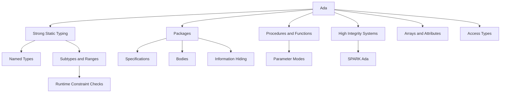

```mermaid
graph TD
    A[Ada] --> B[High Integrity Systems]
    A --> C[Strong Static Typing]
    C --> D[Named Types]
    C --> E[Subtypes and Ranges]
    E --> F[Runtime Constraint Checks]
    A --> G[Packages]
    G --> H[Specifications]
    G --> I[Bodies]
    G --> J[Information Hiding]
    A --> K[Procedures and Functions]
    K --> L[Parameter Modes]
    A --> M[Arrays and Attributes]
    A --> N[Access Types]
    B --> O[SPARK Ada]
```
