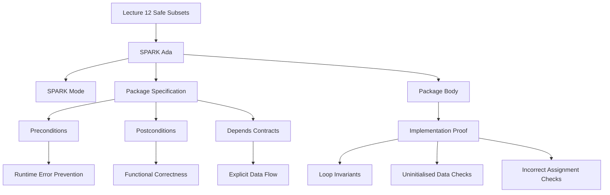

# Lecture 12 Code Practical Graph

```mermaid
graph TD
    A[Lecture 12 Safe Subsets] --> B[SPARK Ada]
    B --> C[SPARK Mode]
    B --> D[Package Specification]
    D --> E[Preconditions]
    D --> F[Postconditions]
    D --> G[Depends Contracts]
    E --> H[Runtime Error Prevention]
    F --> I[Functional Correctness]
    G --> J[Explicit Data Flow]
    B --> K[Package Body]
    K --> L[Implementation Proof]
    L --> M[Loop Invariants]
    L --> N[Uninitialised Data Checks]
    L --> O[Incorrect Assignment Checks]
```
