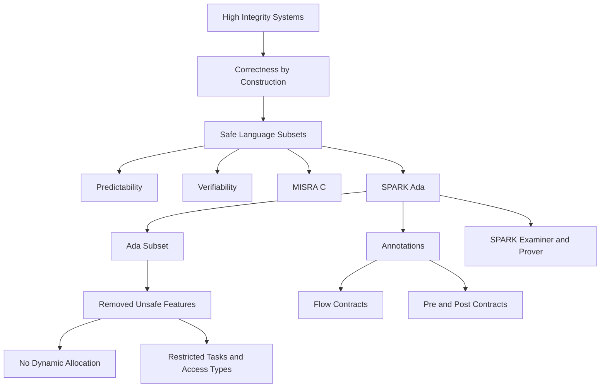

```mermaid
graph TD
    A[High Integrity Systems] --> B[Correctness by Construction]
    B --> C[Safe Language Subsets]
    C --> D[Predictability]
    C --> E[Verifiability]
    C --> F[MISRA C]
    C --> G[SPARK Ada]
    G --> H[Ada Subset]
    G --> I[Annotations]
    H --> J[Removed Unsafe Features]
    J --> K[No Dynamic Allocation]
    J --> L[Restricted Tasks and Access Types]
    I --> M[Flow Contracts]
    I --> N[Pre and Post Contracts]
    G --> O[SPARK Examiner and Prover]
```
