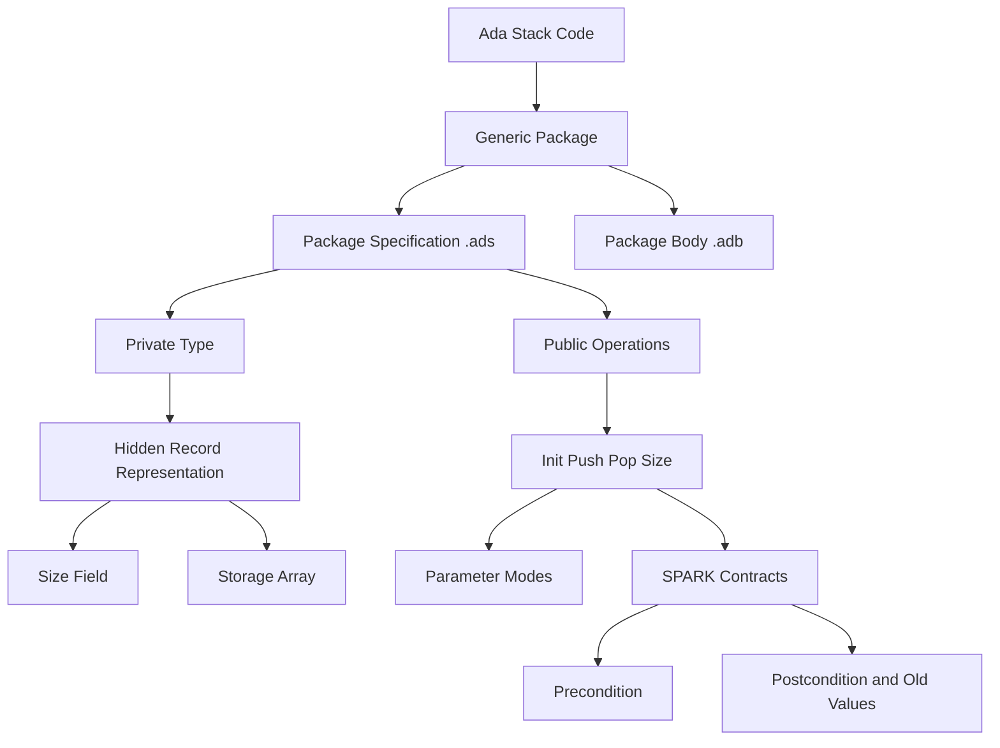

```mermaid
graph TD
    A[Ada Stack Code] --> B[Generic Package]
    B --> C[Package Specification .ads]
    B --> D[Package Body .adb]
    C --> E[Public Operations]
    C --> F[Private Type]
    F --> G[Hidden Record Representation]
    G --> H[Size Field]
    G --> I[Storage Array]
    E --> J[Init Push Pop Size]
    J --> K[Parameter Modes]
    J --> L[SPARK Contracts]
    L --> M[Precondition]
    L --> N[Postcondition and Old Values]
```
