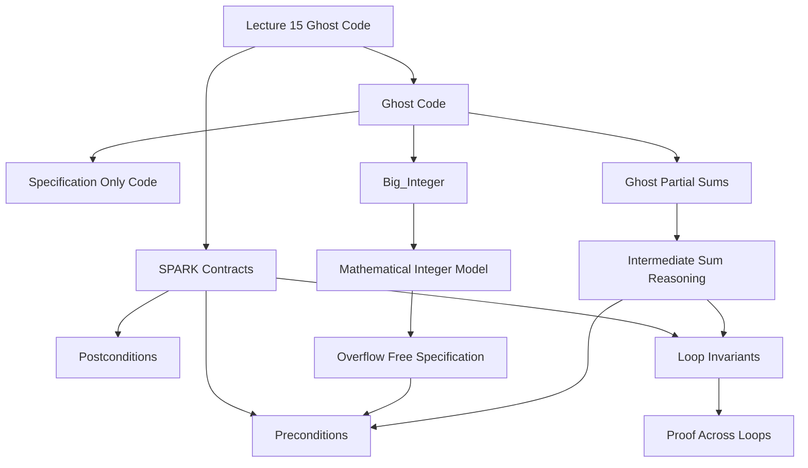

```mermaid
graph TD
    A[Lecture 15 Ghost Code] --> B[SPARK Contracts]
    B --> C[Preconditions]
    B --> D[Postconditions]
    B --> E[Loop Invariants]
    A --> F[Ghost Code]
    F --> G[Specification Only Code]
    F --> H[Big_Integer]
    F --> I[Ghost Partial Sums]
    H --> J[Mathematical Integer Model]
    J --> K[Overflow Free Specification]
    K --> C
    I --> L[Intermediate Sum Reasoning]
    L --> C
    L --> E
    E --> M[Proof Across Loops]
```
