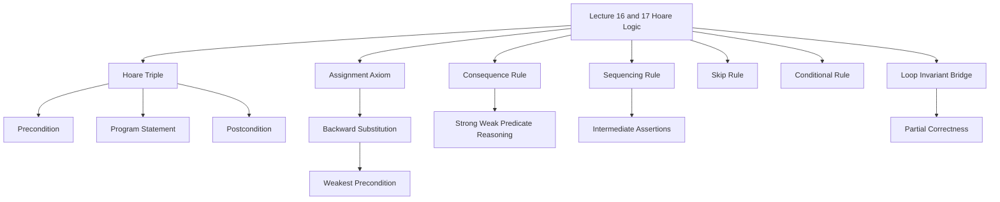

```mermaid
graph TD
    A[Lecture 16 and 17 Hoare Logic] --> B[Hoare Triple]
    B --> C[Precondition]
    B --> D[Program Statement]
    B --> E[Postcondition]
    A --> F[Assignment Axiom]
    F --> G[Backward Substitution]
    G --> H[Weakest Precondition]
    A --> I[Consequence Rule]
    I --> J[Strong Weak Predicate Reasoning]
    A --> K[Sequencing Rule]
    K --> L[Intermediate Assertions]
    A --> M[Skip Rule]
    A --> N[Conditional Rule]
    A --> O[Loop Invariant Bridge]
    O --> P[Partial Correctness]
```
