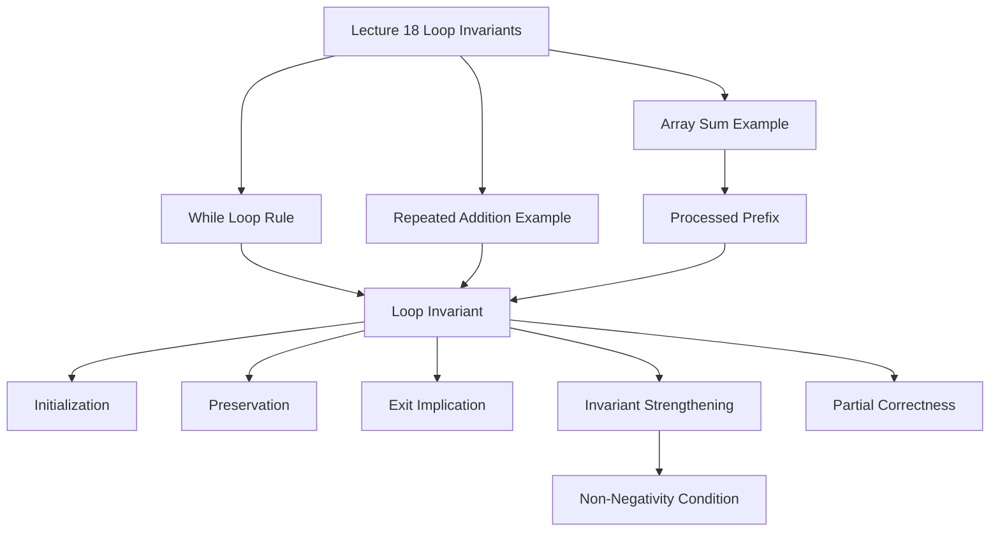

```mermaid
graph TD
    A[Lecture 18 Loop Invariants] --> B[While Loop Rule]
    B --> C[Loop Invariant]
    C --> D[Initialization]
    C --> E[Preservation]
    C --> F[Exit Implication]
    C --> G[Invariant Strengthening]
    G --> H[Non-Negativity Condition]
    A --> I[Repeated Addition Example]
    I --> C
    A --> J[Array Sum Example]
    J --> K[Processed Prefix]
    K --> C
    C --> L[Partial Correctness]
```
