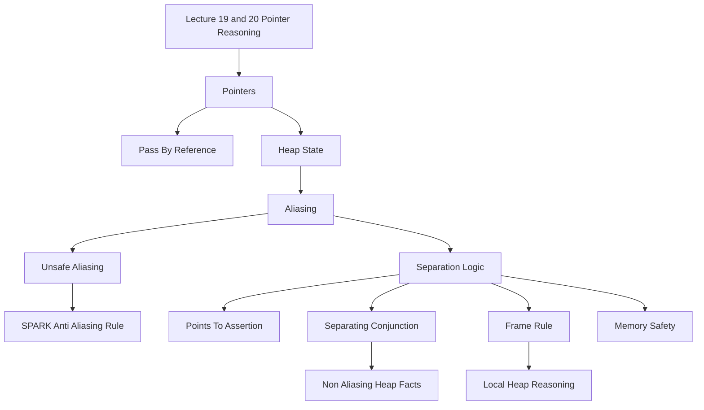

```mermaid
graph TD
    A[Lecture 19 and 20 Pointer Reasoning] --> B[Pointers]
    B --> C[Pass By Reference]
    B --> D[Heap State]
    D --> E[Aliasing]
    E --> F[Unsafe Aliasing]
    F --> G[SPARK Anti Aliasing Rule]
    E --> H[Separation Logic]
    H --> I[Points To Assertion]
    H --> J[Separating Conjunction]
    J --> K[Non Aliasing Heap Facts]
    H --> L[Frame Rule]
    L --> M[Local Heap Reasoning]
    H --> N[Memory Safety]
```
