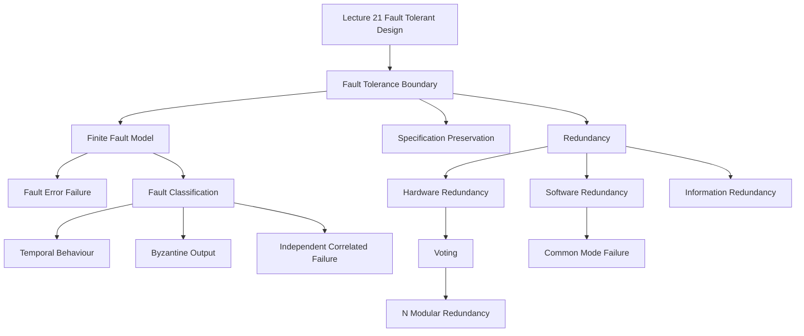

```mermaid
graph TD
    A[Lecture 21 Fault Tolerant Design] --> B[Fault Tolerance Boundary]
    B --> C[Finite Fault Model]
    B --> D[Specification Preservation]
    C --> E[Fault Error Failure]
    C --> F[Fault Classification]
    F --> G[Temporal Behaviour]
    F --> H[Byzantine Output]
    F --> I[Independent Correlated Failure]
    B --> J[Redundancy]
    J --> K[Hardware Redundancy]
    K --> L[Voting]
    L --> M[N Modular Redundancy]
    J --> N[Software Redundancy]
    N --> O[Common Mode Failure]
    J --> P[Information Redundancy]
```
