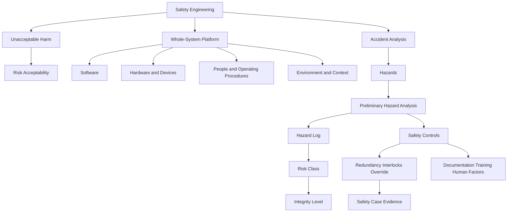

```mermaid
graph TD
    A[Safety Engineering] --> B[Unacceptable Harm]
    B --> C[Risk Acceptability]
    A --> D[Whole-System Platform]
    D --> E[Software]
    D --> F[Hardware and Devices]
    D --> G[People and Operating Procedures]
    D --> H[Environment and Context]
    A --> I[Accident Analysis]
    I --> J[Hazards]
    J --> K[Preliminary Hazard Analysis]
    K --> L[Hazard Log]
    L --> M[Risk Class]
    M --> N[Integrity Level]
    K --> O[Safety Controls]
    O --> P[Redundancy Interlocks Override]
    O --> Q[Documentation Training Human Factors]
    P --> R[Safety Case Evidence]
```
