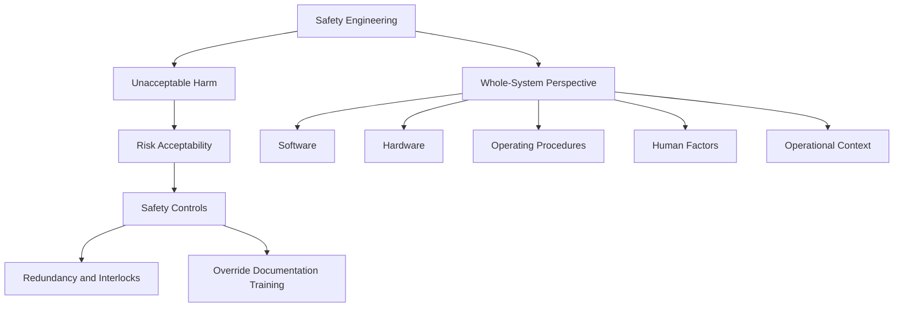

```mermaid
graph TD
    A[Safety Engineering] --> B[Unacceptable Harm]
    B --> C[Risk Acceptability]
    A --> D[Whole-System Perspective]
    D --> E[Software]
    D --> F[Hardware]
    D --> G[Operating Procedures]
    D --> H[Human Factors]
    D --> I[Operational Context]
    C --> J[Safety Controls]
    J --> K[Redundancy and Interlocks]
    J --> L[Override Documentation Training]
```
