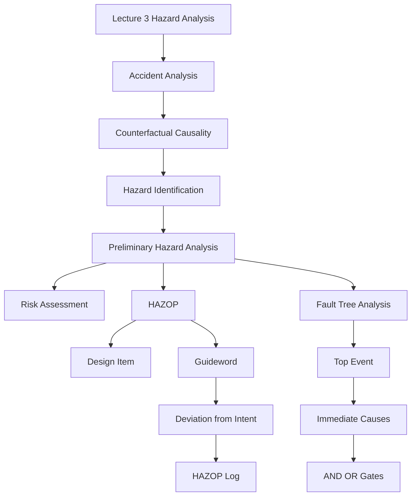

```mermaid
graph TD
    A[Lecture 3 Hazard Analysis] --> B[Accident Analysis]
    B --> C[Counterfactual Causality]
    C --> D[Hazard Identification]
    D --> E[Preliminary Hazard Analysis]
    E --> F[Risk Assessment]
    E --> G[HAZOP]
    G --> H[Design Item]
    G --> I[Guideword]
    I --> J[Deviation from Intent]
    J --> K[HAZOP Log]
    E --> L[Fault Tree Analysis]
    L --> M[Top Event]
    M --> N[Immediate Causes]
    N --> O[AND OR Gates]
```
