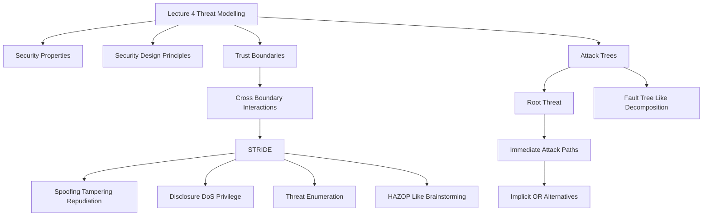

```mermaid
graph TD
    A[Lecture 4 Threat Modelling] --> B[Security Properties]
    A --> C[Security Design Principles]
    A --> D[Trust Boundaries]
    D --> E[Cross Boundary Interactions]
    E --> F[STRIDE]
    F --> G[Spoofing Tampering Repudiation]
    F --> H[Disclosure DoS Privilege]
    F --> I[Threat Enumeration]
    F --> J[HAZOP Like Brainstorming]
    A --> K[Attack Trees]
    K --> L[Root Threat]
    L --> M[Immediate Attack Paths]
    M --> N[Implicit OR Alternatives]
    K --> O[Fault Tree Like Decomposition]
```
