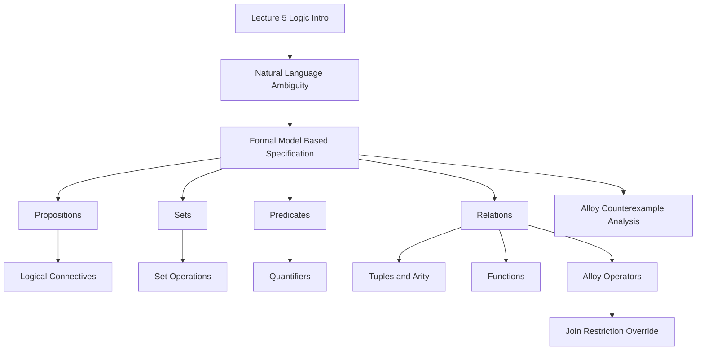

```mermaid
graph TD
    A[Lecture 5 Logic Intro] --> B[Natural Language Ambiguity]
    B --> C[Formal Model Based Specification]
    C --> D[Propositions]
    D --> E[Logical Connectives]
    C --> F[Sets]
    F --> G[Set Operations]
    C --> H[Predicates]
    H --> I[Quantifiers]
    C --> J[Relations]
    J --> K[Tuples and Arity]
    J --> L[Functions]
    J --> M[Alloy Operators]
    M --> N[Join Restriction Override]
    C --> O[Alloy Counterexample Analysis]
```
