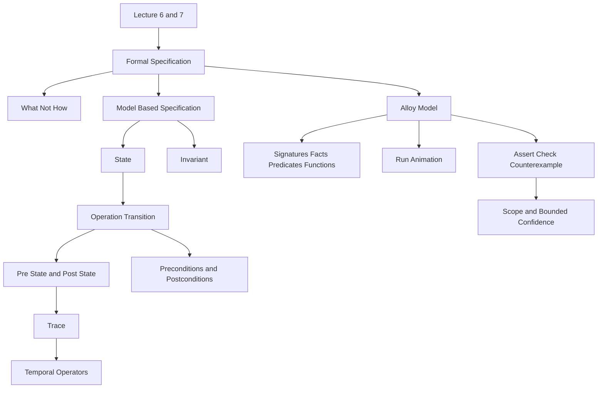

```mermaid
graph TD
    A[Lecture 6 and 7] --> B[Formal Specification]
    B --> C[What Not How]
    B --> D[Model Based Specification]
    D --> E[State]
    E --> F[Operation Transition]
    F --> G[Pre State and Post State]
    G --> H[Trace]
    H --> I[Temporal Operators]
    F --> J[Preconditions and Postconditions]
    D --> K[Invariant]
    B --> L[Alloy Model]
    L --> M[Signatures Facts Predicates Functions]
    L --> N[Run Animation]
    L --> O[Assert Check Counterexample]
    O --> P[Scope and Bounded Confidence]
```
