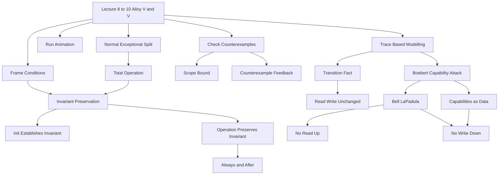

```mermaid
graph TD
    A[Lecture 8 to 10 Alloy V and V] --> B[Frame Conditions]
    A --> C[Normal Exceptional Split]
    C --> D[Total Operation]
    B --> E[Invariant Preservation]
    D --> E
    E --> F[Init Establishes Invariant]
    E --> G[Operation Preserves Invariant]
    G --> H[Always and After]
    A --> I[Run Animation]
    A --> J[Check Counterexamples]
    J --> K[Scope Bound]
    J --> L[Counterexample Feedback]
    A --> M[Trace Based Modelling]
    M --> N[Transition Fact]
    N --> O[Read Write Unchanged]
    M --> P[Boebert Capability Attack]
    P --> Q[Capabilities as Data]
    P --> R[Bell LaPadula]
    R --> S[No Read Up]
    R --> T[No Write Down]
    Q --> T
```
