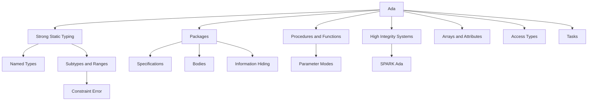

### 1. Topic Overview

- What is this about?
  Lecture 10-11 introduces Ada as a programming language designed for large, long-lived, high-integrity systems.
- Why does it matter?
  Ada's design makes many programming mistakes easier to detect early, either at compile time or through well-defined runtime checks. This is why it is a useful foundation before learning SPARK Ada.
- Difficulty level:
  Beginner to intermediate. The syntax is not the hard part; the key is understanding why Ada deliberately restricts or exposes things that other languages hide.
- Prerequisites:
  Basic programming concepts: variables, types, functions/procedures, modules, arrays, records, and compile-time vs runtime errors.
- Primary course-notes.pdf reference:
  Chapter 4, "Introduction to Ada", pp. 79-99.
- Most relevant course-notes.pdf subsections:
  - Section 4.1, p. 79: Ada history and high-integrity context.
  - Section 4.2, p. 80: Ada for programming in the large.
  - Section 4.3, pp. 80-81: Hello World and compilation units.
  - Section 4.4, pp. 82-83: Specifications and program bodies.
  - Section 4.6, pp. 84-87: Ada type system, arrays, and new types.
  - Section 4.8, pp. 91-92: Procedures, functions, and parameter modes.
  - Section 4.9, pp. 92-95: Access types and passing by reference.
  - Section 4.11, pp. 96-99: Concurrency with tasks.
- Lecture slide reference:
  `materials/Lecture10-11-Ada.pdf`, slides 4-31.

### 2. Core Concepts

#### Concept 1: Why Ada Exists
- Definition:
  Ada is a structured, imperative language designed for safe, modular, portable programming, especially for embedded and high-integrity systems.
- Intuition:
  Ada optimizes for code that can be read, checked, maintained, and trusted over many years.
- Example:
  A flight-control system is maintained for decades. Readability, precise types, and clear module boundaries matter more than saving a few characters of code.
- Common mistakes:
  Thinking Ada is only "old syntax" rather than a language designed around safety and maintainability.
- Reference:
  `course-notes.pdf` Chapter 4 introduction and Sections 4.1-4.2, pp. 79-80.

#### Concept 2: Strong, Static, Safe Typing
- Definition:
  Ada checks types at compile time and treats separately named types as incompatible, even if their values look similar.
- Intuition:
  If two values mean different real-world things, Ada lets you make them different types so accidental mixing is caught early.
- Example:
  `Day_Type` and `Month_Type` can both hold small integers, but assigning a day value to a month variable is illegal if they are distinct Ada types.
- Common mistakes:
  Assuming two types are compatible because they have the same range or representation.
- Reference:
  `course-notes.pdf` Section 4.6 and 4.6.3, pp. 84-87; lecture slides 5 and 17-21.

#### Concept 3: Runtime Checks and Constraint_Error
- Definition:
  Ada defines runtime checks for errors such as integer overflow, array bounds errors, and range violations.
- Intuition:
  Instead of silently continuing with a bad value, Ada can stop at the point where the program violates a safety condition.
- Example:
  Converting a value `20` into a type whose range is `0 .. 10` raises `Constraint_Error`.
- Common mistakes:
  Treating runtime checks as a replacement for good design. They are a safety net, not the whole safety argument.
- Reference:
  `course-notes.pdf` Sections 4.6.2-4.6.3, pp. 86-87; lecture slides 7, 11, 19, and 21.

#### Concept 4: Packages, Specifications, and Bodies
- Definition:
  An Ada package separates the public interface, usually in `.ads`, from the implementation body, usually in `.adb`.
- Intuition:
  The specification says what clients may use; the body says how it is implemented.
- Example:
  `greetings.ads` declares `Hello`; `greetings.adb` implements what `Hello` does.
- Common mistakes:
  Confusing `with` and `use`, or thinking every package is directly executable.
- Reference:
  `course-notes.pdf` Section 4.4, pp. 82-83; lecture slides 6 and 15-16.

#### Concept 5: Information Hiding and Private Types
- Definition:
  Ada can expose a type name while hiding its record fields from client code using `private`.
- Intuition:
  Client code can use a `Vector`, but cannot depend on its internal representation.
- Example:
  A `Vector` package can provide `Set`, `Print`, and `Normalise` while keeping fields `X`, `Y`, and `Z` hidden.
- Common mistakes:
  Thinking private means the compiler knows nothing about the type. The compiler still needs enough information to know its size.
- Reference:
  `course-notes.pdf` Section 4.4 and related package discussion, pp. 82-83; lecture slides 26-28.

#### Concept 6: Procedures, Functions, and Parameter Modes
- Definition:
  Procedures are statements that return no value; functions return values and can appear in expressions. Parameters can be `in`, `out`, `in out`, or `access`.
- Intuition:
  Parameter modes make data flow explicit: read-only, write-only, read-write, or reference-like.
- Example:
  `procedure Normalise(V : in out Vector)` tells the reader and compiler that `V` is both read and modified.
- Common mistakes:
  Ignoring parameter modes and mentally treating all parameters like ordinary mutable variables.
- Reference:
  `course-notes.pdf` Sections 4.8.1-4.8.2, pp. 91-92; lecture slides 23-25.

#### Concept 7: Arrays, Ranges, and Attributes
- Definition:
  Ada arrays can be indexed by ranges or discrete types, and attributes such as `'First`, `'Last`, `'Length`, and `'Range` describe their bounds.
- Intuition:
  Ada wants code to follow the array's own declared shape instead of assuming indexes always start at 0 or 1.
- Example:
  An array declared over `Integer range 5 .. 10` has length 6, first index 5, and last index 10.
- Common mistakes:
  Assuming `'Last` equals length, or that all strings start at index 0.
- Reference:
  `course-notes.pdf` Section 4.6.2, pp. 86-87; lecture slide 22.

#### Concept 8: Access Types
- Definition:
  Ada access types are pointer-like references used to pass or refer to data by address.
- Intuition:
  They avoid copying large data structures but make aliasing and modification behavior more delicate.
- Example:
  Passing `R'Access` lets a procedure modify the same record `R` immediately, rather than a copied value.
- Common mistakes:
  Forgetting that the variable must be marked `aliased` before taking its access value.
- Reference:
  `course-notes.pdf` Section 4.9, pp. 92-95.

#### Concept 9: Tasks and Concurrency
- Definition:
  Ada tasks are built-in concurrent units, similar in purpose to threads.
- Intuition:
  Many embedded systems must handle multiple activities at once, so concurrency is part of Ada's language design.
- Example:
  A housekeeping program may have one task checking CPU status and another task backing up disk state.
- Common mistakes:
  Thinking tasks are called like procedures. They start when created and interact through entries/rendezvous.
- Reference:
  `course-notes.pdf` Section 4.11, pp. 96-99.

#### Concept 10: Ada as the Basis for SPARK
- Definition:
  SPARK is a safer, analyzable subset of Ada with annotations for formal checking.
- Intuition:
  Ada already removes many unsafe habits; SPARK tightens the rules further so tools can prove stronger properties.
- Example:
  Ada allows functions with side effects; SPARK disallows this because proof is easier when functions behave like mathematical functions.
- Common mistakes:
  Treating SPARK as a different compiler instead of a verified subset/tooling layer over Ada.
- Reference:
  `course-notes.pdf` Chapter 5 start, pp. 101-105; lecture slides 13 and 23.

### 3. Deep Understanding

Ada's design is connected to high-integrity engineering in four ways:

1. Early detection:
   The type system catches many mismatches at compile time.

2. Defined failure behavior:
   Runtime checks raise defined exceptions instead of silently producing undefined or misleading results.

3. Modularity:
   Specifications and bodies separate interface from implementation, making large-team development and review easier.

4. Verifiability:
   Ada's structure prepares the way for SPARK, where a restricted subset plus annotations supports stronger static analysis and formal proof.

The most important mental model is this:

```text
Ada is not trying to make quick scripts short.
Ada is trying to make long-lived critical programs explicit, checkable, and maintainable.
```

### 4. Minimal Working Example

```ada
procedure Type_Example is
   type Day_Type is range 1 .. 31;
   type Month_Type is range 1 .. 12;

   Day   : Day_Type := 8;
   Month : Month_Type := 8;
begin
   -- Month := Day;  -- illegal: different named types
   Month := Month_Type(Day); -- explicit conversion, checked against range
end Type_Example;
```

Execution flow:

1. `Day_Type` and `Month_Type` are separate named types.
2. Both can hold the numeric value `8`.
3. Ada still rejects direct assignment because a day is not automatically a month.
4. An explicit conversion says: "I know I am crossing a type boundary."
5. The conversion is checked against the target range.

Why this matters:

In a high-integrity system, accidentally using altitude where speed is expected, or day where month is expected, can become a safety fault. Ada lets the programmer encode those distinctions in the type system.

### 5. Knowledge Graph



### 6. Self-Test Questions

- Recall (1): Why was Ada designed for large, high-integrity systems rather than quick scripting?
- Recall (2): What is the difference between a package specification and a package body?
- Recall (3): What does Ada's name equivalence rule mean for two types with the same range?
- Application (1): If `type Speed is range 0 .. 300;` and `type Altitude is range 0 .. 50000;`, why should Ada reject `Speed_Value := Altitude_Value;`?
- Application (2): An array has range `5 .. 10`. What are its `'First`, `'Last`, and `'Length`?
- Explain like I am 5: Why is Ada happier when you give two different ideas two different type names?

### 7. Weak Point Detection

- Learners often confuse a new type with a subtype.
- Learners often think runtime checks mean compile-time proof.
- Learners often miss why verbosity and explicitness are safety features.
- Learners often confuse package specification (`.ads`) with package body (`.adb`).
- Learners often assume arrays start at 0 or 1, which is not generally true in Ada.
- Learners often confuse `in out` parameters with access types.
