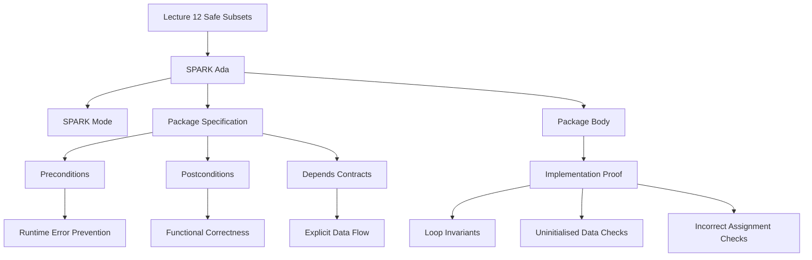

# Lecture 12 Code Practical Notes

## 1. Topic Overview

- What is this about?
  This note connects Lecture 12's safe-language-subset idea to the Ada/SPARK code examples in `materials/Lec12code`.
- Why does it matter?
  The slides explain why SPARK removes hard-to-verify features. The code shows the practical result: contracts, data-flow annotations, loop invariants, and static checks make program behavior easier to reason about before testing.
- Difficulty level:
  Beginner to intermediate.
- Prerequisites:
  Ada packages, package specifications versus bodies, parameter modes, subtypes, arrays, and the basic SPARK idea: safe Ada subset plus annotations.

## 2. Core Concepts

### Concept 1: Package Specification as a Contract Surface

- Definition:
  A package specification (`.ads`) tells callers what operations exist and what each operation promises.
- Intuition:
  The `.ads` file is the public rulebook. The `.adb` file must implement those rules.
- Example:
  `Swap_Add_Max.ads` says `Swap` must finish with `X = Y'Old` and `Y = X'Old`.
- Common mistakes:
  Reading only the body and missing the promised behavior in the specification.

### Concept 2: Postconditions

- Definition:
  A `Post` condition says what must be true after a subprogram finishes.
- Intuition:
  It is a checkable promise about the output.
- Example:
  `Swap` has `Post => (X = Y'Old and Y = X'Old)`, meaning the final values must be exchanged.
- Common mistakes:
  Forgetting that `'Old` means the value at the start of the call.

### Concept 3: Preconditions

- Definition:
  A `Pre` condition says what must be true before a subprogram is allowed to run.
- Intuition:
  It protects the code from unsafe inputs that would make proof or execution fail.
- Example:
  `Add` requires inputs that do not overflow `Integer`.
- Common mistakes:
  Treating `Pre` as an implementation detail instead of a caller responsibility.

### Concept 4: Runtime Error Prevention

- Definition:
  SPARK proof tries to show that operations cannot trigger errors such as overflow, division by zero, invalid array access, or uninitialised reads.
- Intuition:
  The code may compile, but the prover asks a stronger question: can this ever fail at runtime?
- Example:
  `Divide` currently lacks the precondition `Y /= 0`, so division by zero is possible.
- Common mistakes:
  Assuming compiling means safe.

### Concept 5: Loop Invariants

- Definition:
  A loop invariant is a statement that remains true each time the loop repeats.
- Intuition:
  It explains what progress the loop has already made.
- Example:
  In `Linear_Search.adb`, the invariant says every checked element so far is not the target.
- Common mistakes:
  Thinking the invariant is only a comment. In SPARK, it is a proof aid.

### Concept 6: Depends Contracts

- Definition:
  A `Depends` contract states which outputs may depend on which inputs.
- Intuition:
  It makes data flow explicit for the analysis tool.
- Example:
  `Swapping.ads` says final `X` depends on old `Y`, and final `Y` depends on old `X`.
- Common mistakes:
  Thinking `Depends` proves the exact value. It mainly describes allowed information flow.

### Concept 7: Static Detection of Suspicious Code

- Definition:
  SPARK tools can find problems before execution, such as uninitialised data, unused assignments, incorrect dependencies, and possible runtime errors.
- Intuition:
  The tools compare code behavior against SPARK restrictions and annotations.
- Example:
  In `Swapping.adb`, the body assigns `Y := X` after `X := Y`, so both outputs become the old value of `Y`. This violates the intended swap behavior.
- Common mistakes:
  Looking only for syntax errors instead of semantic/data-flow errors.

## 3. Deep Understanding

The Lecture 12 code turns the slide slogan into practice:

```text
Safe subset + annotations -> code that tools can reason about.
```

The most important habit is to read SPARK code in two passes:

1. Read the `.ads` file first: what does the operation promise?
2. Read the `.adb` file second: does the implementation really satisfy that promise?

This mirrors high-integrity development. We do not only ask "does it run?" We ask:

- What inputs are allowed?
- What outputs are promised?
- Which data can influence which other data?
- Can the tool prove no runtime error is possible?

## 4. Minimal Working Example

```ada
procedure Swap (X, Y : in out Integer)
  with Post => (X = Y'Old and Y = X'Old);
```

Reasoning flow:

1. `X` and `Y` are `in out`, so the procedure can read and change both values.
2. `Y'Old` means the value of `Y` before the procedure started.
3. `X = Y'Old` says final `X` must equal the original `Y`.
4. `Y = X'Old` says final `Y` must equal the original `X`.
5. The body must use a temporary variable or another correct method to avoid losing one value.

## 5. Knowledge Graph



## 6. Self-Test Questions

- Recall (1): What does a `Post` condition describe?
- Recall (2): What does `'Old` mean in a SPARK contract?
- Recall (3): Why should you read the `.ads` file before the `.adb` file?
- Application (1): Why does `Divide` need a precondition before it can be proved safe?
- Application (2): Why is `Y := X` suspicious after the code already ran `X := Y` in a swap?
- Explain like I am 5:
  Why does SPARK ask the programmer to write promises about the code?

## 7. Weak Point Detection

- Learners often read the implementation first and ignore the contract in the specification.
- Learners often forget that `'Old` refers to the value before the call.
- Learners often confuse a precondition, which is a caller responsibility, with a postcondition, which is an implementation promise.
- Learners often think `Depends` gives exact values, when it mainly gives allowed data flow.
- Learners often miss that a program can compile but still fail a SPARK proof because of possible runtime errors or broken contracts.
