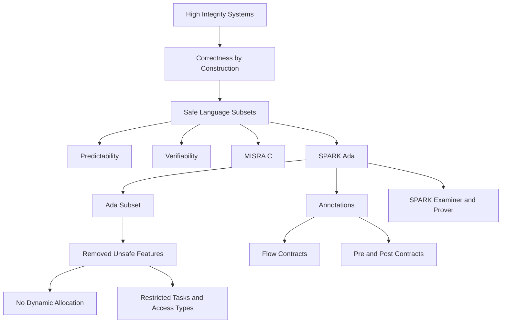

### 1. Topic Overview

- What is this about?
  Lecture 12 explains why high-integrity software often uses a safe subset of a programming language, then introduces SPARK Ada as a safe subset of Ada with extra annotations for static checking and proof.
- Why does it matter?
  High-integrity programs need to be predictable and verifiable. Safe subsets deliberately remove language features that make programs hard to reason about, even if those features are convenient for programmers.
- Difficulty level:
  Beginner to intermediate. The main difficulty is not syntax; it is understanding why restrictions improve verification.
- Prerequisites:
  Ada basics from Lecture 10-11: strong typing, packages, private types, parameter modes, access types, aliasing, tasks, and runtime checks.
- Primary course-notes.pdf reference:
  Chapter 5, "Safe programming language subsets", pp. 101-111.
- Supporting course-notes.pdf reference:
  Chapter 6, "Design by contract", especially Section 6.3, pp. 118-119, for SPARK `Pre` and `Post` contracts.
- Lecture slide reference:
  `materials/Lecture12-SafeLanguageSubsetsAndSPARKAda.pdf`, slides 2-14.

### 2. Core Concepts

#### Concept 1: Safe Programming Language Subset

- Definition:
  A safe programming language subset is a restricted version of a language that forbids unsafe or hard-to-verify features.
- Intuition:
  Instead of trusting programmers to avoid every dangerous feature, the language subset removes many of those features from the allowed toolbox.
- Example:
  MISRA C restricts C for safety-critical systems. SPARK restricts Ada for high-integrity systems.
- Common mistakes:
  Thinking a safe subset means the program can never crash. The better idea is predictability and verifiability.
- Reference:
  `course-notes.pdf` Section 5.2, pp. 102-104; lecture slides 4-6.

#### Concept 2: Correctness by Construction

- Definition:
  Correctness by construction is the idea of building software so that many errors are prevented or detected early, before testing becomes the main safety net.
- Intuition:
  The goal is to make the design and code simple enough that verification is easier and cheaper.
- Example:
  Spending extra time to write explicit, analyzable code can reduce later testing and certification effort.
- Common mistakes:
  Treating testing as the only way to find faults. In high-integrity systems, testing is important but not enough.
- Reference:
  `course-notes.pdf` Section 5.1, pp. 101-102; lecture slide 10.

#### Concept 3: Why Safe Subsets Help

- Definition:
  Safe subsets trade programmer convenience for simpler analysis, testing, and certification.
- Intuition:
  A feature like recursion or dynamic memory allocation may be useful, but it makes questions such as "how much memory can this program need?" much harder.
- Example:
  If a language forbids dynamic memory allocation, the maximum memory requirement can be calculated more easily at design time.
- Common mistakes:
  Saying only "it catches mistakes." The stronger answer is that it makes program behavior easier for both humans and tools to reason about.
- Reference:
  `course-notes.pdf` Sections 5.2 and 5.3.3, pp. 102-107; lecture slide 6.

#### Concept 4: SPARK Ada

- Definition:
  SPARK is a safe subset of Ada plus annotations for static checking.
- Intuition:
  Ada is already designed to be explicit and safe compared with languages like C. SPARK tightens Ada further so proof and static analysis tools can reason about the program.
- Example:
  A SPARK package can use `SPARK_Mode => On` to tell the toolchain that the package should satisfy SPARK rules.
- Common mistakes:
  Thinking SPARK is a separate compiler. The course notes describe it as standard Ada code checked by SPARK tools, then compiled by an Ada compiler.
- Reference:
  `course-notes.pdf` Section 5.3.1, pp. 104-105; lecture slide 11.

#### Concept 5: Features Removed or Restricted by SPARK

- Definition:
  SPARK removes or restricts Ada features that make verification difficult.
- Key examples:
  Dynamic memory allocation, unrestricted tasks, goto, unrestricted access types and aliasing, side-effectful expressions/functions, exception handling, generics, and recursion.
- Intuition:
  Each removed feature either complicates control flow, memory reasoning, data flow, or proof.
- Example:
  Tasks are restricted because concurrent shared state is much harder to verify than sequential state.
- Common mistakes:
  Memorising the list without understanding the reason for each restriction.
- Reference:
  `course-notes.pdf` Section 5.3.2, pp. 105-107; lecture slide 11.

#### Concept 6: SPARK Annotations

- Definition:
  SPARK annotations are formal statements about intended program behavior and data flow.
- Intuition:
  They add a second description of the program: the code says what happens, and the annotations say what should happen. Tools can compare them.
- Example:
  Older SPARK used annotations such as `global` and `derives` for information flow. Later contract annotations include `Pre` and `Post`.
- Common mistakes:
  Treating annotations as ordinary comments. They are formal and tool-checkable.
- Reference:
  `course-notes.pdf` Sections 5.4.1 and 6.3, pp. 108-109 and pp. 118-119; lecture slides 12-14.

#### Concept 7: SPARK Examiner and SPARK Prover

- Definition:
  The SPARK Examiner checks that code conforms to SPARK restrictions and annotations. The SPARK Prover checks deeper properties, including possible runtime errors and functional contracts.
- Intuition:
  Examiner is about valid SPARK and consistency checks; Prover is about proving stronger correctness properties.
- Example:
  In a broken `Swap`, SPARK tools can detect that a temporary variable is assigned but not actually used to derive the final output.
- Common mistakes:
  Assuming the tools only compile code. They perform static reasoning before ordinary compilation.
- Reference:
  `course-notes.pdf` Section 5.4.2, pp. 109-110; lecture slides 12-13.

### 3. Deep Understanding

Lecture 12 continues the logic from Ada:

1. Ada makes programs explicit and safer than many older systems languages.
2. SPARK removes the Ada features that still make reasoning difficult.
3. SPARK adds annotations so tools can check that code, data flow, and contracts agree.
4. The payoff is not shorter code. The payoff is simpler verification, better certification evidence, and fewer fault classes reaching testing.

The key tradeoff is:

```text
More restrictions while coding -> simpler reasoning during verification.
```

This matters because verification and certification usually cost much more than writing the code in high-integrity systems.

### 4. Minimal Working Example

```ada
package Safe_Counter with
   SPARK_Mode => On
is
   subtype Count is Integer range 0 .. 100;

   procedure Increment (X : in out Count)
     with
       Pre  => X < Count'Last,
       Post => X = X'Old + 1;
end Safe_Counter;
```

Execution and reasoning flow:

1. `SPARK_Mode => On` asks SPARK tools to check this package as SPARK code.
2. `Count` restricts the allowed integer range.
3. `Pre => X < Count'Last` says the caller must not call `Increment` when `X` is already 100.
4. `Post => X = X'Old + 1` says the procedure must increase `X` by exactly one.
5. A prover can reason about whether the implementation satisfies the contract and avoids range errors.

### 5. Knowledge Graph



### 6. Self-Test Questions

- Recall (1): What is a safe programming language subset?
- Recall (2): Why does SPARK remove dynamic memory allocation?
- Recall (3): What does `SPARK_Mode => On` tell the tools?
- Application (1): Why are tasks harder to verify than sequential code?
- Application (2): In a broken swap procedure, why might an unused temporary variable be a useful warning?
- Explain like I am 5:
  Why does SPARK make the programmer follow stricter rules?

### 7. Weak Point Detection

- Learners often say safe subsets "make code safer" without explaining predictability and verifiability.
- Learners often memorise the list of forbidden features without linking each one to why proof becomes harder.
- Learners often confuse SPARK annotations with ordinary comments.
- Learners often confuse SPARK Examiner and SPARK Prover.
- Learners often think SPARK replaces Ada, rather than treating SPARK as checked Ada plus annotations.
