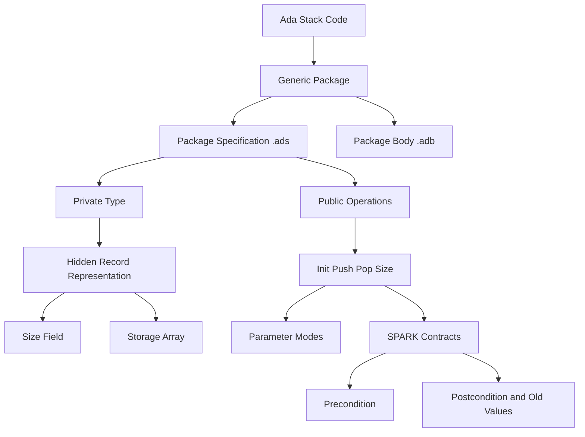

### 1. Topic Overview

- What is this about?
  Lecture 13-14 code demonstrates a bounded stack written as an Ada package with SPARK contracts.
- Why does it matter?
  The code connects Ada syntax to high-integrity design: clear interfaces, hidden representation, explicit data flow, fixed-size storage, and checkable pre/postconditions.
- Difficulty level:
  Beginner to intermediate. The main task is learning to read the package specification before the package body.
- Prerequisites:
  Ada packages, private types, records, arrays, parameter modes, and SPARK `Pre`/`Post` contracts.
- Primary code reference:
  `materials/lecture13-14-code/src/simplestack.ads`, `simplestack.adb`, and `main.adb`.
- Primary course-notes.pdf references:
  - Chapter 4, "Introduction to Ada", pp. 79-99.
  - Section 4.4, pp. 82-83: specifications and program bodies.
  - Section 4.6.2, pp. 86-87: arrays and attributes.
  - Section 4.6.3, p. 87: records and new types.
  - Section 4.8, pp. 91-92: procedures, functions, and parameter modes.
  - Section 5.3, pp. 104-107: SPARK as a safe Ada subset.
  - Section 6.3, pp. 118-119: SPARK `Pre`, `Post`, and `'Old`.

### 2. Core Concepts

#### Concept 1: Package Specification as Public Interface

- Definition:
  The `.ads` file tells outside code what the package provides.
- Intuition:
  A client can see `Init`, `Push`, `Pop`, and `Size`, but not directly change the stack fields.
- Example:
  `type SimpleStack is private;` exposes the type name while hiding its record fields from clients.
- Common mistake:
  Starting from the body before understanding the public contract.

#### Concept 2: Package Body as Implementation

- Definition:
  The `.adb` file contains the code that implements the operations promised in the specification.
- Intuition:
  The body changes `S.size` and `S.storage`; clients should call operations instead of editing fields directly.
- Example:
  `Push` increments `S.size`, then stores the item at the new top index.
- Common mistake:
  Thinking `Push` returns a new stack. It modifies `S` because the parameter mode is `in out`.

#### Concept 3: Generic Stack

- Definition:
  The package is generic because it is parameterised by `Max_Size`, `Item`, and `Default_Item`.
- Intuition:
  The same stack template can become a stack of integers, characters, or another private item type.
- Example:
  `package SS is new SimpleStack(100, Integer, 0);` creates an integer stack with capacity 100.
- Common mistake:
  Forgetting that this instantiation creates a concrete package `SS`.

#### Concept 4: Private Representation

- Definition:
  The stack is represented internally as a record with `size` and `storage`, but clients cannot access those fields directly.
- Intuition:
  The package protects the stack invariant: the visible stack size should match the valid part of the storage array.
- Example:
  `storage : StorageArray;` is hidden in the private part of the specification.
- Common mistake:
  Thinking `private` hides the implementation from the compiler. It hides it from client code.

#### Concept 5: SPARK Contracts

- Definition:
  `Pre` states what must be true before a call; `Post` states what must be true after a call.
- Intuition:
  Contracts turn comments like "do not push when full" into formal, checkable conditions.
- Example:
  `Push` has `Pre => Size(S) /= Max_Size` and `Post => Size(S) = Size(S'Old) + 1`.
- Common mistake:
  Reading `S'Old` as a different variable. It means the old value of `S` before the procedure call.

### 3. Deep Understanding

This example is a small Abstract Data Type:

1. The package specification defines the client-facing operations.
2. The private part defines the hidden representation.
3. The package body implements the representation changes.
4. The main program instantiates the generic package and uses only its public operations.
5. SPARK contracts describe legal calls and expected effects.

The high-integrity idea is that clients do not manipulate the representation directly. They must use operations with explicit modes and contracts.

### 4. Minimal Working Example

```ada
package SS is new SimpleStack(100, Integer, 0);

S : SS.SimpleStack;
I : Integer;
J : Integer;
begin
   SS.Init(S);
   SS.Push(S, 5);
   SS.Push(S, 6);
   SS.Pop(S, I);
   SS.Pop(S, J);
end;
```

Execution flow:

1. `SS.Init(S)` sets the stack size to `0`.
2. `SS.Push(S, 5)` changes size to `1` and stores `5`.
3. `SS.Push(S, 6)` changes size to `2` and stores `6`.
4. `SS.Pop(S, I)` reads the top value `6`, puts it into `I`, then reduces size to `1`.
5. `SS.Pop(S, J)` reads the next value `5`, puts it into `J`, then reduces size to `0`.

### 5. Knowledge Graph



### 6. Self-Test Questions

- Recall (1): What is the role of `simplestack.ads`?
- Recall (2): What is the role of `simplestack.adb`?
- Recall (3): What does `package SS is new SimpleStack(100, Integer, 0);` create?
- Application (1): After pushing `5` then `6`, which value is popped first?
- Application (2): Why does `Push` need `S : in out SimpleStack`?
- Explain like I am 5:
  Why should outside code use `Push` and `Pop` instead of changing the array directly?

### 7. Weak Point Detection

- Learners often confuse the public type name with its private internal record.
- Learners often read `generic` as inheritance; here it means package parameterisation.
- Learners often forget that `in out` means the actual stack object is changed.
- Learners often understand `Pre` and `Post` as comments, not formal contracts.
