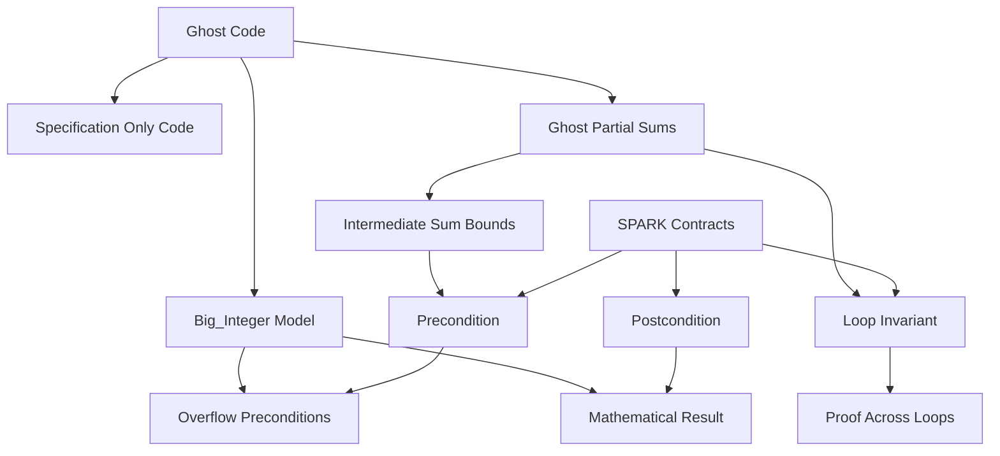

### 1. Topic Overview

- What is this about?
  Lecture 15 explains ghost code in SPARK Ada: specification-only code that helps the prover reason about the real program.
- Why does it matter?
  In high-integrity code, the real program may be too low-level to express the mathematical property we want to prove. Ghost code gives the specification a clean mathematical model without changing runtime behavior.
- Difficulty level:
  Intermediate. The hard part is separating machine integers/runtime code from mathematical integers/specification code.
- Prerequisites:
  SPARK `Pre` and `Post` contracts, loop invariants, integer overflow, Ada arrays and attributes, and the idea that SPARK Prover checks code against contracts.
- Lecture slide reference:
  `materials/Lecture15-GhostCode.pdf`, especially slides 2, 7-13.
- Primary ghost-code reference:
  `materials/lecture15-ghost-code/src/integer_operations.ads`, `array_sum.ads`, `array_sum.adb`, and `big_integers.ads`.
- Primary course-notes.pdf references:
  - Chapter 6, Section 6.3, pp. 118-119: SPARK `Pre`, `Post`, quantification, `'Result`, and expressions in contracts.
  - Chapter 7, pp. 123-143: reasoning about program correctness, weakest preconditions, and loop invariants.
  - Chapter 7, Section 7.4.8, pp. 141-143: finding loop invariants, including the summation example.
  - Chapter 5, Section 5.4, pp. 108-110: SPARK Examiner/Prover style static reasoning.
- Schema-based learning path:
  1. Ghost code as specification-only support.
  2. Machine integer vs mathematical integer specification.
  3. Ghost partial sums for loop proof.
- Cognitive-load plan:
  Start with one distinction only: real runtime code vs proof-only ghost code. Delay `Sum_Acc` details until the learner can explain why the bad `Add` specification is unsafe.

### 2. Core Concepts

#### Concept 1: Ghost Code

- Target schema:
  Ghost code as specification-only support.
- Definition:
  Ghost code is additional SPARK code whose only purpose is to help specify, prove, or reason about the real program.
- Intuition:
  It is a proof helper. It exists for the verifier, not for the deployed behavior.
- Trigger situation:
  Use ghost code when the proof needs extra mathematical state or history that the real program should not maintain at runtime.
- Example:
  `type Partial_Sum is array(Positive range <>) of Big_Integer with Ghost;` in `array_sum.ads` creates a ghost array used to describe mathematical partial sums.
- Common mistake:
  Thinking ghost code is normal helper code. It must not be needed for the real runtime result.
- Reference:
  `Lecture15-GhostCode.pdf`, slide 2; `array_sum.ads` lines 16-19.

#### Concept 2: Machine Integers vs Mathematical Integers

- Target schema:
  Machine integer vs mathematical integer specification.
- Definition:
  A machine `Integer` has fixed bounds, while a mathematical integer is unbounded in the abstract model.
- Intuition:
  The expression `X + Y` can overflow as machine arithmetic before it can be used to specify "real" mathematical addition.
- Trigger situation:
  Use this schema whenever the property to specify is ordinary mathematical arithmetic but the implementation uses bounded machine arithmetic.
- Example:
  `Add_Incorrect_Spec` uses `X + Y` inside the precondition, so the specification itself can overflow.
- Common mistake:
  Writing the contract in the same bounded arithmetic that caused the problem.
- Reference:
  `Lecture15-GhostCode.pdf`, slides 7-9; `integer_operations.ads` lines 5-18.

#### Concept 3: Big_Integer as Ghost Mathematical Model

- Target schema:
  Machine integer vs mathematical integer specification.
- Definition:
  `Big_Integer` is a ghost mathematical integer type used to write contracts about unbounded arithmetic.
- Intuition:
  Convert machine integers into mathematical integers, reason safely, then convert back only when the value is known to fit.
- Example:
  `Add` uses `To_Big_Integer(X) + To_Big_Integer(Y)` in the precondition and postcondition.
- Common mistake:
  Forgetting that `To_Integer` is only safe after the `Big_Integer` value has been shown to be inside `Integer'First .. Integer'Last`.
- Reference:
  `integer_operations.ads` lines 24-29; `big_integers.ads` lines 8-45.

#### Concept 4: Ghost Partial Sums

- Target schema:
  Ghost partial sums for loop proof.
- Definition:
  A ghost partial-sum function computes the mathematical running total of an array.
- Intuition:
  To prove an array sum is safe, it is not enough to say the final answer fits. Every intermediate running total must also fit.
- Trigger situation:
  Use this schema when a loop's final output depends on a sequence of intermediate computations.
- Example:
  `Sum_Acc(A)(J)` represents the mathematical sum of the array prefix ending at index `J`.
- Common mistake:
  Checking only the final sum and missing an intermediate overflow.
- Reference:
  `Lecture15-GhostCode.pdf`, slides 10-13; `array_sum.ads` lines 7-25.

#### Concept 5: Loop Invariant Using Ghost State

- Target schema:
  Ghost partial sums for loop proof.
- Definition:
  A loop invariant states what remains true before and after every loop iteration.
- Intuition:
  The real variable `Result` is connected to the ghost mathematical model `Sum_Acc(A)` so the prover can see that the loop is computing the intended sum.
- Example:
  In `array_sum.adb`, the invariant says that before processing `A(I)`, `Result` equals the previous ghost partial sum.
- Common mistake:
  Treating the loop invariant as a runtime check only. In SPARK, it is proof information for the loop.
- Reference:
  `array_sum.adb` lines 8-12; `course-notes.pdf` Chapter 7, Section 7.4.8, pp. 141-143.

### 3. Deep Understanding

Lecture 15 continues the course-notes path:

1. Chapter 6 gives us formal contracts in SPARK.
2. Chapter 7 explains why loops need invariants for proof.
3. Lecture 15 adds ghost code as a way to write specifications that are mathematically precise enough for the prover.

The important distinction is:

```text
Real code computes the deployed result.
Ghost code describes the mathematical story needed to prove that result correct.
```

For integer addition, the real code still returns an `Integer`. The contract, however, talks about `Big_Integer` so the specification does not overflow while trying to describe overflow avoidance.

For array summation, the real code still loops through the array and updates `Result`. The ghost model `Sum_Acc` records the mathematical partial sums, letting the precondition say: every intermediate value must fit into a machine `Integer`.

### 4. Minimal Working Example

```ada
function Add(X : Integer; Y : Integer) return Integer with
  Pre => In_Range(To_Big_Integer(X) + To_Big_Integer(Y),
                  To_Big_Integer(Integer'First),
                  To_Big_Integer(Integer'Last)),
  Post => Add'Result = To_Integer(To_Big_Integer(X) + To_Big_Integer(Y));
```

Execution and reasoning flow:

1. The real body can still be `X + Y`.
2. The precondition is written using ghost mathematical integers, so the specification itself avoids machine overflow.
3. `In_Range` proves that the mathematical result fits in a machine `Integer`.
4. The postcondition says the returned machine integer equals the mathematical sum converted back to `Integer`.

For arrays:

```ada
type Partial_Sum is array(Positive range <>) of Big_Integer with Ghost;
```

This ghost array lets the specification talk about every prefix sum, not only the final answer.

### 5. Knowledge Graph



### 6. Self-Test Questions

- Recall (1): What is ghost code used for in SPARK?
- Recall (2): Why is `X + Y` inside a precondition dangerous for bounded `Integer` values?
- Recall (3): What role does `Big_Integer` play in Lecture 15?
- Application (1): Why must `Sum_Blind` check every partial sum, not only the final sum?
- Application (2): In `array_sum.adb`, why does the loop invariant mention `Sum_Acc(A)`?
- Explain like I am 5:
  Why can ghost code help prove a program correct even though it is not part of the real result?
- Completion task:
  Complete this sentence: `Big_Integer` helps because the contract needs to talk about _____ arithmetic before converting back to bounded `Integer`.
- Near-transfer task:
  If a multiplication function may overflow, explain whether its precondition should use `X * Y` directly or a mathematical-integer model.

### 7. Weak Point Detection

- Learners often confuse ghost code with ordinary helper functions.
- Learners often forget that a bad specification can overflow too.
- Learners often check only the final array sum and ignore intermediate overflow.
- Learners often see `Big_Integer` as changing the implementation, rather than changing the mathematical model used in the contract.
- Learners often read loop invariants as comments, not as the bridge between code and proof.
- Learners can become overloaded if `Big_Integer`, `Sum_Acc`, quantifiers, and loop invariants are introduced in the same chat step. Teach them in the schema order above.
