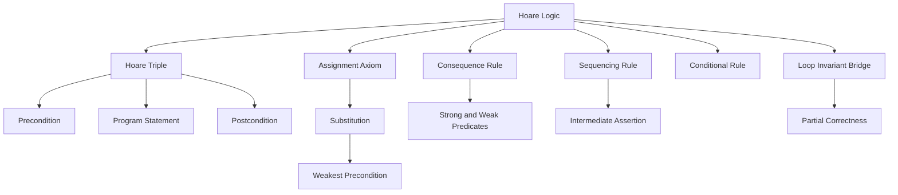

### 1. Topic Overview

- What is this about?
  Lectures 16 and 17 introduce Hoare logic: a rule-based way to prove that a program satisfies a stated contract.
- Why does it matter?
  Testing gives observed examples. Hoare logic lets us reason mathematically about all states covered by the precondition, which is central to high-integrity software assurance.
- Difficulty level:
  Intermediate. The hard part is not the syntax of triples; it is learning to reason backwards from a postcondition and to track logical strength.
- Prerequisites:
  Preconditions, postconditions, implication, conjunction, assignment, sequencing, and the SPARK contract idea from earlier lectures.
- Primary lecture references:
  `materials/Lecture16-HoareLogic-Part1.pdf` and `materials/Lecture17-HoareLogic-Part2.pdf`.
- Primary course-note reference:
  `materials/course-notes.pdf`, Chapter 7, especially Sections 7.3 to 7.6.
- Source-faithful learning path:
  1. Why program proof is stronger than testing, but still depends on the right specification.
  2. Hoare triple shape: `{P} S {Q}`.
  3. Assignment axiom and substitution.
  4. Consequence rule and strong/weak predicates.
  5. Weakest-precondition reasoning as a backwards proof method.
  6. Sequencing rule for multi-statement programs.
  7. Skip rule.
  8. Conditional rule.
  9. Course-note bridge: loop invariants, partial correctness, and mechanised verification conditions.

### 2. Core Concepts

#### Concept 1: Hoare Triple

- Target schema:
  Hoare triple as program-correctness contract.
- Definition:
  A Hoare triple has the form `{P} S {Q}`. It means: if precondition `P` is true before program statement `S` runs, then postcondition `Q` is true after `S` runs, assuming the statement terminates.
- Intuition:
  The triple is a small theorem about how the program changes state.
- Example:
  `{x = 2} x := x + 1 {x = 3}` says that starting from `x = 2`, the assignment establishes `x = 3`.
- Common mistakes:
  Treating the triple as a test case only, or forgetting that the proof is only as good as the specification being proved.

#### Concept 2: Assignment Axiom

- Target schema:
  Backward substitution for assignment.
- Definition:
  The assignment axiom is `{P[E/x]} x := E {P}`.
- Intuition:
  To know what must be true before `x := E`, take the desired postcondition and replace each future `x` with the expression assigned to `x`.
- Example:
  To establish `{x = 1}` after `x := x + 1`, substitute `x + 1` for `x` in `x = 1`, giving the precondition `x + 1 = 1`, equivalent to `x = 0`.
- Common mistakes:
  Reasoning forwards too early, or substituting the wrong direction.

#### Concept 3: Consequence Rule

- Target schema:
  Logical adjustment around a Hoare triple.
- Definition:
  If `P' => P`, `{P} S {Q}`, and `Q => Q'`, then `{P'} S {Q'}`.
- Intuition:
  We may start from a stronger precondition than needed, and we may claim a weaker postcondition than what was proved.
- Example:
  From `{x = 0} x := x + 1 {x = 1}`, we can conclude `{x = 0} x := x + 1 {x > 0}` because `x = 1` implies `x > 0`.
- Common mistakes:
  Reversing the implication direction for stronger and weaker conditions.

#### Concept 4: Weakest Precondition Reasoning

- Target schema:
  Work backwards from the required result.
- Definition:
  For a statement `S` and postcondition `Q`, `wp(S, Q)` is the weakest condition that guarantees `Q` after `S` terminates.
- Intuition:
  Start with the goal at the end, calculate what must have been true immediately before each statement, then check whether the real precondition is strong enough.
- Example:
  For `{x = 0} x := x + 1 {x > 0}`, the assignment axiom gives weakest precondition `x + 1 > 0`. Then we check `x = 0 => x + 1 > 0`.
- Common mistakes:
  Thinking the computed weakest precondition must syntactically equal the original precondition. It only needs to be implied by the original precondition.

#### Concept 5: Sequencing Rule

- Target schema:
  Insert intermediate assertions between statements.
- Definition:
  If `{P} S1 {R}` and `{R} S2 {Q}`, then `{P} S1; S2 {Q}`.
- Intuition:
  `R` is the bridge condition: it is the postcondition of the first statement and the precondition of the second.
- Example:
  To prove `{x = 0} x := x + 1; x := x + 1 {x = 2}`, work backwards:
  - before the second assignment, need `x + 1 = 2`;
  - before the first assignment, need `x + 2 = 2`;
  - check `x = 0 => x + 2 = 2`.
- Common mistakes:
  Working left-to-right when deriving weakest preconditions for a sequence.

#### Concept 6: Skip Rule

- Target schema:
  No-op preserves truth.
- Definition:
  `{P} skip {P}`.
- Intuition:
  `skip` changes nothing, so whatever was true before remains true after.
- Example:
  `{x >= 0} skip {x >= 0}`.
- Common mistakes:
  Inventing a new condition for `skip`; the precondition and postcondition are the same.

#### Concept 7: Conditional Rule

- Target schema:
  Prove each branch under its own guard.
- Definition:
  To prove an `if B then S1 else S2 endif` establishes `Q`, prove the then-branch under `B` and the else-branch under `not B`.
- Intuition:
  A conditional is correct only if every possible branch that can run establishes the postcondition.
- Example:
  For:
  ```text
  if x > y then
      r := x
  else
      r := y
  endif
  ```
  to prove `r >= x and r >= y`, the then branch uses the assumption `x > y`, and the else branch uses the assumption `x <= y`.
- Common mistakes:
  Proving only the branch that feels likely, or forgetting to include the branch guard.

#### Concept 8: Loop Invariant Bridge

- Target schema:
  One preserved relationship proves many iterations.
- Definition:
  A loop invariant is a predicate that holds before the loop, is preserved by one loop-body execution, and with the negated guard implies the loop postcondition.
- Intuition:
  We cannot prove a loop by unrolling every possible iteration count. We prove one preserved relationship instead.
- Example:
  In the course-note factorial proof, the invariant is `f = i!`. When the loop exits with `i = n`, the invariant gives `f = n!`.
- Common mistakes:
  Treating an invariant as a final postcondition only, or forgetting that it must hold before and after each iteration.
- Note:
  Loop invariants are in course-note Chapter 7 and are the natural bridge to Lecture 18.

### 3. Deep Understanding

Hoare logic shifts program reasoning from "I ran some tests" to "I proved a theorem about all states satisfying the precondition." The theorem has three parts:

```text
{precondition} program {postcondition}
```

The proof is structural. Each programming construct has a matching rule:

- assignment: substitute backwards from the desired postcondition;
- consequence: adjust pre/post strength using implication;
- sequence: insert intermediate assertions;
- skip: preserve the same predicate;
- conditional: prove both guarded branches;
- loop: provide and preserve an invariant.

The key mental move is backwards reasoning. Instead of asking "what happens next?", ask:

```text
What must have been true before this statement so that my desired result is true after it?
```

This is why the assignment rule and weakest preconditions appear early in both Lecture 16/17 and Chapter 7.

The caveat from the slides is important: proving a program correct does not guarantee there are no bugs. The specification may be wrong, incomplete, or different from the real deployed system. Hoare logic proves code against a mathematical model and a chosen specification.

### 4. Minimal Working Example

Goal:

```text
{x = 0} x := x + 1 {x > 0}
```

Backward proof:

1. Desired postcondition is `x > 0`.
2. The statement is `x := x + 1`.
3. Substitute `x + 1` for future `x` in the postcondition:

```text
x + 1 > 0
```

4. The assignment axiom gives:

```text
{x + 1 > 0} x := x + 1 {x > 0}
```

5. The actual precondition is `x = 0`.
6. Check the consequence condition:

```text
x = 0 => x + 1 > 0
```

This implication is true, so the original triple is proved.

### 5. Knowledge Graph



### 6. Self-Test Questions

- Recall (1): What does `{P} S {Q}` mean?
- Recall (2): In the assignment axiom `{P[E/x]} x := E {P}`, which direction do we substitute?
- Recall (3): What does the consequence rule let us change around a proved triple?
- Application (1): Compute the weakest precondition for `x := x + 2` to establish `x = 5`.
- Application (2): For `x := x + 1; x := x + 1`, why do we work backwards from the second assignment first?
- Explain like I am 5:
  Why does a loop need an invariant instead of just checking the final result?

### 7. Weak Point Detection

- Learners often read a Hoare triple as one execution example, not a theorem about all states satisfying the precondition.
- Learners often substitute in the wrong direction for assignment.
- Learners often reverse strong/weak implication directions in the consequence rule.
- Learners often try to reason through sequences left-to-right instead of deriving weakest preconditions right-to-left.
- Learners often treat loop invariants as comments or final goals rather than preserved relationships.
