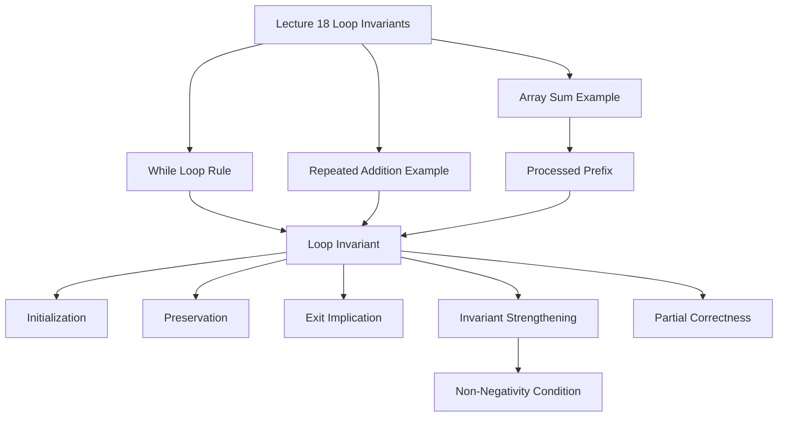

### 1. Topic Overview

- What is this about?
  Lecture 18 extends Hoare logic from straight-line code and conditionals to loops.
- Why does it matter?
  Loops may run zero, one, or many times, so we need one preserved statement that summarizes all possible iterations.
- Difficulty level:
  Intermediate to advanced. The hard part is choosing the invariant, not applying the algebra once the invariant is known.
- Prerequisites:
  Hoare triples, assignment axiom, consequence rule, weakest-precondition reasoning, sequencing, and conditionals from Lectures 16 and 17.
- Primary lecture reference:
  `materials/Lecture18-LoopInvariants.pdf`.
- Primary course-note reference:
  `materials/course-notes.pdf`, Chapter 7, especially Sections 7.4.7, 7.4.8, 7.5, and 7.6.

### 2. Core Concepts

#### Concept 1: Loop Invariant

- Definition:
  A loop invariant is a predicate that holds before the loop starts, is preserved by every loop-body execution, and helps prove the final postcondition when the loop guard is false.
- Intuition:
  Instead of proving every possible number of iterations separately, prove one relationship that survives each iteration.
- Example:
  For repeated addition:

```text
a = A;
result = 0;
while a > 0 do
  result = result + B;
  a = a - 1;
done
```

  The invariant is:

```text
result + (a * B) = A * B and a >= 0
```

- Common mistakes:
  Treating the invariant as only the final postcondition, or forgetting that it must be true before and after each loop iteration.

#### Concept 2: The Three Invariant Obligations

- Definition:
  A useful invariant `I` must satisfy three proof obligations:
  1. Initialization: `I` holds when the loop is first reached.
  2. Preservation: if `I` holds and the guard is true before the body, `I` holds again after the body.
  3. Exit use: if `I` holds and the guard is false, the required postcondition follows.
- Intuition:
  Start true, stay true, then become useful at exit.
- Common mistakes:
  Checking only preservation and forgetting initialization, or checking only the final postcondition and forgetting preservation.

#### Concept 3: Strengthening an Invariant

- Definition:
  Sometimes the first guessed invariant is too weak, so we add information needed for one of the obligations.
- Example:
  `result + (a * B) = A * B` alone does not prove `result = A * B` at loop exit, because the exit condition gives `a <= 0`, not necessarily `a = 0`.
  Adding `a >= 0` gives:

```text
result + (a * B) = A * B and a >= 0
```

  At exit, `a <= 0 and a >= 0`, so `a = 0`, and therefore `result = A * B`.
- Common mistake:
  Thinking a plausible pattern is enough before checking the exit implication.

#### Concept 4: Loop Preconditions May Need Strengthening

- Definition:
  The whole program precondition must be strong enough to establish the invariant before the loop.
- Example:
  For the repeated-addition program, starting from `{true}` is too weak because the proof needs `A >= 0`. The strengthened precondition is:

```text
{A >= 0}
```

- Common mistake:
  Assuming `{true}` is acceptable just because the code runs; proof may require a stronger contract.

#### Concept 5: Sum Loop Invariant

- Definition:
  For an array-summing loop, the invariant usually states that the accumulator equals the sum of the already-processed prefix.
- Example:

```text
i = 0;
sum = 0;
while i != N do
  sum = sum + A[i];
  i = i + 1;
done
```

  A suitable invariant is:

```text
sum = A[0] + ... + A[i-1]
```

  When the loop exits with `i = N`, this becomes the required full sum.
- Common mistake:
  Using the final postcondition too early, before all elements have been processed.

### 3. Deep Understanding

The course notes present the while-loop rule as a partial-correctness rule. It proves:

```text
if the loop terminates, then the postcondition holds
```

It does not by itself prove termination. Total correctness would require both partial correctness and termination.

Loop proofs differ from straight-line weakest-precondition proofs. For assignments, sequencing, skip, and conditionals, the rules mostly compute the needed precondition automatically. For loops, the prover needs an extra human-supplied idea: the loop invariant. The course notes emphasize that finding invariants is the difficult part and is not fully automatic in general.

The practical schema for finding an invariant is:

```text
look at loop variables + look at postcondition + describe progress so far
```

Then test the three obligations:

```text
initialization -> preservation -> exit use
```

If one fails, strengthen the invariant or the program precondition.

### 4. Minimal Working Example

Goal:

```text
{A >= 0}
a = A;
result = 0;
while a > 0 do
  result = result + B;
  a = a - 1;
done
{result = A * B}
```

Candidate invariant:

```text
I: result + (a * B) = A * B and a >= 0
```

Reasoning:

1. Before the loop, `a = A` and `result = 0`, so `result + (a * B) = A * B`.
2. The precondition `A >= 0` gives `a >= 0`.
3. One iteration adds `B` to `result` and subtracts `1` from `a`, so the total `result + (a * B)` stays equal to `A * B`.
4. At exit, the guard is false, so `a <= 0`.
5. The invariant also gives `a >= 0`, so `a = 0`.
6. Therefore `result + 0 * B = A * B`, so `result = A * B`.

### 5. Knowledge Graph



### 6. Self-Test Questions

- Recall (1): What are the three obligations for a loop invariant?
- Recall (2): Why is a loop invariant needed instead of just unrolling the loop?
- Recall (3): What is the difference between partial correctness and total correctness?
- Application (1): Why is `result + (a * B) = A * B` too weak without `a >= 0`?
- Application (2): For an array-summing loop, what does the accumulator represent after `i` iterations?
- Explain like I am 5:
  Why does the loop need a statement that stays true every time it goes around?

### 7. Weak Point Detection

- Learners often treat the invariant as the postcondition instead of a preserved relationship.
- Learners often forget the initialization obligation.
- Learners often forget the exit implication: `I and not guard => postcondition`.
- Learners often need to strengthen a plausible invariant after a failed proof obligation.
- Learners often miss that loop proofs in this chapter prove partial correctness unless termination is also shown.
