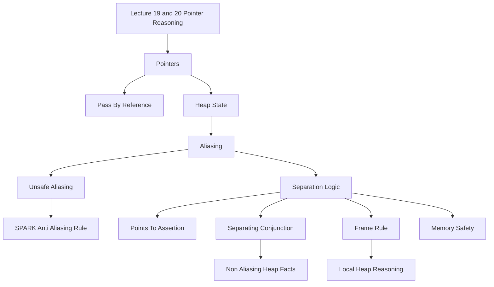

### 1. Topic Overview

- What is this about?
  Lectures 19 and 20 extend program reasoning from ordinary variables to pointer-based heap state.
- Why does it matter?
  Pointers make verification harder because two names can refer to the same memory. A statement that appears to update one thing may silently change another thing too.
- Difficulty level:
  Advanced. The hard part is not pointer syntax alone; it is tracking when two expressions may refer to overlapping heap locations.
- Prerequisites:
  Ada access types, aliasing risk, SPARK restrictions, Hoare triples, assignment reasoning, frame conditions, and loop-invariant proof structure.
- Primary lecture references:
  `materials/Lecture19-Pointers.pdf` and `materials/Lecture20-SeparationLogic.pdf`.
- Primary course-note reference:
  `materials/course-notes.pdf`, Chapter 8, especially Sections 8.1 to 8.3.

### 2. Core Concepts

#### Concept 1: Pointer Aliasing

- Definition:
  Two variables alias when they both refer to the same region of memory.
- Intuition:
  If `X` and `Y` point to the same integer, then writing through `X` also changes what `Y` sees.
- Example:
  If `X` and `Y` both point to the same cell containing `5`, then `X.all := 0` also makes `Y.all` read as `0`.
- Common mistakes:
  Assuming that only the written variable changed, or assuming two pointer parameters are separate just because they have different names.

#### Concept 2: Safe vs Unsafe Aliasing

- Definition:
  Aliasing is safe when, while the aliases exist, the program does not use both aliases to access the same memory in a reasoning-breaking way.
- Intuition:
  A temporary pointer used only to move a reference during a swap can be okay. Reading or writing through two active aliases is where reasoning becomes unstable.
- Example:
  In a pointer-swap procedure, `Temp : IntPtr := X` creates an alias, but if `X` is not dereferenced while `Temp` is still used as the saved reference, this alias can be safe.
- Common mistakes:
  Treating all aliases as equally bad, or missing that an alias can become unsafe when both names are used later.

#### Concept 3: SPARK Anti-Aliasing Discipline

- Definition:
  SPARK limits pointer use so the prover can assume that simultaneously used pointers do not unsafely alias.
- Intuition:
  SPARK trades some programming freedom for easier proof.
- Example:
  In the course notes, `Zero_First_Arg(X, Y)` can prove `Y.all = Y.all'Old` after `X.all := 0` because SPARK's anti-aliasing discipline allows the prover to assume `X` and `Y` are not the same active memory cell.
- Common mistakes:
  Forgetting that the postcondition about `Y` is only sound if `X` and `Y` are known not to alias unsafely.

#### Concept 4: Points-To Assertions

- Definition:
  `p |-> v` means that the heap location identified by pointer/address `p` currently stores value `v`.
- Intuition:
  Ordinary Hoare logic talks about variables. Separation logic also talks about heap cells.
- Example:
  If `p` stores address `120`, and heap address `120` contains `5`, then `p |-> 5`.
- Common mistakes:
  Reading `p |-> v` as assignment rather than as a heap assertion, or forgetting that `p` must refer to a valid heap location.

#### Concept 5: Separating Conjunction

- Definition:
  `P * Q` in separation logic means `P` holds for one part of the heap, `Q` holds for another part, and those parts do not overlap.
- Intuition:
  It is a stronger "and" for heap reasoning: both facts are true, and they talk about separate memory.
- Example:
  `x |-> 3 * y |-> 3` says `x` points to a cell containing `3`, `y` points to a cell containing `3`, and `x` and `y` do not alias.
- Common mistakes:
  Treating `*` like ordinary logical `and`, or forgetting that it carries a non-aliasing/separation fact.

#### Concept 6: Frame Rule

- Definition:
  The frame rule lets us prove a command on the heap cells it touches, then preserve a separate heap fact around it.
- Intuition:
  If a command only updates `x`'s heap cell, then a separate `y` heap cell stays unchanged.
- Example:
  From `{x |-> 3} *x := 2 {x |-> 2}`, the frame rule lets us derive `{x |-> 3 * y |-> 3} *x := 2 {x |-> 2 * y |-> 3}`.
- Common mistakes:
  Applying the frame rule when the framed assertion mentions a local variable modified by the command.

### 3. Deep Understanding

Lecture 19 motivates the problem: pass-by-reference and pointers are efficient, but reasoning becomes hard when multiple references may point to the same memory. Course-note Chapter 8 names this as aliasing and shows why a statement through one reference can invalidate a fact about another reference.

SPARK's answer is restriction: avoid unsafe aliasing so the prover can reason as if active pointer accesses are separate. Separation logic's answer is proof expressiveness: extend Hoare logic with heap assertions and a special separating conjunction so the proof itself records which heap regions are separate.

The key transition is:

```text
ordinary Hoare logic:
  variables change

pointer reasoning:
  local variables plus heap cells change

separation logic:
  prove only the touched heap footprint, then frame the untouched heap
```

Separation logic triples also carry memory-safety meaning. If `{P} S {Q}` is valid, then starting from `P`, `S` will not dereference an invalid pointer before reaching `Q`.

### 4. Minimal Working Example

Question:

```text
{x |-> 3 and y |-> 3}
*x := 2
{x |-> 2 and y |-> 3}
```

This is not valid if `and` is ordinary conjunction. `x` and `y` might alias. If they point to the same heap cell, then writing `2` through `x` also changes what `y` sees.

The separation-logic version is valid:

```text
{x |-> 3 * y |-> 3}
*x := 2
{x |-> 2 * y |-> 3}
```

Reason:

1. `x |-> 3 * y |-> 3` says the `x` cell and `y` cell are separate.
2. `*x := 2` updates only the heap cell pointed to by `x`.
3. The separate `y` cell is the frame and remains unchanged.
4. Therefore the postcondition is `x |-> 2 * y |-> 3`.

### 5. Knowledge Graph



### 6. Self-Test Questions

- Recall (1): What does it mean for two pointers to alias?
- Recall (2): What does `p |-> v` say about the heap?
- Recall (3): What extra meaning does separating conjunction add beyond ordinary `and`?
- Application (1): Why is `{x |-> 3 and y |-> 3} *x := 2 {x |-> 2 and y |-> 3}` not automatically valid?
- Application (2): In `{x |-> 3 * y |-> 3} *x := 2 {x |-> 2 * y |-> 3}`, which fact is the frame?
- Explain like I am 5:
  Why is it dangerous when two names secretly point to the same box?

### 7. Weak Point Detection

- Learners often think different pointer variable names imply different heap cells.
- Learners often confuse assigning a pointer variable with writing through the pointer.
- Learners often read `p |-> v` as an action instead of as an assertion.
- Learners often treat separating conjunction as ordinary conjunction and miss the non-overlap guarantee.
- Learners often apply the frame rule without checking whether the framed assertion depends on a local variable modified by the command.
