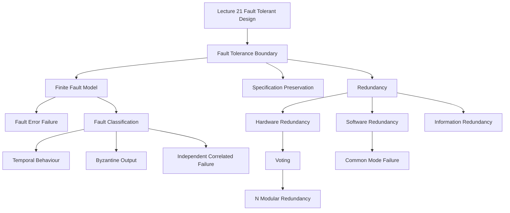

### 1. Topic Overview

- What is this about?
  Lecture 21 introduces fault-tolerant design: designing a system so it can keep meeting its specification even when a finite number of faults occur.
- Why does it matter?
  High-integrity systems cannot assume that all faults have been removed. Fault tolerance is one way to increase reliability and reduce the chance that faults become unsafe, insecure, or unavailable system behaviour.
- Difficulty level:
  Intermediate. The difficult part is not the definition itself; it is choosing what faults are tolerated, how many, and which redundancy mechanism is appropriate.
- Prerequisites:
  Failure, fault, error, specification, reliability, HAZOP-style fault identification, and basic probability/reliability intuition.
- Primary lecture reference:
  `materials/Lecture21-Fault_Tolerant_Design.pdf`.
- Primary course-note reference:
  `materials/course-notes.pdf`, Chapter 9, especially Sections 9.1 to 9.6.
- Source coverage note:
  The Lecture 21 slides extracted through hardware redundancy, voting, N-modular redundancy, and purging. Course-note Chapter 9 gives the fuller version, adding software redundancy, Byzantine failures, information redundancy, and aircraft practice cases.

### 2. Core Concepts

#### Concept 1: Fault Tolerance Boundary

- Definition:
  A system is fault tolerant if it can continue to function according to its specification in the presence of a finite number of faults.
- Intuition:
  We do not make the system immune to every possible failure. We decide which faults and how many faults the design should handle.
- Example:
  A triplex sensor system with three sensors may tolerate one bad sensor by voting on the three readings. It is not designed to tolerate all three sensors being wrong together.
- Common mistakes:
  Thinking "fault tolerant" means "cannot fail", or forgetting that the tolerated fault set must be chosen during design.

#### Concept 2: Fault, Error, and Failure

- Definition:
  A fault is the underlying defect or cause. An error is the manifestation of that fault in the system state or output. A failure is externally visible behaviour that deviates from the specification.
- Intuition:
  Fault tolerance tries to stop faults/errors from becoming specification-level failures.
- Example:
  A sensor defect is a fault. A wrong temperature reading is an error. The cooling system taking the wrong action and violating its specification is a failure.
- Common mistakes:
  Using fault, error, and failure as synonyms.

#### Concept 3: Hardware vs Software Failure Behaviour

- Definition:
  Hardware faults often behave randomly because of wear, manufacturing defects, or environmental effects. Software faults usually behave systematically: same state and same inputs tend to produce the same failure.
- Intuition:
  Replacing a faulty hardware part can restore behaviour. Copying the same faulty software usually just copies the same design fault.
- Example:
  Two physical sensors are less likely to fail in exactly the same way at the same time than two copies of the same buggy program on the same input.
- Common mistakes:
  Applying hardware redundancy ideas directly to software without accounting for common-mode software failures.

#### Concept 4: Redundancy Types

- Definition:
  Redundancy means adding spare capacity so the system can detect, mask, or recover from faults.
- Intuition:
  Fault tolerance costs resources: extra hardware, extra software development, extra information bits, or extra time.
- Example:
  Hardware redundancy uses multiple processors. Software redundancy uses multiple independent implementations. Information redundancy adds parity bits or checksums. Time redundancy retries or rolls back work.
- Common mistakes:
  Treating redundancy as automatically reliable without checking independence, voter correctness, or error-detection limits.

#### Concept 5: Static Pair vs Voting

- Definition:
  A static pair compares two outputs and can detect disagreement. Voting uses more than two redundant components so the system may identify the likely faulty component and continue.
- Intuition:
  Two components can tell you "something is wrong"; three or more may let you choose a plausible correct output.
- Example:
  If two sensors read 32.0 and 4.3, the system knows they disagree but not which one is wrong. With readings 32.0, 32.1, and 4.3, the third reading is likely faulty.
- Common mistakes:
  Thinking two redundant components can always mask one failed component.

#### Concept 6: Voting Algorithms and Approximate Agreement

- Definition:
  Voting algorithms choose an output from redundant component outputs. Approximate agreement treats values as sufficiently equal when their distance is within a system-specific error bound.
- Intuition:
  Real sensors may not produce exactly identical values, so agreement often means "close enough", not "bit-for-bit equal".
- Example:
  If epsilon is 0.2 degrees, readings 24.2 and 24.1 agree, while 42.3 is far outside the acceptable distance.
- Common mistakes:
  Forgetting that the distance metric and epsilon are design choices that affect risk tolerance.

#### Concept 7: N-Modular Redundancy and Purging

- Definition:
  N-modular redundancy runs N redundant units and votes on their outputs. With N = 2m + 1 units, it can mask m failed units under the usual voting assumptions.
- Intuition:
  More modules increase fault masking ability, but the voter and independence assumptions become important design concerns.
- Example:
  Triple modular redundancy can mask one failed unit. After the bad unit is detected, it should usually be purged so its future results are ignored.
- Common mistakes:
  Ignoring that after purging, the system may drop from fault masking to only fault detection.

#### Concept 8: Software Redundancy and Common-Mode Failure

- Definition:
  Software redundancy uses independent software versions, such as N-version programming or recovery blocks, to reduce the chance that one design fault causes total failure.
- Intuition:
  Multiple copies of the same program do not help against the same bug. The versions must be diverse enough to reduce common-mode failure.
- Example:
  Three teams implementing the same specification may still make the same mistake if the specification is faulty or if they choose similar algorithms.
- Common mistakes:
  Assuming "independent teams" automatically means independent failures.

#### Concept 9: Information Redundancy

- Definition:
  Information redundancy sends or stores extra information so errors can be detected and sometimes corrected.
- Intuition:
  Extra bits can reveal corruption, but stronger correction needs more overhead.
- Example:
  A parity bit can detect many one-bit errors but cannot locate and correct every possible error. Interlaced parity can correct some single-bit errors with more parity bits.
- Common mistakes:
  Confusing error detection with error correction.

### 3. Deep Understanding

Fault-tolerant design does not replace earlier engineering methods such as HAZOP, specification validation, testing, or formal verification. It assumes faults may still remain and asks a different design question:

```text
Which faults should the system tolerate, and what extra structure lets it continue safely?
```

This is why the phrase "finite number of faults" matters. The engineer chooses a fault model: permanent, intermittent, transient, Byzantine, independent, or correlated. The chosen fault model then drives the redundancy strategy.

The core tradeoff is:

```text
more tolerance -> more resources, more design complexity, and more assumptions to justify
```

For hardware, independence is often a plausible assumption because physical components may fail randomly. For software, independence is harder because two versions can share the same specification fault, algorithmic mistake, training bias, or toolchain problem.

### 4. Minimal Working Example

Scenario:

```text
Three tank temperature sensors report:
S1 = 35.6
S2 = 35.7
S3 = 58.0
Allowed difference epsilon = 0.2 degrees
```

Reasoning:

1. Compare readings using the chosen error margin.
2. `35.6` and `35.7` are sufficiently equal because they differ by `0.1`.
3. `58.0` is not sufficiently equal to either of the first two.
4. The system can treat `58.0` as likely erroneous and use one of the close values or their average.

The important schema is not "always take the majority number." The schema is:

```text
define acceptable agreement -> group close outputs -> use agreement to mask likely faulty outputs
```

### 5. Knowledge Graph



### 6. Self-Test Questions

- Recall (1): What does "finite number of faults" mean in the definition of fault tolerance?
- Recall (2): What is the difference between a fault, an error, and a failure?
- Recall (3): Why does simply copying the same software not provide strong software fault tolerance?
- Application (1): Two sensors produce `32.0` and `4.3`. What can a static pair conclude, and what can it not conclude?
- Application (2): Three sensors produce `24.2`, `24.1`, and `42.3`, with epsilon `0.2`. Which reading is likely faulty, and why?
- Explain like I am 5:
  Why do we need spare components or spare information if we want a system to keep working after something goes wrong?

### 7. Weak Point Detection

- Learners often treat fault tolerance as absolute, instead of bounded by an explicit fault model.
- Learners often confuse fault, error, and failure.
- Learners often assume two redundant components can decide which one is correct.
- Learners often forget that software copies share design faults unless there is real design diversity.
- Learners often confuse error detection with error correction in information redundancy.
