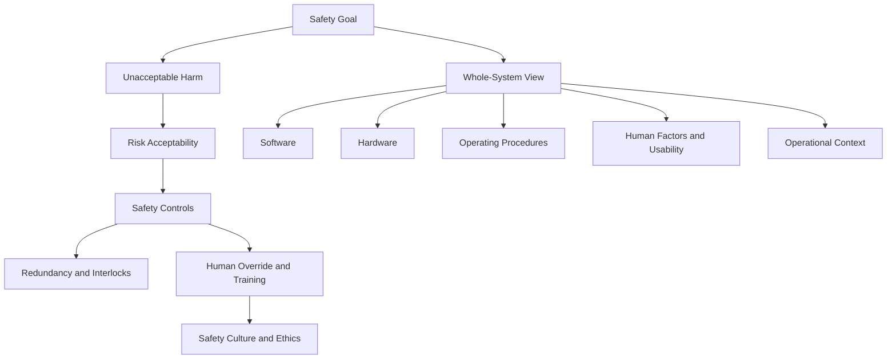

### 1. Topic Overview

- What is this about?
  Safety engineering for software-intensive systems: building systems that do not cause unacceptable harm to people or the environment when used under expected operating conditions.
- Why does it matter?
  Software rarely harms in isolation, but software inside real systems can contribute to deaths, injuries, legal injustice, and large economic loss.
- Lecture structure (main topics only):
  1. What safety means and why “unacceptable harm” is central.
  2. Why software safety must be treated as whole-system safety (software + hardware + procedures + context).
  3. Failure case studies (Therac-25, London Ambulance, Airbus A320 event, Boeing 737 MAX/MCAS, Horizon/Robodebt).
  4. Safety engineering principles (redundancy, human override, usability, documentation/training, safety culture/ethics).
- Prerequisite knowledge:
  Basic software engineering, system thinking, and the idea of risk vs absolute safety.
- Difficulty level:
  Intermediate (conceptually simple, but hard in socio-technical practice).
- Most confusing parts for learners:
  “Unacceptable” is value-laden (not purely technical), and “pilot/user error” is often a system design failure in disguise.

### 2. Core Concepts

#### Concept 1: Safety and Unacceptable Harm
- Definition:
  Safety means a system does not cause unacceptable harm.
- Intuition:
  “Zero harm” is ideal, but engineering decisions usually involve acceptable vs unacceptable risk.
- Example:
  Air travel accepts very low residual risk, but a design causing repeated preventable crashes is unacceptable.
- Common mistakes:
  Treating safety as “no failures ever” or as purely a compliance checkbox.

#### Concept 2: Software Is Safe Only in Context
- Definition:
  Software safety is a property of the larger socio-technical system, not standalone code.
- Intuition:
  The same code can be safe in one environment and unsafe in another.
- Example:
  A dosage-calculation module is safe only if sensors, interface, clinician workflow, and operating procedures are also safe.
- Common mistakes:
  Evaluating code correctness while ignoring hardware limits, user workflow, or deployment context.

#### Concept 3: System Components That Determine Safety
- Definition:
  Safety emerges from interaction among software, hardware, operating procedures, people, and environment.
- Intuition:
  Harm often appears at interfaces between components, not inside a single component.
- Example:
  A cockpit alert placed where pilots rarely notice it can trigger unsafe outcomes even if the alert logic is correct.
- Common mistakes:
  Blaming one component (“operator error”) without analyzing system design and interaction effects.

#### Concept 4: Human Factors and Usability as Safety Controls
- Definition:
  Interface design, workflow, alarm behavior, and operator cognition are safety-critical design elements.
- Intuition:
  If humans repeatedly make the same “mistake,” the system likely invites that mistake.
- Example:
  In Therac-25, confusing interaction and frequent noisy errors made it harder for operators to detect real danger.
- Common mistakes:
  Assuming training can compensate for poor interface design.

#### Concept 5: Defensive Design (Redundancy, Interlocks, Override)
- Definition:
  Safety-critical systems need layered defenses: sensor redundancy, independent interlocks, and effective human override.
- Intuition:
  One fault should not immediately become catastrophe.
- Example:
  MCAS using one AoA source and weak override pathways created single-point failure behavior.
- Common mistakes:
  Removing hardware protections because software is “smart enough.”

#### Concept 6: Transparency, Documentation, and Training
- Definition:
  Safety behavior must be visible to operators, documented clearly, and trained explicitly.
- Intuition:
  Hidden automation creates surprise at exactly the worst time.
- Example:
  If pilots are not trained on an automated stabilizing feature, they may respond incorrectly under time pressure.
- Common mistakes:
  Hiding changes to reduce retraining or preserve product-market compatibility.

#### Concept 7: Safety Culture and Ethics
- Definition:
  Organizational priorities (cost, schedule, legal pressure) shape technical safety outcomes.
- Intuition:
  Unsafe systems are often produced by normal teams under bad incentives, not by “bad coders.”
- Example:
  Cost-driven design choices that weaken redundancy can later produce massive loss, grounding, lawsuits, and criminal consequences.
- Common mistakes:
  Treating safety as a late-stage patch instead of a first-order design constraint.

### 3. Deep Understanding

- How it works internally:
  1. Define system boundaries and stakeholders.
  2. Identify hazards (ways harm can occur).
  3. Estimate and classify risk/acceptability.
  4. Derive safety constraints and controls (technical + procedural).
  5. Build layered mitigations (redundancy, interlocks, fail-safe states, clear operator control).
  6. Verify assumptions continuously in realistic operational context.
- Relationship with other concepts:
  - Safety depends on risk analysis and human factors.
  - Reliability supports safety but does not guarantee it.
  - Security and safety interact (a security breach can become a safety event).
  - Ethics and governance influence engineering decisions that become technical architecture.

### 4. Minimal Working Example

Concrete scenario: infusion pump controller

```text
Input: prescribed_rate, sensor_rate, max_safe_rate, emergency_stop

if emergency_stop == true:
    stop_pump()                        # human override always wins
elif sensor_rate > max_safe_rate:
    stop_pump(); alarm("over-rate")    # independent safety condition
elif prescribed_rate > max_safe_rate:
    reject_order("unsafe prescription")
else:
    run_pump(prescribed_rate)
```

Why this is a safety example:
- It defines unacceptable harm boundary (`max_safe_rate`).
- It uses layered control (validation + runtime monitor + hard stop).
- It includes explicit human override.
- It assumes broader system checks are still needed (sensor validity, nurse workflow, alarm audibility).

### 5. Knowledge Graph



### 6. Self-Test Questions

- Recall (1): Define safety in one sentence using the term “unacceptable harm.”
- Recall (2): List the five system elements that must be considered together in safety engineering.
- Recall (3): Why is “software cannot harm on its own” an important statement?
- Application (1): A team removes a hardware interlock because software checks “should be enough.” What new failure mode could this introduce?
- Application (2): An operator repeatedly misses a critical warning. Give two design changes to reduce risk without blaming the operator.
- Deep understanding (1): Compare “pilot/user error” versus “system design error” in a real incident pattern and explain how both can be true at once.

### 7. Weak Point Detection

- Learners usually fail to separate reliability from safety.
- Learners underweight human factors and over-focus on algorithm correctness.
- Learners struggle to define “acceptable” risk in socio-technical terms.
- Learners misattribute blame to operators instead of interface/procedure/context design.
- Learners miss how organizational incentives (cost/schedule) create technical safety debt.
