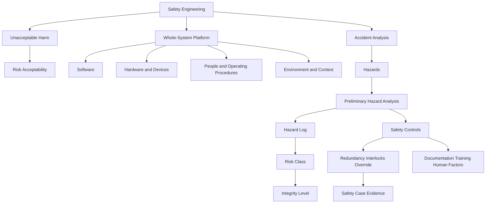

### 1. Topic Overview

- What is this about?
  Safety engineering for software-intensive systems: building and assuring systems whose software, hardware, operating procedures, people, and environment do not lead to unacceptable harm.
- Primary sources revised from:
  `materials/Lecture2-SafetyEngineering.pdf` and Chapter 2 of `materials/course-notes.pdf`.
- Why does it matter?
  Software rarely harms people by itself, but software inside a larger system can contribute to deaths, injuries, environmental damage, legal injustice, and large economic loss.
- Difficulty level:
  Intermediate. The definition is simple, but the practice is hard because the causes of harm are usually distributed across software, hardware, people, procedures, environment, and organisational incentives.
- Prerequisites:
  Basic software engineering, system boundaries, and the difference between a program being correct and a whole system being safe.

Lecture 2 slide spine:

1. What is safety?
2. What does safety mean for software?
3. Case studies: Therac-25, London Ambulance, Airbus A320, Boeing 737 MAX/MCAS, Horizon, Robodebt.
4. Whole-system safety: software, hardware, operating procedures, and context.

Course-note extensions to attach to Lecture 2:

1. Correctness alone does not guarantee safety.
2. Reliability alone does not guarantee safety.
3. Safety engineering produces evidence for a safety case.
4. Accident analysis feeds preliminary hazard analysis.
5. Hazards are tracked in hazard logs and assessed by risk.
6. Risk class is assigned to hazards; integrity level is assigned to systems or safety-related functions.

Likely confusion points:

- Treating safety as "no failures ever" instead of "no unacceptable harm."
- Treating software safety as a property of isolated code.
- Confusing correctness, reliability, and safety.
- Blaming "human error" without analysing interface design, procedures, training, and context.
- Thinking safety is something tested at the end rather than engineered across the lifecycle.

### 2. Core Concepts

#### Concept 1: Safety Means No Unacceptable Harm

- Definition:
  A system is safe when software and hardware, used under correct operating conditions, do not cause unacceptable harm to people or the environment.
- Intuition:
  Safety is not the same as "nothing bad can ever happen." Engineering usually accepts some residual risk, but it must be reduced to an acceptable level.
- Example:
  Air travel accepts very low residual risk. A repeated preventable crash caused by a design feature is not acceptable.
- Common mistakes:
  Defining safety as perfect absence of risk, or treating acceptability as a purely technical number with no social, legal, ethical, or regulatory judgement.

#### Concept 2: Software Is Safe Only in a Whole System

- Definition:
  Software safety is a property of the platform: software, hardware, physical devices, people, operating procedures, and environment.
- Intuition:
  Software is an abstraction. It harms only when connected to actions in the world: moving a machine, delivering radiation, dispatching an ambulance, changing a flight surface, or making administrative decisions.
- Example:
  A dosage-calculation module can be correct as code but unsafe if the sensor is unreliable, the alarm is unclear, or the clinician workflow invites a dangerous confirmation error.
- Common mistakes:
  Inspecting only the program and ignoring the system boundary.

#### Concept 3: Correctness Is Not Safety

- Definition:
  Correctness means the implementation satisfies its specification. Safety means the system avoids unacceptable harm in its actual operating context.
- Intuition:
  A design can be implemented exactly as specified and still be unsafe if the specification or system design is unsafe.
- Course-note example:
  A car braking system whose brake pedal does nothing can be implemented correctly, but it is unsafe unless the rest of the system somehow makes braking unnecessary.
- Common mistakes:
  Saying "the code passed all tests, therefore the system is safe."

#### Concept 4: Reliability Is Not Safety

- Definition:
  Reliability is the probability that a system works without failure for a specified time in a given environment. Safety is about avoiding harm.
- Intuition:
  A reliable unsafe system can consistently do the dangerous thing. An unreliable safe system might fail in a way that prevents operation but avoids harm.
- Course-note examples:
  A match that reliably lights is less safe than one that fails to light. An aircraft that never starts its engines is unreliable but may be safe; an aircraft with a perfectly reliable "no brakes" design is unsafe.
- Common mistakes:
  Believing that removing all software faults is enough to prove safety.

#### Concept 5: Accident, Incident, Hazard, Failure, Error, Flaw, Fault

- Accident:
  An unintended event, or sequence of events, leading to harm.
- Incident:
  An event that significantly reduces safety but does not lead to an accident.
- Hazard:
  A physical situation or platform state that can lead to an accident.
- Failure:
  An unintended condition where delivered service deviates from specified service and can lead to a hazard.
- Error:
  An unintended state that can lead to a failure.
- Flaw:
  A design defect that can give rise to an error under specific conditions.
- Fault:
  Activation of a flaw, resulting in an error.
- Common mistakes:
  Calling every bug a hazard, or using "fault" in the software-testing sense without noticing the safety-engineering meaning.

#### Concept 6: Safety Engineering and Safety Cases

- Definition:
  Safety engineering is the set of processes, methods, and techniques used to assure system safety across the lifecycle.
- Safety case:
  A high-level argument, supported by evidence, that a system is safe enough for regulators or customers.
- Intuition:
  Safety is not shown by one test campaign. The safety case gathers evidence that hazards were identified, risks were assessed, and the design handles those hazards appropriately.
- Lifecycle view:
  Requirements use exploratory hazard analysis; design and implementation use deductive and inductive analysis; acceptance uses the accumulated safety case.
- Common mistakes:
  Treating safety as a final document written after implementation.

#### Concept 7: Accident Analysis Feeds Hazard Analysis

- Definition:
  Accident analysis studies previous accidents and incidents to identify hazards, causes, consequences, and risks for future systems.
- Intuition:
  Similar systems reveal failure patterns that designers might otherwise miss.
- Example:
  The 737 MAX case highlights single-sensor dependence, weak human override, missing documentation/training, and economic pressure as recurring safety concerns.
- Common mistakes:
  Treating case studies as history stories rather than inputs to requirements and hazard analysis.

#### Concept 8: Preliminary Hazard Analysis, Hazard Logs, Risk Classes

- Preliminary hazard analysis (PHA):
  An early lifecycle activity that asks: "What possible accidents or incidents could occur?"
- Hazard log:
  A living document that records hazards, causes, severity, frequency, risk class, integrity targets, and other tracking information.
- Risk:
  A function of severity and likelihood/frequency.
- IEC 61508-style risk classes:
  Class I is intolerable. Class II is undesirable and tolerable only if reduction is impractical. Class III is tolerable if reduction cost exceeds improvement. Class IV is negligible.
- Integrity level:
  Assigned to systems or safety-related functions, not hazards. Higher integrity is needed when more risk reduction is required.
- Common mistakes:
  Confusing hazard risk class with system integrity level.

#### Concept 9: Human Factors, Redundancy, Override, and Safety Culture

- Human factors:
  Interface design, workflow, warnings, alarm load, and training shape whether people can act safely.
- Redundancy and interlocks:
  A single component fault should not immediately become a catastrophic accident.
- Human override:
  Operators need realistic, documented, and trained ways to regain control.
- Safety culture:
  Organisational pressure around cost, schedule, certification, legal exposure, and product similarity can shape technical design.
- Common mistakes:
  Blaming "operator error" or "pilot error" before analysing why the system made that error likely or unrecoverable.

#### Case Study Signals from the Lecture

- Therac-25:
  Software errors, poor usability, noisy error messages, broken communication, and removal of hardware lockouts made radiation overdose possible.
- London Ambulance:
  Dispatch failure showed that ordinary-looking scheduling and status-tracking software can become safety-critical when delay means death.
- Airbus A320:
  The Habsheim crash shows why "pilot error" can hide deeper system issues: procedures, maps, displays, cues, automation behaviour, and environment all matter.
- Boeing 737 MAX/MCAS:
  The recurring pattern is single-sensor dependence, repeated automated nose-down command, weak human override, missing documentation/training, and economic pressure.
- Horizon:
  Faulty accounting software plus institutional trust in the system produced criminal convictions, bankruptcies, and severe social harm.
- Robodebt:
  Automated decision-making can encode the assumptions and biases of the people, systems, and policies that create it; safety thinking must therefore include institutional context, not only code.

### 3. Deep Understanding

Safety engineering is a whole-lifecycle feedback loop:

1. Define the platform and system boundary.
2. Identify stakeholders and possible harms.
3. Study accidents and incidents in similar systems.
4. Identify hazards and accident scenarios.
5. Assess risk using severity and likelihood.
6. Derive safety constraints and controls.
7. Design controls such as redundancy, interlocks, alarms, fail-safe states, documentation, training, and override.
8. Verify and validate the controls in realistic operational context.
9. Maintain a hazard log and build a safety case from the evidence.

Relationship to later course topics:

- Lecture 3 hazard methods deepen PHA through HAZOP and fault trees.
- Formal specification later helps state safety properties precisely.
- Ada/SPARK later helps build higher-assurance software, but verified code still sits inside a larger safety case.
- Fault-tolerant design later expands redundancy, voting, and failure containment.

Key schema:

```text
unsafe outcome
  <- accident sequence
  <- hazard state
  <- failure / human interaction / environmental condition
  <- flaw or design decision
  <- requirements, architecture, culture, or process cause
```

This schema prevents shallow blame. It makes us ask: what system conditions made the harm possible?

### 4. Minimal Working Example

Scenario: infusion pump controller

```text
Input: prescribed_rate, measured_rate, max_safe_rate, emergency_stop

if emergency_stop == true:
    stop_pump()
elif prescribed_rate > max_safe_rate:
    reject_order("unsafe prescription")
elif measured_rate > max_safe_rate:
    stop_pump()
    alarm("over-rate")
else:
    run_pump(prescribed_rate)
```

Why this is safety engineering, not just coding:

- The harm boundary is explicit: over-infusion above `max_safe_rate`.
- There is a safety constraint: the pump must not deliver above the maximum safe rate.
- There are multiple controls: input validation, runtime monitoring, alarm, and emergency stop.
- The design still depends on system context: sensor reliability, alarm audibility, nurse workflow, training, maintenance, and hazard-log evidence.

Small hazard-log style entry:

```text
Hazard: pump delivers medication above max safe rate
Cause: wrong prescription input; failed rate sensor; software command error
Severity: catastrophic
Frequency: to be estimated
Risk class: provisional
Controls: reject unsafe orders; independent rate monitor; hard stop; clear alarm; emergency stop
Evidence needed: tests, sensor validation, usability review, fault analysis, procedure review
```

### 5. Knowledge Graph



### 6. Self-Test Questions

- Recall (1): Define safety using the phrase "unacceptable harm."
- Recall (2): Why can software harm people only as part of a larger system?
- Recall (3): What is the difference between correctness, reliability, and safety?
- Recall (4): Define accident, incident, and hazard.
- Application (1): A team says its flight-control feature is safe because all unit tests pass. What safety-engineering question should you ask next?
- Application (2): A warning light is technically correct but pilots often miss it. Explain why this is a system safety problem, not just pilot error.
- Application (3): For an automated medication pump, name one hazard, one possible cause, and one safety control.
- Explain like I am 5:
  Why is safety more like checking the whole playground than checking one toy?

### 7. Weak Point Detection

- Learners often confuse "correct implementation" with "safe system."
- Learners often confuse "reliable operation" with "safe operation."
- Learners may memorise case-study facts without extracting reusable causes: single-point failure, weak override, poor usability, missing training, and bad incentives.
- Learners may define hazards too vaguely; a useful hazard is a concrete system state that can lead to an accident.
- Learners may confuse risk classes, which classify hazards, with integrity levels, which classify required safety-related system performance.
