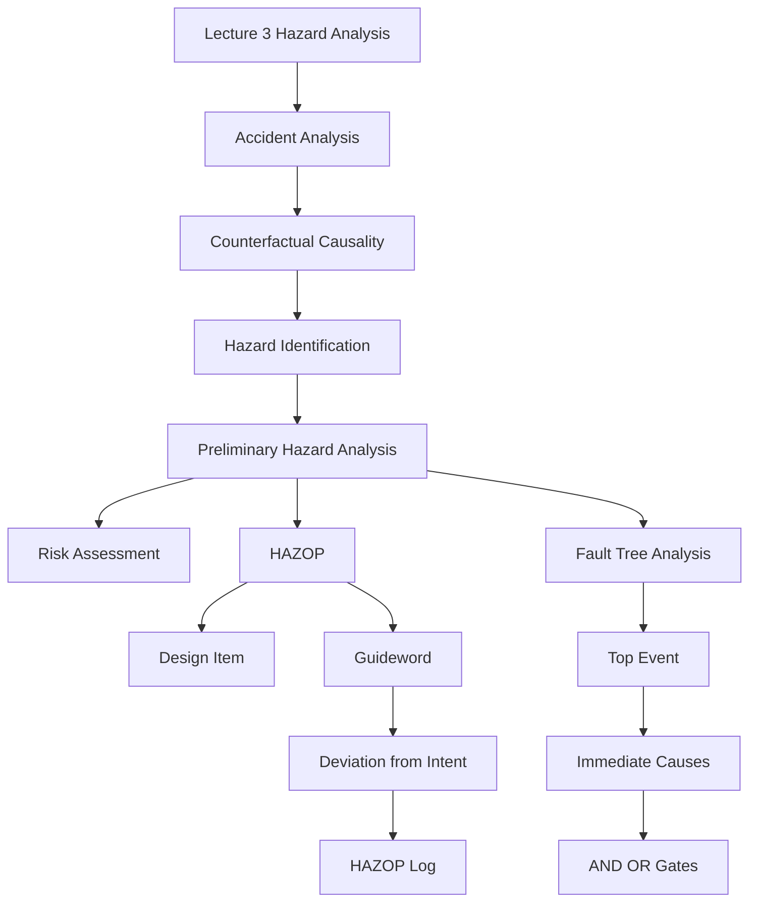

### 1. Topic Overview

- Topic: Lecture 3 - Safety Engineering, HAZOP, and Fault Tree Analysis.
- Main source: `materials/Lecture3-HAZOPS_FTA.pdf`.
- Course-note reference: `materials/course-notes.pdf`, especially sections 2.4.4, 2.5.2, 2.6.1, and 2.6.2.
- What this is about:
  Lecture 3 explains how safety engineers move from past accidents and hazard ideas into systematic analysis methods. The two main methods are HAZOP, used early to brainstorm deviations from intended behaviour, and Fault Tree Analysis, used to reason backwards from a hazard to combinations of causes.
- Why it matters:
  A safety-critical system cannot be judged safe only by testing normal behaviour. Engineers need repeatable methods for asking what could go wrong, what could cause it, how severe and likely it is, and whether the design mitigates it.
- Difficulty level:
  Intermediate. It builds on Lecture 2 concepts: accident, hazard, cause, risk, safety control, safety case, and hazard log.
- Prerequisites:
  Whole-system safety, hazard-to-control reasoning, risk as consequence plus frequency, and the difference between a hazard and an accident.

### 2. Core Concepts

#### Concept: Accident Causes Become Hazard Inputs

- Definition:
  Safety engineers study past accidents and incidents to identify causes that could become hazards in future systems.
- Intuition:
  New systems often resemble old systems. If a past design failed because of a known causal pattern, a new design should be checked against that pattern.
- Example:
  If a past brake-by-wire incident involved delayed brake-pedal signals, then a new brake controller should analyse the hazard where the ECU receives a brake signal late or not at all.
- Common mistakes:
  Treating accident history as storytelling rather than evidence for future hazard identification.

#### Concept: Counterfactual Causality

- Definition:
  A is treated as a cause of B when, if A had not happened, B would not have happened.
- Intuition:
  Causality is not just two things occurring together. We mentally remove one event and ask whether the later event would still occur.
- Example:
  In the steam-boiler example from the course notes, corrosion causes weakened metal because if the corrosion had not occurred, the metal would not have become weakened in that way.
- Common mistakes:
  Confusing correlation with causation, such as thinking a barometer reading causes a storm.

#### Concept: Preliminary Hazard Analysis

- Definition:
  Preliminary Hazard Analysis (PHA) is an early safety-lifecycle activity that asks what possible accidents or incidents could occur and what hazards and causes may be present.
- Intuition:
  Before detailed implementation, the team gathers known incident data, system models, and expert judgement to make a first hazard list and provisional risk assessment.
- Example:
  For a brake controller, PHA may identify that braking commands can be missing, late, too strong, or based on bad sensor input.
- Common mistakes:
  Thinking PHA proves the system is safe. PHA is an early identification and filtering activity, not final assurance.

#### Concept: Risk as Consequence Times Frequency

- Definition:
  Risk is assessed from the severity of a hazardous event and the likelihood or frequency of it occurring.
- Intuition:
  A very severe hazard can be intolerable even when rare; a less severe hazard may still matter if it is frequent.
- Example:
  In IEC 61508 style tables, catastrophic and frequent hazards are Class I, intolerable risk. Incredible and negligible hazards are Class IV, negligible risk.
- Common mistakes:
  Saying "high risk" without naming both the consequence and the concrete frequency factor.

#### Concept: HAZOP Design-Item and Guideword Schema

- Definition:
  HAZOP is an exploratory preliminary hazard analysis method. It takes each design item and applies guidewords to generate deviations from intended behaviour.
- Intuition:
  HAZOP makes brainstorming systematic. Instead of asking a vague "what could go wrong?", it asks structured what-if questions.
- Example:
  Design item: "the brake controller ECU receives a signal from the brake pedal when its foot pressure changes."
  Guideword NONE: no signal is received.
  Deviation: ECU does not know the brake was pressed.
  Consequence: vehicle may fail to decelerate.
- Common mistakes:
  Applying guidewords mechanically without interpreting them for the actual system.

#### Concept: HAZOP Log

- Definition:
  A HAZOP log records the result of analysing each design item and guideword pair.
- Intuition:
  The log is not just a list of scary events. It preserves traceability from intended behaviour to deviation, cause, consequence, safeguards, and recommendations.
- Example log columns:
  ID, guideword, deviation, causes, consequences, safeguards, recommendations.
- Common mistakes:
  Recording only the hazard while omitting causes, safeguards, or recommendations.

#### Concept: HAZOP Guidewords

- Definition:
  Guidewords are standard prompts for deviations from intent.
- Core guidewords:
  NONE, MORE, LESS, AS WELL AS, PART OF, REVERSE, OTHER THAN, EARLY, LATE, BEFORE, AFTER.
- Intuition:
  Each guideword changes the intended behaviour in a specific way.
- Example:
  For "send brake signal immediately":
  NONE means no signal is sent.
  LATE means the signal arrives after it is needed.
  EARLY may be nonsensical if "immediate after pedal press" leaves no meaningful earlier time.
- Common mistakes:
  Forcing every guideword to produce a hazard even when it is not meaningful for that design item.

#### Concept: HAZOP Limitations

- Definition:
  HAZOP has practical limits as a preliminary hazard analysis method.
- Key limitations:
  It needs a well-defined intended behaviour; it is time and resource intensive; it creates large documentation; and it tends to focus on single deviations from intent.
- Intuition:
  HAZOP is systematic, not automatic. It still depends on expertise and careful interpretation.
- Example:
  A team analysing every design item against every guideword creates a large spreadsheet that must be reviewed and maintained.
- Common mistakes:
  Treating HAZOP as complete accident analysis rather than an exploratory method.

#### Concept: Fault Tree Analysis

- Definition:
  Fault Tree Analysis (FTA) is a deductive hazard analysis technique that starts from a hazard or top-level event and works backwards to immediate causes and basic causes.
- Intuition:
  HAZOP asks "what deviations might happen?" FTA asks "given this bad event, what combination of causes could produce it?"
- Example:
  For the chemical mixing plant, the top event "tank overflows" occurs when Valve A is closed AND Valve B is open.
- Common mistakes:
  Building a fault tree forward from components instead of backward from the hazard.

#### Concept: Fault Tree Gates and Events

- Definition:
  Fault trees use event symbols and logic gates to show how causes combine.
- Core events:
  Basic event, undeveloped event, intermediate event, normal event, conditioning event.
- Core gates:
  AND, OR, priority AND, exclusive OR, inhibit.
- Intuition:
  AND means all input events are needed. OR means any one input event is sufficient.
- Example:
  "Level sensing failed" may require Sensor X failed AND Sensor Y failed. "Valve B open" may occur because Valve B failed OR an incorrect control signal was sent.
- Common mistakes:
  Using AND when one cause alone is sufficient, or using OR when multiple causes must combine.

#### Concept: Immediate, Necessary, and Sufficient Causes

- Definition:
  FTA decomposes an event by identifying immediate, necessary, and sufficient causes.
- Intuition:
  Think small. Do not jump from the top hazard straight to remote root causes.
- Example:
  The immediate causes of "tank overflows" are Valve A closed and Valve B open. Causes of Valve B open can be decomposed later.
- Common mistakes:
  Skipping intermediate events, producing a tree that hides important design reasoning.

### 3. Deep Understanding

Lecture 3 connects past accidents to systematic future analysis.

The reasoning path is:

1. Past accidents and incidents reveal causal patterns.
2. Counterfactual reasoning helps distinguish true causes from mere correlation.
3. Preliminary hazard analysis uses accident data, system models, and expert judgement to ask what could go wrong.
4. Risk assessment classifies hazards using consequence and frequency.
5. HAZOP makes early hazard brainstorming repeatable by applying guidewords to intended design items.
6. Fault Tree Analysis checks design mitigation by working backwards from hazards to combinations of causes.
7. The outputs become documentation for safety cases, design changes, and future incident analysis.

Relationship between HAZOP and FTA:

- HAZOP is exploratory and often used early during PHA.
- FTA is deductive and often used once a hazard or top event has been identified.
- HAZOP is good at generating possible hazards and deviations.
- FTA is good at explaining how a known hazard can occur through combinations of causes.

Key tradeoffs:

- HAZOP improves completeness and repeatability, but it is labour intensive and produces lots of documentation.
- FTA gives clear causal structure and can support probability calculations, but it depends on choosing the right top event and decomposing causes correctly.

### 4. Minimal Working Example

Scenario:

Design item: "The brake controller ECU receives a signal from the brake pedal when pedal pressure changes."

HAZOP-style analysis:

| Guideword | Deviation | Cause | Consequence | Safeguard or recommendation |
|---|---|---|---|---|
| NONE | No brake-pedal signal reaches ECU | sensor fault, wire fault, communication failure | vehicle may fail to slow | redundant signal path or fault detection |
| LATE | Signal arrives too late | scheduling delay, bus congestion, controller overload | vehicle decelerates later than expected | timing monitor and safe fallback |
| EARLY | Signal arrives before pedal change | may be nonsensical for this design item, or indicates spurious signal | unwanted braking | signal validation and debounce logic |

FTA-style follow-up:

Top event: "Vehicle fails to slow when brake is pressed."

Immediate causes might be:

- ECU does not receive brake signal.
- ECU receives signal but does not command brakes.
- Brake actuator receives command but does not apply force.

This shows the shift:

- HAZOP generates deviations from intended behaviour.
- FTA works backward from a selected bad event to causes.

### 5. Knowledge Graph

### 6. Self-Test Questions

Recall:

1. What is the difference between a hazard and an accident?
2. What does counterfactual causality ask?
3. Name three HAZOP guidewords.

Application:

1. For the design item "the train door closes after the warning tone," apply the guideword LATE and name one possible consequence.
2. For the top event "tank overflows," decide whether "Valve A closed" and "Valve B open" should be connected with AND or OR.

Explain like I am 5:

1. Explain HAZOP as a way of asking careful "what if" questions.

### 7. Weak Point Detection

Learners usually struggle with:

- Confusing causation with correlation.
- Restating a hazard as a cause.
- Applying HAZOP guidewords without first identifying a clear design item.
- Treating every guideword as meaningful for every design item.
- Mixing up HAZOP and FTA: HAZOP explores deviations; FTA works backward from a selected bad event.
- Choosing AND vs OR gates in a fault tree.
