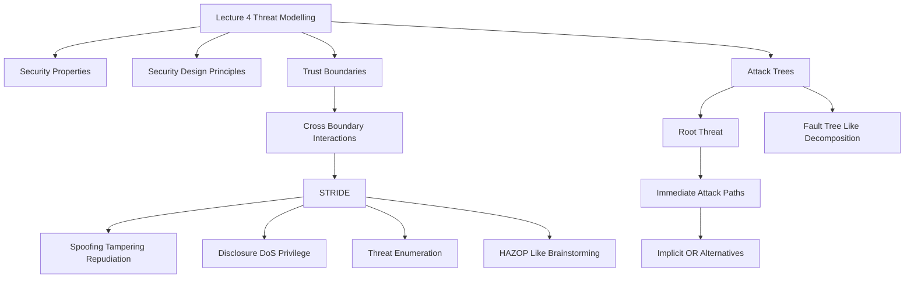

### 1. Topic Overview

- Topic: Lecture 4 - Security Engineering: Threat Modelling and Attack Trees.
- Main source: `materials/Lecture4-ThreatModelling_AttackTrees.pdf`.
- Course-note reference: `materials/course-notes.pdf`, Section 2.7, especially 2.7.1 The STRIDE Method and 2.7.2 Attack Trees.
- What this is about:
  Lecture 4 moves from safety hazard analysis to security threat analysis. The central idea is to systematically ask what an attacker could do at each trust boundary, then use attack trees to break an important threat into possible attack paths.
- Why it matters:
  Security failures in high-integrity systems can break confidentiality, integrity, availability, authentication, non-repudiation, or access control. Threat modelling makes security analysis repeatable instead of relying on vague brainstorming.
- Difficulty level:
  Intermediate. It builds directly on Lecture 3: HAZOP and Fault Tree Analysis.
- Prerequisites:
  Security goals, HAZOP guideword-style brainstorming, Fault Tree backward-cause analysis, and the idea that different system parts may be controlled by different entities.

### 2. Core Concepts

#### Concept: Security Properties

- Definition:
  Security engineering often checks whether a design protects confidentiality, integrity, availability, authentication, non-repudiation, and access control.
- Intuition:
  These are the kinds of security promises a system may need to keep.
- Example:
  If a user can see another user's private data, confidentiality is broken. If a user can modify another user's order, integrity and access control may be broken.
- Common mistakes:
  Treating "security" as one vague property instead of naming which property is threatened.

#### Concept: Saltzer and Schroeder Security Design Principles

- Definition:
  Saltzer and Schroeder's principles are design rules that reduce common sources of insecurity.
- Core principles from the lecture:
  Economy of mechanism, fail-safe defaults, complete mediation, open design, separation of privilege, least privilege, least common mechanism, and psychological acceptability.
- Intuition:
  Secure design should be simple, deny by default, check every access, avoid relying on secrecy of design, minimise privilege, minimise shared trusted mechanisms, and make the secure action easy for users.
- Example:
  Complete mediation says every access to a file or page should be checked, not just the first access in a session.
- Common mistakes:
  Memorising the list without connecting each principle to the security failure it prevents.

#### Concept: Threat Modelling

- Definition:
  Threat modelling is a systematic process for enumerating potential security threats to a system.
- Intuition:
  It is the security analogue of hazard analysis. Hazard analysis asks what unsafe states may occur; threat modelling asks what attacks or threats may occur.
- Example:
  In a website using a third-party CDN, threat modelling asks what users, network attackers, the web server, and the CDN could do or fail to do.
- Common mistakes:
  Jumping straight to controls before identifying the threat and affected security property.

#### Concept: Trust Boundary

- Definition:
  A trust boundary separates parts of a system controlled by different entities or trusted to different degrees.
- Intuition:
  Cross-boundary interactions are where security assumptions are tested.
- Example:
  In the lecture slide, the user/browser, corporate data centre, and offsite web storage/database live in separate trust boundaries. In the course-note example, the user's browser, web server, and third-party CDN are distinct trust regions.
- Common mistakes:
  Drawing boundaries around technology types instead of control/trust relationships.

#### Concept: STRIDE

- Definition:
  STRIDE is a threat-modelling method where each letter names a class of security threat.
- Categories and linked security goals:
  Spoofing threatens authentication.
  Tampering threatens integrity.
  Repudiation threatens non-repudiation.
  Information disclosure threatens confidentiality.
  Denial of service threatens availability.
  Elevation of privilege threatens access control.
- Intuition:
  STRIDE is like a set of security guidewords. Apply each category to cross-boundary interactions and ask, "How could this threat happen here?"
- Example:
  For a web user talking to a web server, spoofing could be one user pretending to be another; tampering could be modifying data in transit; denial of service could be flooding the site with traffic.
- Common mistakes:
  Thinking the categories must be perfectly non-overlapping. The course notes explicitly warn that some threats can fit more than one category.

#### Concept: STRIDE and HAZOP Analogy

- Definition:
  STRIDE is similar to HAZOP because both are systematic brainstorming methods.
- Intuition:
  HAZOP applies guidewords to design items to find safety deviations. STRIDE applies threat categories to trust-boundary interactions to find security threats.
- Example:
  HAZOP might apply NONE to "brake signal reaches ECU"; STRIDE might apply Spoofing to "browser sends request to web server."
- Common mistakes:
  Saying STRIDE is a risk ranking method. In this lecture, its main role is threat enumeration and brainstorming.

#### Concept: Attack Trees

- Definition:
  An attack tree deductively explores the ways a chosen threat could be realised.
- Intuition:
  It is the security analogue of a fault tree. Start with the attacker goal at the root and ask "how could this happen?"
- Example:
  Root: Access the building.
  Children: go through the door, go through the window, go through the wall, or some other way.
  The "go through the door" branch can be refined into when it is unlocked, drill the lock, pick the lock, use the key, or social engineering.
- Common mistakes:
  Starting with random attacker actions instead of first choosing the root threat.

#### Concept: Implicit OR in Simple Attack Trees

- Definition:
  In the simple attack trees used in this lecture, multiple children usually represent alternative ways for the parent event to occur.
- Intuition:
  If any child attack path succeeds, the parent threat can be realised.
- Example:
  To "use the key", an attacker might find a key, steal a key, photograph and reproduce it, or socially engineer a key.
- Common mistakes:
  Assuming all child nodes must occur together. In the simple variant, they are usually alternatives unless an AND relation is explicitly introduced.

### 3. Deep Understanding

Lecture 4 has a clear bridge from Lecture 3:

1. Safety hazard analysis tries to enumerate hazards.
2. Security threat modelling tries to enumerate threats.
3. HAZOP uses guidewords over design items.
4. STRIDE uses threat categories over trust-boundary interactions.
5. Fault Tree Analysis starts from a selected bad event and works backward to causes.
6. Attack trees start from a selected attacker goal or threat and work downward to possible attack paths.

The main workflow is:

1. Identify security properties that matter.
2. Draw trust boundaries by asking who controls each part of the system.
3. Apply STRIDE at the interactions crossing those boundaries.
4. Record concrete threats rather than vague worries.
5. Choose serious threats for deeper analysis.
6. Build attack trees to show how those threats could be realised.
7. Use the result to decide which mitigations should be designed and justified.

Key tradeoffs:

- STRIDE improves coverage, but it still depends on choosing meaningful boundaries and interactions.
- STRIDE categories are brainstorming aids, not perfect labels.
- Attack trees make attack paths explicit, but they depend on choosing the right root threat and decomposing it at the right level of detail.

### 4. Minimal Working Example

Scenario:

A web application has a user's browser, a web server, and a third-party CDN.

Trust boundaries:

- User/browser: controlled by the user or possible attacker.
- Web server: controlled by the organisation.
- Third-party CDN: controlled by an external provider, trusted differently from both users and the organisation.

STRIDE-style threat brainstorming:

| STRIDE category | Question | Example threat |
|---|---|---|
| Spoofing | Who could pretend to be someone else? | A user logs in as another user using stolen credentials. |
| Tampering | What could be modified without permission? | An attacker changes data in transit between server and CDN. |
| Repudiation | Could someone deny an action later? | An attacker deletes or modifies access logs. |
| Information disclosure | What secret could be learned? | An attacker steals the TLS private key or password file. |
| Denial of service | What could stop legitimate service? | A bot army floods the website with traffic. |
| Elevation of privilege | What forbidden action could become possible? | A user accesses another user's content by changing request IDs. |

Attack-tree follow-up:

Root threat: Access another user's private content.

Possible child paths:

- Guess or steal the user's password.
- Abuse a missing access-control check.
- Trick the user into sending an unintended request.
- Connect directly to a backend or CDN component that bypasses normal checks.

### 5. Knowledge Graph

### 6. Self-Test Questions

Recall:

1. What is a trust boundary?
2. What does each letter of STRIDE stand for?
3. What is the root node of an attack tree?

Application:

1. For a mobile banking app, name one trust boundary and one STRIDE threat across it.
2. Build a two-level attack tree for "attacker withdraws money from another user's account."

Explain like I am 5:

1. Explain why threat modelling asks us to "think like attackers."

### 7. Weak Point Detection

Learners usually fail in these places:

- They list generic attacks without tying them to a trust boundary.
- They memorise STRIDE but cannot map each category to a security property.
- They treat STRIDE as exact classification rather than a brainstorming aid.
- They start an attack tree from a technique instead of from the attacker goal.
- They forget that simple attack-tree children are usually alternative paths, like an implicit OR.
