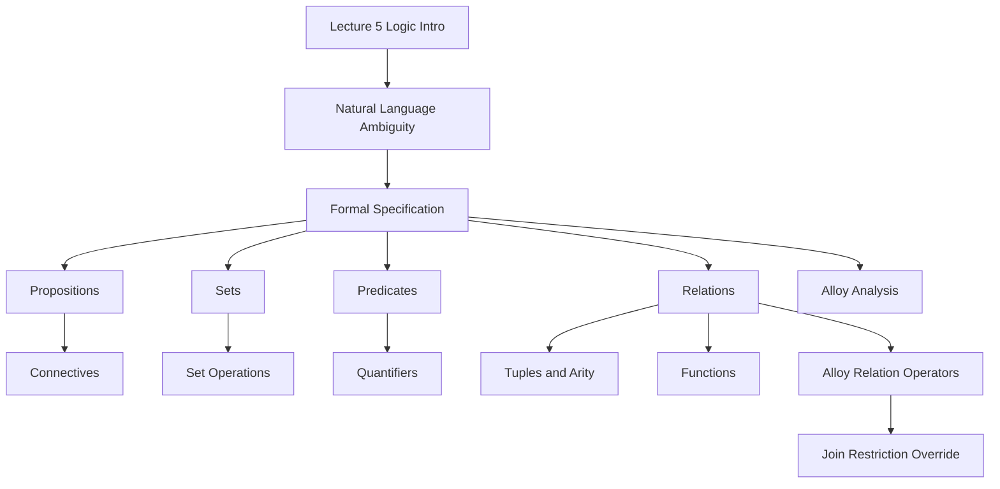

### 1. Topic Overview

- Topic: Lecture 5 - Introduction to Logic.
- Main source: `materials/Lecture5-IntroToLogic.pdf`.
- Course-note reference: `materials/course-notes.pdf`, especially Sections 3.4 to 3.7: logic and set theory, introduction to Alloy, Alloy logic, and Alloy language.
- Extracted source text:
  - `outputs/_extracted/lecture5_intro_to_logic.txt`
  - `outputs/_extracted/course_notes_section_3_4_to_3_7_logic_alloy.txt`
- What this is about:
  Lecture 5 introduces the logic, set, predicate, and relation vocabulary needed for formal model-based specification and Alloy.
- Why it matters:
  Natural-language requirements are ambiguous. Formal specifications use logic and set theory so that we can reason about consistency, properties, and counterexamples more precisely.
- Difficulty level:
  Beginner to intermediate. The ideas are simple one at a time, but they combine quickly in Alloy.
- Prerequisites:
  Basic boolean reasoning, the idea of a set, and the Lecture 2-4 motivation that high-integrity systems need systematic evidence, not only informal claims.

### 2. Core Concepts

#### Concept: Why Logic Is Needed

- Definition:
  Logic gives a precise language for writing statements that can be reasoned about mechanically or mathematically.
- Intuition:
  A sentence like "share health data securely and only with authorized parties" sounds clear, but it hides many questions: who is authorized, what counts as sharing, and what does secure mean?
- Example:
  Natural language: "Only doctors have access to patient medical records."
  Logical shape: if a person has access to a medical record, then that person must be a doctor.
- Common mistakes:
  Treating formal logic as implementation detail. In this course, logic is used to specify what must be true, not how code must be written.

#### Concept: Propositions and Connectives

- Definition:
  A proposition is a statement that is either true or false. Connectives combine propositions: and, or, not, implies, and iff.
- Intuition:
  Propositions are the smallest truth-carrying pieces. Connectives build larger claims from them.
- Example:
  `Raining[Parkville] and not Raining[Sydney]` combines two smaller claims.
- Common mistakes:
  Reading `implies` like ordinary English causation. In logic, `P implies Q` means whenever P is true, Q must be true.

#### Concept: Sets

- Definition:
  A set is a collection of things. Alloy uses set operations such as union `+`, intersection `&`, difference `-`, subset `in`, empty set `none`, universe `univ`, and cardinality `#A`.
- Intuition:
  Sets let us talk about groups of possible values without choosing an implementation such as arrays or lists.
- Example:
  If `Doctors` is the set of doctors and `Staff` is the set of staff, then `Doctors in Staff` says every doctor is also staff.
- Common mistakes:
  Confusing membership and subset:
  `x in A` says one element belongs to A.
  `B in A` says every element of set B is also in A.

#### Concept: Predicates and Quantifiers

- Definition:
  A predicate is a proposition with variables. Quantifiers state how many variable values make the predicate true: `all`, `some`, `one`, `lone`, and `no`.
- Intuition:
  Predicates let a specification talk about many possible objects at once.
- Example:
  `all city : AustralianCities | Raining[city]` says every Australian city is raining.
  `some city | not Raining[city]` says at least one city is not raining.
- Common mistakes:
  Mixing up `some` and `all`, or forgetting the domain of the variable.

#### Concept: Relations as Sets of Tuples

- Definition:
  A relation is a set of tuples. A unary relation is a set of atoms, a binary relation is a set of pairs, and a ternary relation is a set of triples.
- Intuition:
  A relation records which things are connected to which other things.
- Example:
  A password database relation could be:
  `LDAPDB = {(u1,p3), (u2,p2), (u3,p1)}`
  Each tuple says which password belongs to which username.
- Common mistakes:
  Thinking relations are only database tables or only functions. In Alloy, sets, predicates, and relations are all closely related.

#### Concept: Functions as Special Relations

- Definition:
  A function is a relation where each input maps to at most one output. A total function gives an answer for every input in its domain; a partial function may leave some inputs unmapped.
- Intuition:
  Every function is a relation, but not every relation is a function.
- Example:
  If `u3` maps to both `p1` and `p2`, then the username-to-password relation is not a function.
- Common mistakes:
  Assuming `Username -> Password` automatically means every username has exactly one password. Functionality and totality are separate constraints.

#### Concept: Alloy Relation Operators

- Definition:
  Alloy provides operators for combining and changing relations:
  `+` union, `++` override, `<:` domain restriction, `:>` range restriction, and `.` or `[]` relational join.
- Intuition:
  Relations are the main data structure in Alloy, so many modelling steps are relation operations.
- Example:
  `LDAPDB + (u4 -> p2)` adds one username-password pair.
  `LDAPDB ++ (u3 -> p2)` replaces the existing mapping for `u3` with the new one.
- Common mistakes:
  Confusing `+` with `++`. Union adds tuples; override removes old tuples with the same domain before adding the new tuple.

#### Concept: Alloy as Logic + Language + Analysis

- Definition:
  The course notes describe Alloy as three parts: first-order predicate logic plus relational calculus, a modelling language, and an analyser that searches bounded domains for counterexamples.
- Intuition:
  Alloy does not mainly prove that a model is universally correct. It is often used to find small counterexamples that show what is wrong with a model.
- Example:
  A model with three usernames, URLs, and passwords can still expose a broken assertion because Alloy searches all possible cases in that small finite scope.
- Common mistakes:
  Saying "Alloy found no counterexample, so the assertion is proved forever." In bounded analysis, no counterexample means the property may hold within the chosen scope.

### 3. Deep Understanding

Lecture 5 sits between informal engineering analysis and formal modelling.

The bridge is:

1. Natural-language requirements are useful but ambiguous.
2. Formal model-based specification uses logic and set theory to remove ambiguity.
3. Sets describe the possible data values.
4. Predicates describe properties and operations over those values.
5. Relations connect values and become the central representation in Alloy.
6. Alloy adds a language and an analyser so models can be explored for counterexamples.

The course notes add two important motivations beyond the slides:

1. Sets and predicates force abstraction. They help specify what the system must do without specifying design or implementation details.
2. Alloy analysis is bounded counterexample search. It is useful because many early specifications are wrong, and small counterexamples are easier to understand.

Key tradeoffs:

- Logic improves precision, but beginners can overload quickly if propositions, sets, predicates, and relations are introduced all at once.
- Alloy is powerful because everything is relational, but this means the learner must become comfortable treating atoms, sets, and mappings in one unified way.
- Formal specification avoids implementation detail, but the writer must still choose the right abstraction.

### 4. Minimal Working Example

Requirement:

Only doctors may access patient medical records.

First formal shape:

```text
all p : Person, r : MedicalRecord |
    canAccess[p, r] implies p in Doctor
```

Reasoning flow:

1. `Person`, `MedicalRecord`, and `Doctor` are sets.
2. `canAccess` is a relation between people and records.
3. `all p : Person, r : MedicalRecord` says we check every person-record pair.
4. `canAccess[p, r] implies p in Doctor` says access is allowed only if the person is a doctor.

This still does not say how access control is implemented. It only states the property the system must satisfy.

### 5. Knowledge Graph



### 6. Self-Test Questions

Recall:

1. What is a proposition?
2. What is the difference between `some x | P[x]` and `all x | P[x]`?
3. What is a relation in Alloy?

Application:

1. Write the logical shape of "every registered car has one owner."
2. Given `DB = {(u1,p1), (u2,p2)}`, what is the result of `DB + (u1 -> p3)` and why is this different from `DB ++ (u1 -> p3)`?

Explain like I am 5:

1. Explain why formal logic is useful when requirements use words like "securely", "only", or "authorized".

### 7. Weak Point Detection

Learners usually fail in these places:

- They cannot translate "only X can do Y" into an implication.
- They confuse element membership with subset.
- They confuse relation union `+` with relation override `++`.
- They treat functions and total functions as the same thing.
- They think Alloy "proves correctness" rather than searching bounded domains for counterexamples.
