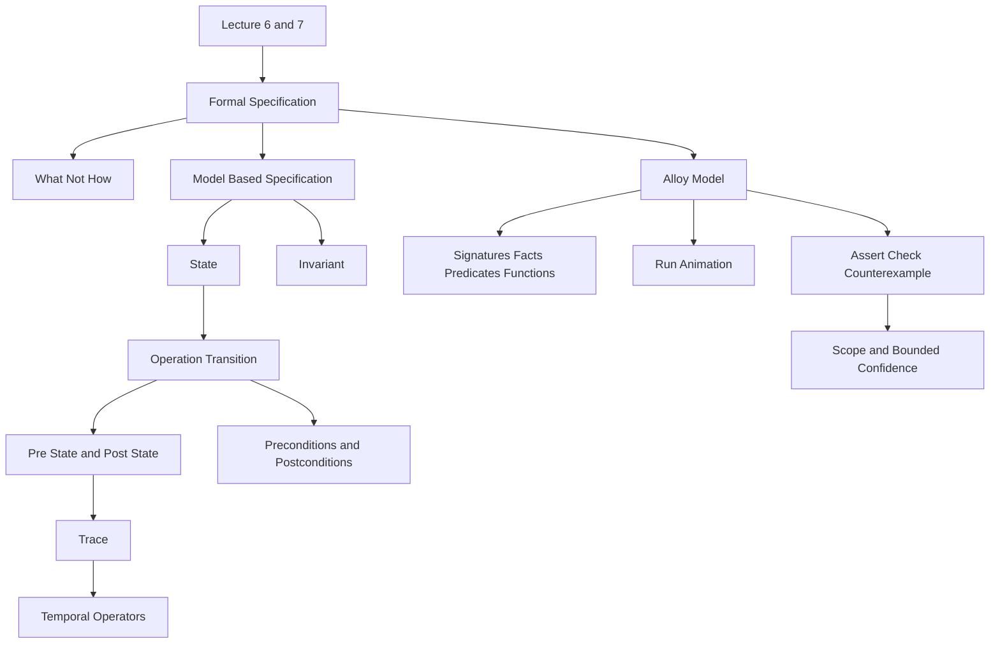

### 1. Topic Overview

- Topic: Lecture 6 and Lecture 7 - Formal Specification and Checking Formal Specifications.
- Main sources:
  - `materials/Lecture6-FormalSpecification.pdf`
  - `materials/Lecture7-CheckingFormalSpecifications.pdf`
- Course-note reference:
  - `materials/course-notes.pdf`, Chapter 3, especially Sections 3.1 to 3.11.
- Extracted source text:
  - `outputs/_extracted/lecture6_formal_specification.txt`
  - `outputs/_extracted/lecture7_checking_formal_specifications.txt`
  - `outputs/_extracted/course_notes_full_latest.txt`
- What this is about:
  These lectures move from the logic vocabulary of Lecture 5 into model-based formal specification: describe system state, describe allowed transitions, then use Alloy to explore behaviours and check assertions within finite bounds.
- Why it matters:
  High-integrity systems need more than informal requirements and tests. Formal specifications can remove ambiguity early, support machine checking, and expose mistakes while they are still cheaper to fix.
- Difficulty level:
  Intermediate. The basic idea is simple: specify what, not how. The difficulty comes from tracking states over time and interpreting Alloy's bounded analysis correctly.
- Prerequisites:
  Basic predicate logic, sets, relations, functions, Alloy relation operators, and the idea of pre-state versus post-state from Lecture 5.

### 2. Core Concepts

#### Concept: Formal Specification Says What, Not How

- Definition:
  A formal specification uses mathematical notation to define what a system or module must do without committing to an algorithm, data structure, or implementation design.
- Intuition:
  A specification is like a precise contract for behaviour. It says what outcomes are allowed. The program later decides how to achieve those outcomes.
- Example:
  A sort specification can say the output list is sorted and is a permutation of the input list. It does not say whether to use quicksort, mergesort, or insertion sort.
- Common mistakes:
  Treating formal specification as code. A specification may look formal like code, but its job is to constrain allowed behaviour, not execute an implementation recipe.

#### Concept: Model-Based Specification as a State Machine

- Definition:
  Model-based specification represents a system using state plus operations that transition the system from one state to another.
- Intuition:
  A module has variables that describe its current state. Each operation describes how the next state is allowed to differ from the current state.
- Example:
  A counter has state `n : Natural`. The operation `increment` can be specified as `n' = n + 1`, meaning the next value of `n` is the current value plus one.
- Common mistakes:
  Reading `n' = n + 1` as assignment. In Alloy-style temporal logic, this is a relation between pre-state and post-state values.

#### Concept: Traces and Temporal Operators

- Definition:
  A trace is a sequence of states. Temporal operators describe what must hold now, in the next state, eventually, or throughout the future of a trace.
- Intuition:
  Instead of asking only "what is true in this state?", temporal logic asks "what is true over time?"
- Example:
  If the current state is `s0`, then:
  - `after P` means `P` holds in the next state.
  - `always P` means `P` holds in every state from now onward.
  - `eventually P` means `P` holds in at least one future state.
  - `P ; Q` means `P` holds now and `Q` holds in the next state.
- Common mistakes:
  Forgetting that `always` is needed when the assertion must apply throughout a trace, not only at the initial state.

#### Concept: Precondition and Postcondition

- Definition:
  A precondition states the assumptions under which an operation is specified. A postcondition states the behaviour that must hold after the operation, assuming the precondition held before.
- Intuition:
  The precondition says "when this operation is allowed or meaningful." The postcondition says "what result must be true after it runs."
- Example:
  Binary search assumes the input list is sorted:
  - Precondition: `sorted(list)`.
  - Postcondition: either the returned `index` points to the target, or `index = -1` and the target is not in the list.
- Common mistakes:
  Writing only the successful case as the postcondition and forgetting the "not found" case.

#### Concept: Data Types as Sets, Relations, and Functions

- Definition:
  Formal model-based specifications usually model data using sets, relations, and functions rather than implementation structures.
- Intuition:
  We abstract away arrays, pointers, and storage layout. We keep only the mathematical shape needed to state behaviour.
- Example:
  A sequence of elements of type `T` can be modelled as a function from positive integers to `T`. Its domain is the valid indices, and its range is the set of elements in the sequence.
- Common mistakes:
  Confusing an implementation list with a mathematical sequence model. The model is allowed to be simpler and more abstract than the eventual implementation.

#### Concept: Why Formal Specification Can Reduce Later Cost

- Definition:
  Formal specification often moves effort earlier in the lifecycle so ambiguity, incompleteness, and design questions are found before implementation and testing.
- Intuition:
  It may feel slower at the start, but it can reduce expensive rework later.
- Example:
  Lecture 6's cost slide compares Z used versus Z not used. The Z-used curve has more early specification/design effort but fewer later problems in verification and system testing.
- Common mistakes:
  Assuming formal specification is always cheaper or always worthwhile. The course notes are more careful: it is most justified when the cost of faults is high, especially for high-integrity requirements.

#### Concept: Alloy Model Structure

- Definition:
  Alloy models are built from signatures, facts, predicates, functions, and assertions.
- Intuition:
  These constructs separate the pieces of a formal model:
  - Signatures declare sets and relations.
  - Facts globally constrain the model.
  - Predicates describe properties, operations, or state transitions.
  - Functions provide shorthand expressions.
  - Assertions state properties that should follow from the model.
- Example:
  In the password-manager example, `PassBook` has a variable relation `password : Username -> URL -> Password`; operations such as `add` and `delete` describe how `password'` changes.
- Common mistakes:
  Treating predicates as procedures that execute line by line. Predicate bodies are logical constraints evaluated together.

#### Concept: Finite State Machines in Alloy

- Definition:
  A finite state machine model has an initial state, a collection of state variables, and operations that define possible transitions.
- Intuition:
  Alloy can describe "what traces are possible" by saying which initial states are allowed and which operations may occur between states.
- Example:
  A common pattern is:

```alloy
sig State { ... }
pred Init[s : State] { ... }
pred Inv[s : State] { ... }
pred Op1[s : State] { ... }
pred OpN[s : State] { ... }
```

- Common mistakes:
  Forgetting to constrain the allowed transitions. If the model allows arbitrary transitions, Alloy may produce behaviours that are valid under the written model but invalid under the intended system.

#### Concept: Animation with `run`

- Definition:
  Alloy's `run` command searches for instances that satisfy a predicate within a specified finite bound.
- Intuition:
  `run` is used to animate or explore the specification. It helps answer: "Can this behaviour happen according to my model?"
- Example:
  `run add for 3 but 1 PassBook, 1..2 steps` asks Alloy to find a one-transition example of `add` using a small finite universe.
- Common mistakes:
  Thinking a failed `run` proves impossibility. It may only mean the chosen scope was too small.

#### Concept: Assertion Checking with `assert` and `check`

- Definition:
  An `assert` declares a property expected to follow from the specification. `check` searches for a counterexample within a finite scope.
- Intuition:
  `check` tries to break your claim. If it finds a counterexample, the model or the assertion is wrong relative to your intention.
- Example:
  Lecture 7's `deleteIsUndo` assertion says: if we add a password and then delete it, the password relation two states later should equal the original relation.

```alloy
assert deleteIsUndo {
  all pb : PassBook, url : URL, user : Username, pwd : Password |
    (add[pb, url, user, pwd] ; delete[pb, url, user])
      => pb.password = pb.password''
}
```

- Common mistakes:
  Reading "no counterexample found" as a proof. Alloy performs bounded assertion checking unless a special argument justifies a broader proof.

#### Concept: Scope and the Small Scope Hypothesis

- Definition:
  Scope is the finite bound Alloy uses for its search: how many atoms of each signature, and for temporal models, how many steps in a trace.
- Intuition:
  Alloy explores all cases inside the chosen small universe, not just a few tests. The small scope hypothesis says many modelling faults have small counterexamples.
- Example:
  Start with a small scope such as 3 to find obvious modelling mistakes, then increase the scope once the model appears sane.
- Common mistakes:
  Using too small a scope and treating the result as strong confidence, or using a large scope before the model has been debugged.

#### Concept: Invalid Counterexamples

- Definition:
  An "invalid counterexample" is usually not invalid to Alloy. It is valid under the model as written, but invalid under the modeller's intended meaning.
- Intuition:
  These counterexamples are useful because they reveal missing facts, missing preconditions, wrong assertions, or underconstrained transitions.
- Example:
  If the password model forgets a constraint that each user/URL pair has at most one password, Alloy may show a strange password graph. That graph is a counterexample to the modeller's intention, but the model allowed it.
- Common mistakes:
  Dismissing such counterexamples as tool noise. Often they are evidence that the specification is incomplete.

#### Concept: Invariant Preservation

- Definition:
  An invariant is a property that should hold in every reachable state. In Alloy, assertions can check whether initialisation establishes the invariant and whether each operation preserves it.
- Intuition:
  For high-integrity systems, many safety and security requirements have invariant shape: "this bad condition must never become true."
- Example:

```alloy
assert addPreservesInv {
  always all pb : PassBook, user : Username, url : URL, pwd : Password |
    inv[pb] and add[pb, url, user, pwd] => after inv[pb]
}
```

- Common mistakes:
  Omitting `always`, which can accidentally check only the initial state rather than arbitrary states in the trace.

### 3. Deep Understanding

Lecture 6 and Lecture 7 form one learning chain:

1. Natural-language requirements are ambiguous.
2. Formal specification makes the behavioural claim precise.
3. Model-based specification chooses a state-machine abstraction.
4. Operations are described as pre-state to post-state relations.
5. Temporal logic lets us talk about traces of states, not only one state.
6. Alloy gives a compact language for signatures, facts, predicates, functions, and assertions.
7. `run` explores possible behaviours.
8. `check` searches for bounded counterexamples to claimed properties.
9. Counterexamples are learning assets: they often reveal missing constraints or wrong mental models.
10. No counterexample in a finite scope gives confidence, not universal correctness.

The central tradeoff:

- Formal specification requires more upfront thinking and specialised skill.
- In high-integrity contexts, this can be worth it because early mistakes are cheaper and less dangerous than faults found after implementation or release.
- Alloy is especially useful because it makes specifications machine-checkable, but its bounded nature must be interpreted carefully.

### 4. Minimal Working Example

Suppose a small access-control module stores which users may view which records.

State:

```text
canView : User -> Record
```

Operation:

```text
grant[u, r]
```

Precondition:

```text
u in User and r in Record
```

Postcondition:

```text
canView' = canView + (u -> r)
```

Meaning:

1. `canView` is the current relation.
2. `canView'` is the next-state relation.
3. `(u -> r)` is the new permission tuple.
4. The postcondition says the next state is the old permissions plus the new permission.
5. It says nothing about database tables, API endpoints, or implementation.

Possible assertion:

```text
If grant[u, r] happens, then after the operation, u can view r.
```

Alloy-style shape:

```alloy
assert grantWorks {
  all u : User, r : Record |
    grant[u, r] => after ((u -> r) in canView)
}
```

This assertion can be checked within a finite scope. If Alloy finds a counterexample, either `grant` is wrong, the assertion is wrong, or the model is missing a constraint.

### 5. Knowledge Graph



### 6. Self-Test Questions

Recall:

1. What is the difference between a formal specification and a program implementation?
2. What does `x'` mean in a state-transition specification?
3. What is the difference between Alloy's `run` and `check` commands?

Application:

1. For a counter with state `n`, write the postcondition for an operation that resets it to zero.
2. If Alloy finds a counterexample to an assertion, what are two possible explanations?

Explain like I am 5:

1. Explain why "no counterexample found" is not the same as "the specification is definitely correct."

### 7. Weak Point Detection

Learners usually fail in these places:

- They read primed expressions like assignments instead of next-state values.
- They mix up preconditions and postconditions.
- They write postconditions that cover only the success case and forget exceptional cases.
- They think Alloy executes predicates line by line.
- They treat `check` as proof rather than bounded counterexample search.
- They dismiss strange counterexamples instead of asking which model constraint allowed them.
