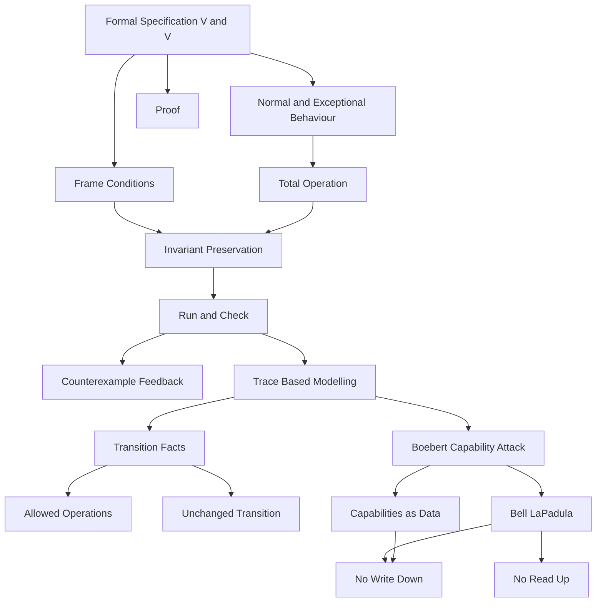

### 1. Topic Overview

- Topic:
  Lecture 8 plus Lecture 9-10 - Formal verification and validation, then trace-based modelling with Boebert's capability attack.
- Main sources:
  - `materials/Lecture8-FormalVerificationAndValidation.pdf`
  - `materials/Lecture9-10-TraceBasedModelling.pdf`
  - `materials/L8-code-expanded_lastpass.als`
  - `materials/Lecture9-10-boebert-code.als`
- Course-note reference:
  - `materials/course-notes.pdf`, Chapter 3, especially Sections 3.8 to 3.11.
- Extracted source text:
  - `outputs/_extracted/lecture8_formal_verification_and_validation.txt`
  - `outputs/_extracted/lecture9_10_trace_based_modelling.txt`
  - `outputs/_extracted/course_notes_full_latest.txt`
- What this is about:
  Lecture 8 strengthens the modelling discipline from Lectures 6-7: specify normal and exceptional behaviour, frame unchanged state explicitly, and use V&V techniques to find model faults. Lecture 9-10 then applies trace-based Alloy modelling to a security example where the interesting bug appears across a sequence of operations, not in one isolated transition.
- Why it matters:
  High-integrity systems often fail because the model omits something important: an exceptional case, an unchanged field, an initial condition, or a multi-step attack path. These lectures teach how to make those omissions visible.
- Difficulty level:
  Intermediate to advanced. The hard part is not the syntax alone; it is keeping separate "what is true in one transition" from "what is true across a trace."
- Prerequisites:
  Alloy signatures, relations, predicates, assertions, `run`, `check`, scope, `var` fields, primed post-state expressions, `after`, `always`, and basic access-control terms.

### 2. Core Concepts

#### Concept 1: Frame Conditions

- Definition:
  A frame condition says which parts of the state stay unchanged during an operation.
- Intuition:
  In Alloy, if a mutable field is not constrained, Alloy may choose any post-state value for it. "Not mentioned" does not mean "unchanged."
- Example:
  If an object has mutable fields `x` and `y`, then:

```alloy
pred addToX [o : Obj] {
  o.x' = o.x + ...
}
```

  constrains only `x`. The post-state value of `y` is arbitrary. A safer version says:

```alloy
pred addToX [o : Obj] {
  o.x' = o.x + ...
  o.y' = o.y
}
```

- Common mistakes:
  Assuming a field stays the same because the operation "does not talk about it."

#### Concept 2: Normal and Exceptional Behaviour

- Definition:
  A total operation can be built from a normal case and one or more exceptional cases.
- Intuition:
  Normal behaviour says what happens when the precondition is satisfied. Exceptional behaviour says what happens when it is not.
- Example:
  In the expanded LastPass model, `addNormal` adds a password only when no password already exists. `addExceptional` handles the duplicate-add case by leaving `pb.password` unchanged and returning `Failed`.
- Common mistakes:
  Writing the exceptional case as only `report in Failed` and forgetting to constrain the post-state.

#### Concept 3: Invariant Establishment and Preservation

- Definition:
  An invariant is a property that should hold in every reachable state. Verification normally checks that initialization establishes it and every operation preserves it.
- Intuition:
  The proof/checking shape is:
  - first state is good,
  - every operation takes good states to good states,
  - therefore all reachable states stay good.
- Example:

```alloy
assert initEstablishes {
  all pb : PassBook | init[pb] => inv[pb]
}

assert addPreservesInv {
  always all pb : PassBook, user : Username, url : URL,
      pwd : Password, report : Report |
      inv[pb] and add[pb, url, user, pwd, report] => after inv[pb]
}
```

- Common mistakes:
  Omitting `always`, which can accidentally check only the first state of a trace.

#### Concept 4: V&V for Formal Specifications

- Definition:
  Verification and validation of formal specifications checks whether the model is internally consistent and whether it represents the intended system.
- Intuition:
  A formal spec can still be wrong. It may precisely say the wrong thing.
- Techniques:
  - Animation with `run`.
  - Model checking with `check`.
  - Implementation and testing.
  - Reviews and inspections.
  - Proof.
- Common mistakes:
  Thinking a formal model is automatically correct because it is mathematical.

#### Concept 5: Boebert's Capability Attack

- Definition:
  Boebert's attack shows that sparse capability systems, where capabilities are treated as ordinary data, cannot directly enforce the Bell-LaPadula star-property.
- Intuition:
  A capability can be copied through a data channel. If caps and data are indistinguishable, access rights can propagate in ways the policy did not intend.
- Example:
  Low has a read-write capability to a low segment. Low writes that capability into the low segment. High reads it from the low segment. Now High possesses a write capability to a low object, violating "no write down."
- Common mistakes:
  Treating the attack as one operation. It requires a trace: write first, then read.

#### Concept 6: Bell-LaPadula Rules Used Here

- Definition:
  The model uses two confidentiality rules:
  - Simple Security Property: no read up.
  - Star-property: no write down.
- Intuition:
  Low should not read high data. High should not write to low places, because that could leak high information downward.
- Example:
  A High actor having a `Write` capability to a Low segment violates the star-property.
- Common mistakes:
  Remembering only "no read up" and forgetting that "no write down" is the rule Boebert's attack breaks.

#### Concept 7: Alloy Model for Capabilities

- Definition:
  The Boebert model represents capabilities, actors, segments, classifications, rights, and changing state.
- Intuition:
  Capabilities are data items that point to an object and carry permissions.
- Code shape:

```alloy
sig Cap extends Data { target : one Object, perms : set Rights }
abstract sig Object { clas : one Classification }
sig Segment extends Object {}
sig Actor extends Object {}

one sig State {
  var segsdata : Segment -> set Data,
  var actorscaps : Actor -> set Cap
}
```

- Common mistakes:
  Thinking `State` means many separate state atoms. Here `State` is one atom whose `var` fields change over time.

#### Concept 8: Trace Constraints

- Definition:
  A trace constraint tells Alloy which transitions are allowed at every step of a trace.
- Intuition:
  Without a fact constraining transitions, Alloy can invent arbitrary state changes.
- Example:

```alloy
fact state_transition {
  always all s : State {
    read[s] or write[s] or state_unchanged[s]
  }
}
```

- Common mistakes:
  Forgetting `state_unchanged`, which matters because Alloy represents traces as lasso traces.

#### Concept 9: Counterexamples as Model Feedback

- Definition:
  A counterexample is not just a failed proof attempt; it is evidence about what the written model allows.
- Intuition:
  If Alloy finds a strange counterexample, first ask: "Did my model allow this because I forgot a constraint?"
- Example:
  The first `no_violation` check finds a counterexample where a segment initially already contains a problematic capability. That leads to the stronger initial condition `safe_state_strong`.
- Common mistakes:
  Dismissing the counterexample as invalid instead of using it to refine the model.

### 3. Deep Understanding

The combined learning chain is:

1. A model has mutable state.
2. Every operation must say what changes and what does not change.
3. Normal and exceptional cases should both constrain the post-state.
4. Invariants are checked by initialization plus preservation by each operation.
5. `run` animates possible behaviours; `check` searches for counterexamples.
6. Some properties are not about one transition but about whole traces.
7. Trace models need facts that constrain allowed transitions.
8. Security attacks often appear as multi-step traces, not single bad states.
9. Counterexamples help distinguish a real attack from a missing model constraint.
10. Proof gives stronger assurance, but proof itself can reveal missing requirements.

The key bridge from Lecture 8 to Lecture 9-10:

```text
Lecture 8: If an operation omits a post-state constraint, the next state is too loose.
Lecture 9-10: If a trace omits transition or initial-state constraints, the whole behaviour space is too loose.
```

Code observations:

- `L8-code-expanded_lastpass.als` correctly uses frame conditions such as `pb.password' = pb.password` in failed add/delete cases.
- The same file defines `updateExceptional`, but `update` combines `updateNormal` with `deleteExceptional`. This means the defined `updateExceptional` predicate is not used by the total `update` operation. That is exactly the kind of issue V&V and review should notice.
- `Lecture9-10-boebert-code.als` uses `write_safe` and `read_safe` to check one-operation preservation first, then adds a trace fact and checks longer executions with `no_violation` and `no_violation_from_strong`.
- In the Boebert model, `safe_state` constrains capabilities possessed by actors. `safe_state_strong` also constrains capabilities stored inside memory segments.

### 4. Minimal Working Example

Frame condition example:

```alloy
pred failedAdd_bad [pb : PassBook, report : Report] {
  report in Failed
}

pred failedAdd_good [pb : PassBook, report : Report] {
  pb.password' = pb.password
  report in Failed
}
```

Execution meaning:

1. `failedAdd_bad` says the report is `Failed`, but says nothing about `pb.password'`.
2. Alloy is allowed to choose any post-state password relation.
3. `failedAdd_good` says failure also means no password state change.
4. This is a frame condition.

Trace example:

```alloy
fact trans {
  always all s : State |
    read[s] or write[s] or state_unchanged[s]
}
```

Execution meaning:

1. Every step in the trace must be a read, a write, or no change.
2. Alloy cannot invent arbitrary jumps between states.
3. Now an assertion such as "safe initially implies always safe" is checked over meaningful traces.

### 5. Knowledge Graph



### 6. Self-Test Questions

- Recall 1:
  In Alloy, what happens to a mutable field if an operation does not constrain its post-state value?
- Recall 2:
  What is the difference between `run` and `check`?
- Recall 3:
  Why do invariant-preservation assertions usually need `always`?
- Application 1:
  If an operation changes `x` but should leave `y` and `z` unchanged, write the frame-condition part in plain English or Alloy-style notation.
- Application 2:
  In Boebert's attack, which operation happens first: Low writes a capability into a low segment, or High reads that capability out?
- Explain like I am 5:
  Explain why a rule that checks only one move may miss a problem that happens after two moves.

### 7. Weak Point Detection

Learners usually struggle with:

- Reading an omitted post-state constraint as "unchanged."
- Forgetting that exceptional behaviour still needs a precise postcondition.
- Treating `No counterexample found` as proof for all scopes.
- Confusing a single operation check with a trace property.
- Forgetting that Alloy counterexamples are valid under the written model, even when they are not valid under the intended model.
- Missing the central Boebert idea: capabilities move as data, so access rights can propagate through ordinary reads and writes.
